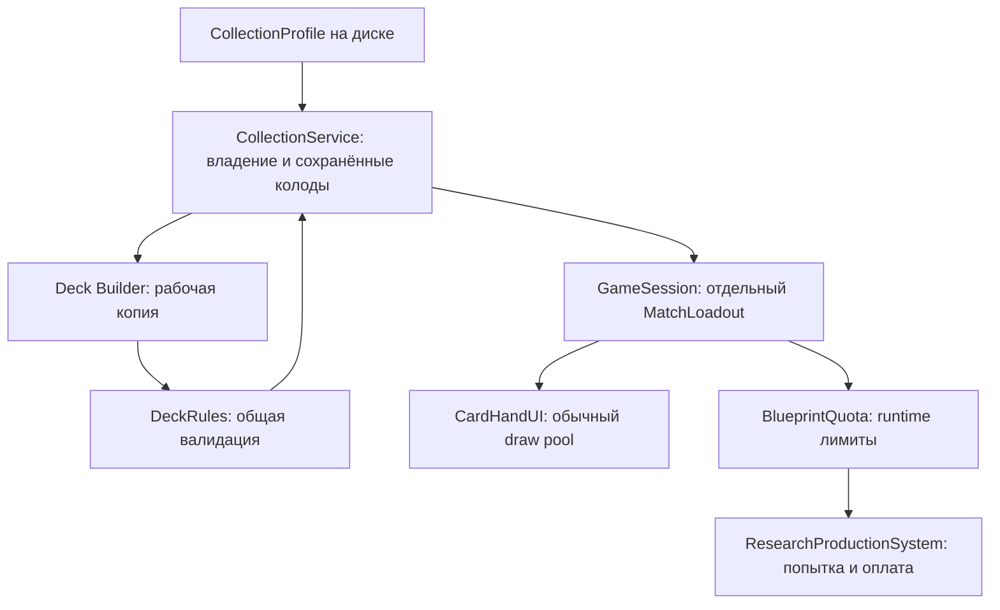

# Deck Collection / Deck Builder — отчёт реализации

Масштаб: новая функциональность и граница между постоянным профилем и состоянием матча. AI V2, банк и боевые правила не перепроектированы. Реализация подготовлена для ревью; окончательная приёмка требует Unity **6000.5.4f1**. Компиляция, EditMode и игровой/UI сценарий в этой среде **не запускались**.

Исходный анализ выполнен на `9c979237f53c2c300361425104b63c7d6aa54b2d`. При публикации база обновлена до `7553244f51ef976254e3286b7807ae543a192b43`: промежуточные исправления изображений каньона и AI null-snapshot / lone-hero estimate не пересекаются с файлами реализации и сохранены. Изменения AI-оценки проверены по diff; сборщик loadout их не вызывает.

## Согласованность и существующая функциональность

- `CardDefinition` — встроенная запись каталога, а не отдельный ScriptableObject. Эта модель сохранена.
- `StartingDeckCatalog` уже владеет составами и раскрытием строк в draw pool; `DeckDraw` уже выполняет добор без возвращения. Новый механизм добора не создан.
- `ResearchProductionSystem` уже владеет условиями, зарегистрированным счётом игрока, списанием AP/ресурсов, испытанием и выпуском карты. К нему добавлена квота человека; проверка хозяина и эффекты вложений остаются в `EquipmentSystem`.
- `GameTurnController` уже владеет окончательным устранением и победой. Награды получают типизированный факт результата, а не вычисляют победителя из UI/AI статистики.
- Постоянного коллекционного профиля, сохранённых пользовательских колод и редактора в исходном коде не было. Новые классы ограничены этими обязанностями.
- Поддерживается существующая модель одного локального человека. Второй человек отклоняется до запуска; AI vs AI не требует загрузки профиля.
- Согласованное исключение: у The Vessels только Mechanical-хозяева. Его стартовая колода содержит три Equipment и **не содержит Mutators**. Три стартовых Mutators принадлежат общей коллекции благодаря стартовой выдаче других фракций. Каноническое требование Bio не менялось.

## Передача данных

Профиль возвращает копии DTO. Редактирование и создание нескольких колод не уменьшают Owned. Перед сменой сцены валидируется и копируется выбранная колода; перед формированием руки снимок повторно валидируется. Equipment/Mutators не попадают в обычную руку. У каждого участника собственные изменяемые пулы; ИИ продолжает использовать прежний стартовый каталог.

## Стоимость и начальные коллекции

Полная таблица **151 коллекционной карты**: [card-costs.csv](card-costs.csv). Все **162 определения** имеют стабильные непустые ключи; 11 системных определений исключены. Ранее существовавшие непустые authoredKey сохранены.

| Колода человека | Очки | Blueprint seed |
|---|---:|---|
| Iron Concord | 74 / 100 | 3 Equipment + 3 Mutators |
| The Ashen | 75 / 100 | 3 Equipment + 3 Mutators |
| The Vessels | 53 / 100 | 3 Equipment |

Полные составы: [initial-collections.md](initial-collections.md). Количества обычных стартовых карт и все восемь героев каждой фракции сохранены. Общие карты выдаются по максимальному начальному количеству, а не суммируются между фракциями.

**Состояние калибровки:** это фиксированная исходная нормализация, а не доказанный соревновательный баланс. Колонки Utility в CSV содержат простые авторские прокси; они не являются результатом исполнения боевого ядра. Обычные юниты нормализованы по статам, мобильности и возможностям; герои — по командованию, Fate и ролям. Для построек заданы небольшие фиксированные значения. Для вложений учтены объявленные изменения и способности; многие эффекты зависят от хозяина и контекста. Лимиты сейчас явно заданы в каждой записи (4 у коллекционных, 0 у исключённых). Стоимость не пересчитывается в матче и не связана с AP/ценой производства.

`Game/Collection/Generate Calibration Report` использует существующие `EquipmentSystem.FitsHost`, `EquipmentSystem.Project`, `AiPower` и `EquipmentEfficiency.Utility` для слабых, сильных, бронированных, Bio, разведывательных хозяев и героев. Отсутствующий совместимый класс отмечается `none`. Меню также генерирует 18 валидируемых конфигураций с полной авторской коллекцией: Mass, Armor, Recon, Mixed, Aviation, Economy для каждой фракции. Это проверочные конфигурации, не выдача игроку. CSV калибровки и JSON этих конфигураций появятся только после выполнения меню в Unity; здесь оно **не выполнялось**. Игровое сравнение стратегий и корректировка стоимости остаются частью приёмки.

При миграции обнаружены исходные неразрешимые ссылки `Iron Concord/AA Crawler` и устаревшие `Neutral/it ...`. Они явно сопоставлены имеющимся Crawler (с AA-способностью) и соответствующим существующим Equipment. Это исправляет сломанные ссылки событий/охранных армий; соответствующие ранее пропускавшиеся карты теперь разрешаются. Количества в этих строках не изменены.

## Сохранение и награды

`collection-v1.json` хранится в `Application.persistentDataPath`. Запись кандидата выполняется через временный файл, flush и атомарную замену с `.bak`; состояние в памяти публикуется после успешной записи. Ошибка записи возвращается UI. Повреждённый текущий файл восстанавливается из сохранённой резервной копии и изолируется; неизвестные ключи сохраняются, проблемная колода остаётся редактируемой, но запуск блокируется. Более новая версия профиля не затирается старым клиентом. Добавление карты в каталог не повторяет стартовую выдачу.

Победа сохраняет до пяти разных равновероятных предложений и требует выбрать `min(2, количество предложений)`; поражение атомарно выдаёт до одной карты и сохраняет квитанцию для показа. Карты при лимите Owned исключены. Старое владение сверх нового лимита не обрезается. `matchId` и список начисленных матчей предотвращают повторную выдачу; незавершённый победный выбор восстанавливается в главном меню. Ничья, досрочный выход, AI vs AI и debug spectator не создают награду.

## Ресурсы, резервы и жизненный цикл

Результат **аудита исходников**, не исполненного игрового теста:

- Единственное списание попытки остаётся в `ResearchProductionSystem.PayCardCost`. Проверки каталога, актёра, зарегистрированного `PlayerRoot`, доступности AP/ресурсов и квоты выполняются до него.
- `BlueprintQuota` резервирует только ключ экземпляра. Денежного/AP резерва, отдельного счёта или вмешательства в AI bank нет.
- Повторная попытка того же pending-ключа отклоняется до оплаты. Повторный callback завершённой `ProductionAttempt` инертен.
- Провал и отмена освобождают квоту, успех расходует одну копию. AP/ресурсы остаются потраченными при провале по прежнему правилу.
- Принудительное закрытие R/P модали использует существующий `BattleAttackPopupUI.Hide`: восстанавливает Fate и завершает попытку провалом. Отключение контроллера также освобождает токен.
- Состояние профиля не изменяет активный MatchLoadout. Квоты создаются на новый матч, `SubsystemRegistration` очищает статический контекст при новом Play Mode.
- Предложения R/P обновляются при завершении попытки; исчерпанное выделение сбрасывается. Ежекадрового кэширования профиля/игровых оценок не добавлено.
- Окна подписываются на изменения профиля только на время показа; закрытие/уничтожение удаляет блокировку и подписки. ESC закрывает верхнее сообщение без передачи того же нажатия нижнему экрану.
- Существующий `UIFocusUtility` блокирует карту, камеру, меню и shortcuts. Статический preview получает разрешение ввода от владельца Collection, поэтому новый блок gameplay не блокирует клики самого каталога.

## Изменённые файлы и ответственность

Все пути ниже относительно корня репозитория. Новые `.meta` соответствуют только новым исходникам и папке Progression; существующие GUID и metadata не менялись.

| Файл | Ответственность изменения |
|---|---|
| `Assets/Scripts/Cards/CardDefinition.cs` | Фиксированные deckPointCost, deckCopyLimit, deckBuilderExcluded |
| `Assets/Scripts/Cards/FactionCardCatalog.cs` | Общий cross-catalog resolver стабильных ключей с отказом при дубликате |
| `Assets/Scripts/Cards/StartingDeckCatalog.cs` | Blueprint seed и строгая сборка custom pool; прежняя сборка ИИ сохранена |
| `Assets/Scripts/Cards/ResearchProductionCatalog.cs` | Повторное использование стабильного resolver |
| `Assets/Scripts/Cards/EventCatalog.cs` | Разрешение мигрированных ключей событий с legacy-совместимостью |
| `Assets/Scripts/Cards/NeutralArmyCatalog.cs` | Такое же разрешение ключей охранных армий |
| `Assets/Scripts/Cards/DeckRules.cs` | Единственный валидатор состава, допуска, количества и общей стоимости |
| `Assets/Scripts/Cards/MatchLoadout.cs` | Копия состава; отдельная квота и завершение попытки |
| `Assets/Scripts/Progression/CollectionProfile.cs` | DTO профиля, колод, выбора, результата и ожидающей награды |
| `Assets/Scripts/Progression/CollectionProfileStore.cs` | Валидация формата и атомарная дисковая запись/восстановление |
| `Assets/Scripts/Progression/CollectionService.cs` | Владение, стартовая выдача, сохранение/удаление/выбор колод |
| `Assets/Scripts/Progression/ProgressionContext.cs` | Создание локальных сервисов и жизненный цикл между сценами |
| `Assets/Scripts/Progression/RewardService.cs` | Постоянная транзакция начисления и идемпотентность |
| `Assets/Scripts/Core/GameConfig.cs` | Ссылки на существующие каталоги коллекции |
| `Assets/Scripts/Core/GameSession.cs` | Валидация перед запуском, снимки, идентификатор и eligibility матча |
| `Assets/Scripts/Players/PlayerSetupData.cs` | Выбранная колода и собственный runtime loadout/квота |
| `Assets/Scripts/Setup/GameSetupController.cs` | Подготовка loadout до загрузки игры и отображение ошибки |
| `Assets/Scripts/UI/PlayerRowUI.cs` | Выбор сохранённой колоды и переход к редактору |
| `Assets/Scripts/UI/MainMenuController.cs` | Collection/My Decks, возврат к setup и восстановление наград |
| `Assets/Scripts/UI/CardHandUI.cs` | Сборка руки из проверенного снимка, явная ошибка вместо неполной колоды |
| `Assets/Scripts/UI/CollectionScreensUI.cs` | Отдельные browser/editor представления; фильтры, CRUD, draft и dirty guard |
| `Assets/Scripts/UI/CollectionUIElements.cs` | Общие технические элементы новых экранов, scaler 1024×768, audio binding |
| `Assets/Scripts/UI/CollectionCardDetail.cs` | Детализация через существующие форматтеры без регистрации игровых юнитов |
| `Assets/Scripts/UI/CollectionMessageUI.cs` | Жизненный цикл сообщения, прокрутка описания, ESC и блокировка ввода |
| `Assets/Scripts/UI/CollectionRewardUI.cs` | Показ/подтверждение награды, retry записи и возврат в меню |
| `Assets/Scripts/UI/ArmyUnitCardUI.cs` | Повторное использование preview с разрешением ввода/hover от владельца |
| `Assets/Scripts/UI/UIFocusUtility.cs` | Учёт коллекционных overlay в существующей блокировке ввода |
| `Assets/Scripts/UI/GameMenuPanelUI.cs` | Недоступность gameplay menu под новым overlay |
| `Assets/Scripts/Cards/ResearchProductionSystem.cs` | Проверка и резерв квоты перед прежней транзакцией; tracked attempt overload |
| `Assets/Scripts/Map/HexSelectionController.cs` | Завершение/отмена tracked attempt через прежний popup |
| `Assets/Scripts/UI/ResearchProductionModalUI.cs` | Фильтрация человека, remaining и обновление после попытки |
| `Assets/Scripts/Turns/GameTurnController.cs` | Типизированный окончательный исход участника и блокировка overlay |
| `Assets/Editor/CollectionContentValidation.cs` | Build gate: ключи, метаданные, ссылки, валидность и совместимость starter |
| `Assets/Editor/DeckCalibrationReport.cs` | Offline Unity-отчёт через канонические модели и 18 strategy fixtures |
| `Assets/Editor/DeckCollectionTests.cs` | 33 новых EditMode-тестов профиля, правил, наград, снимков и UI preview |
| `Assets/Editor/ResearchProductionAttemptTransactionTests.cs` | Регрессия оплаты, прямого обхода и расхода квоты человека |
| `Assets/Cards/IronConcord/CardCatalog_IronConcord.asset` | Стабильные ключи и метаданные Concord |
| `Assets/Cards/TheAshen/CardCatalog_TheAshen.asset` | Стабильные ключи и метаданные Ashen |
| `Assets/Cards/TheVessels/CardCatalog_TheVessels.asset` | Метаданные при сохранении существующих ключей |
| `Assets/Cards/Neutral/CardCatalog_Neutral.asset` | Стабильные ключи/метаданные shared, исключение guard-only |
| `Assets/Cards/StartingDeckCatalog.asset` | Мигрированные ссылки и отдельные стартовые чертежи |
| `Assets/Cards/EventCatalog.asset` | Мигрированные ссылки наград |
| `Assets/Cards/NeutralArmyCatalog.asset` | Мигрированные ссылки и явное исправление устаревших имён |
| `Assets/Config/GameConfig.asset` | Ссылки на StartingDeckCatalog и ResearchProductionCatalog |
| `Assets/Scenes/MainMenu.unity` | Ссылка контроллера на GameConfig; новые сцены/арты не добавлены |
| `Tools/deck-collection/migrate_content.py` | Одноразовая миграция данных; повторный запуск отвергается до записи |
| `Tools/deck-collection/verify_content.py` | Read-only аудит данных против исходной ревизии |
| `Docs/DeckCollection/card-costs.csv` | Полная фиксированная таблица, прокси и ограничения калибровки |
| `Docs/DeckCollection/initial-collections.md` | Начальные составы и согласованное исключение Vessels |
| `Docs/DeckCollection/implementation-report.md` | Этот отчёт и статус приёмки |

## Выполненные проверки

| Проверка | Результат |
|---|---|
| Read-only content audit против исходного snapshot | PASS: 162 ключа, составы 74/75/53, 20 Research и 42 Production refs |
| Сравнение исходных combat fields и количеств AI starter | PASS: без изменений |
| Разрешение всех cardKey в authored catalogs | PASS |
| Совместимость starter BP, offline проверка тегов | PASS; канонический Unity gate ещё не выполнен |
| `verify_full.js` на всех 9 изменённых `.asset`/`.unity` | PASS: missing/duplicates/overflow = 0 |
| `verify_types.js` на тех же файлах | PASS |
| `git diff --check` | PASS |
| Python syntax для migration/audit | PASS |
| 33 новых collection tests + 1 regression в существующем transaction fixture | ДОБАВЛЕНЫ, НЕ ЗАПУСКАЛИСЬ |
| Baseline вспомогательного C# compile_check | НЕДОСТУПЕН: dotnet отсутствует; сообщение скрипта «0 errors» не доказательство компиляции |
| Unity compile / EditMode / PlayMode / UI | НЕ ЗАПУСКАЛИСЬ |

В локальной среде код получен через коннектор и HEAD — технический snapshot исходной ревизии; аудит выполнен как `python Tools/deck-collection/verify_content.py --base HEAD`. В обычном git checkout запустить без `--base`: по умолчанию используется исходный настоящий commit `9c979237...`, а не текущий HEAD.

## Сохранённые инварианты и неподтверждённая приёмка

По структуре изменений сохранены: существующие бой/Fate/разведка; AP/ресурсы и canonical root; AI V2 исполнение, bank/reservations/cache; карты событий и добывающие постройки как gameplay-источники; добор без возвращения; исходная рука, starter counts ИИ и независимые пулы; правила совместимости и независимые Equipment/Mutator слоты. Исключение по исправленным неразрешимым ссылкам событий/охранных армий указано выше.

**Работоспособность экранов и полный игровой цикл пока не подтверждены.** В Unity 6000.5.4f1 выполнить весь EditMode suite, особенно `DeckCollectionTests`, `ResearchProductionAttemptTransactionTests`, existing attachment/production/catalog, draw/hand, menu/input и AI economy/cache/lifecycle tests. Запустить `Game/Collection/Validate Content` и отчёт калибровки, затем проверить build.

На 1024×768 и поддерживаемых других соотношениях сторон проверить сетку, отсутствие перекрытия колонок, card text/art, hover/click, scrolling/dropdown, Back/ESC/Save-Discard-Cancel, фокус, возврат к Game Setup, Missing Script и ссылки. Затем пройти без debug обходов: первый запуск → коллекция → новая колода → сохранение → выбор → матч → добор/развёртывание → Research/Production (success/fail/cancel/exhaustion) → победа/поражение → награда → перезапуск → коллекция → следующая колода/матч. Отдельно проверить backup recovery, write failure, interrupted victory selection, human elimination в multiplayer, AI vs AI и отсутствие награды при выходе.

Commit/PR публикуются отдельной веткой; ссылки и ограничения находятся в описании draft PR. Merge не выполняется до Unity-приёмки.

## Повторный аудит снизу вверх

Повторно проверены данные → DeckRules → профиль → runtime снимки → R/P оплата и квоты → награды → UI → AI/resource/cache границы. Найдены и исправлены четыре пропуска: (1) ошибки/backup notice загрузки профиля теперь показаны сразу в главном меню; (2) ожидающие награды корректно завершаются после удаления карты/изменения лимита, исходные ключи предложений сохраняются без случайной подмены; (3) некорректные duplicate/claimed reward identities и дубли выбора фракции отвергаются как повреждённый формат; (4) изменение количества в длинной колоде больше не сбрасывает прокрутку всех колонок.

Добавлены четыре регрессии, всего 33 новых Collection tests + 1 transaction test. Они не выполнялись без Unity. Read-only content audit и оба YAML verifier повторно прошли. Итоги и оставшиеся проверки: [re-audit.md](re-audit.md).
