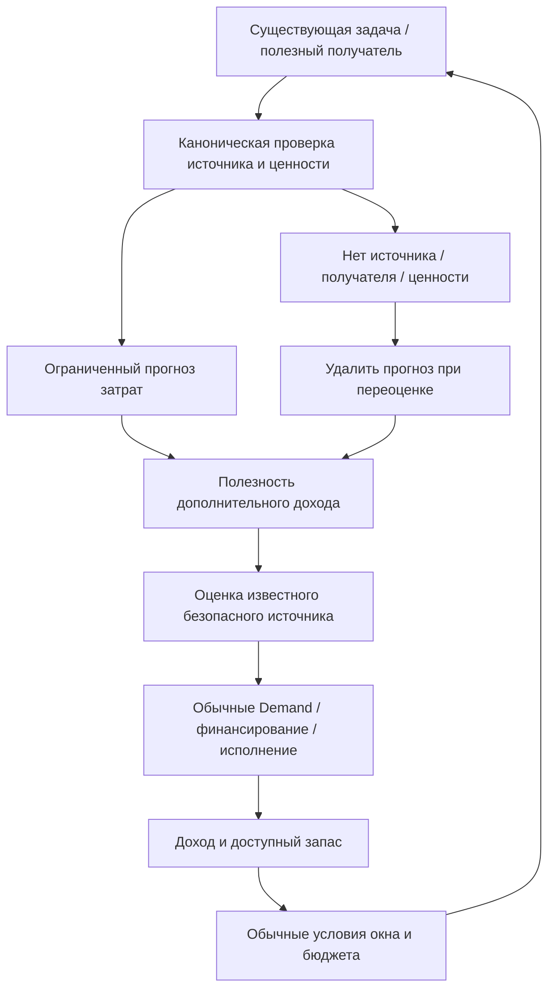
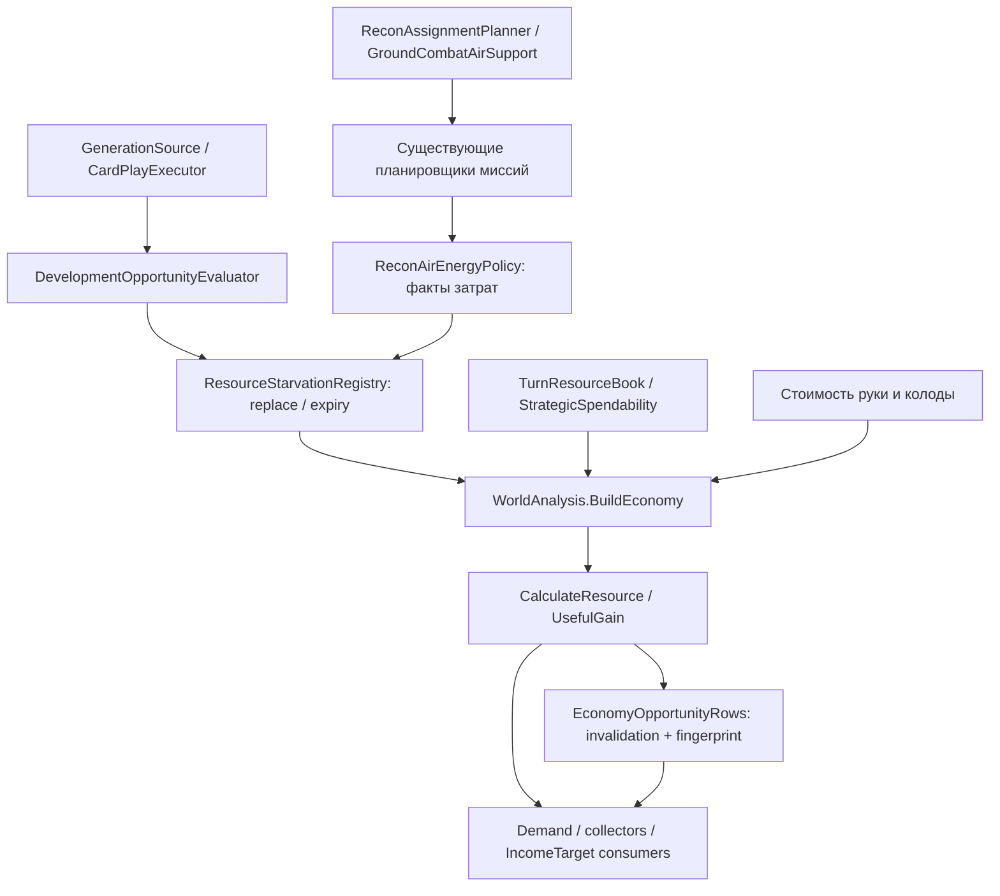
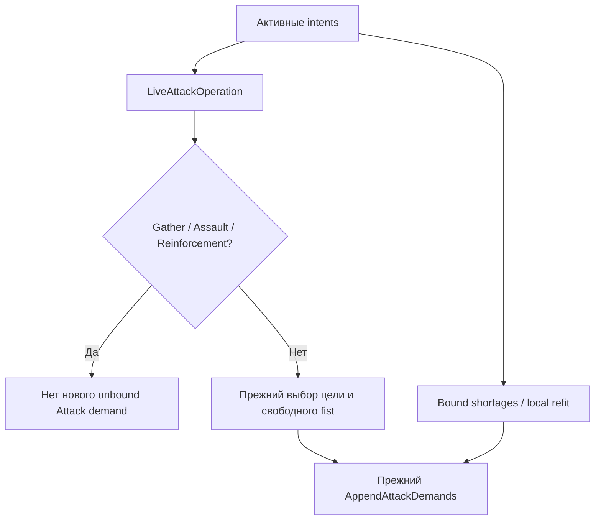
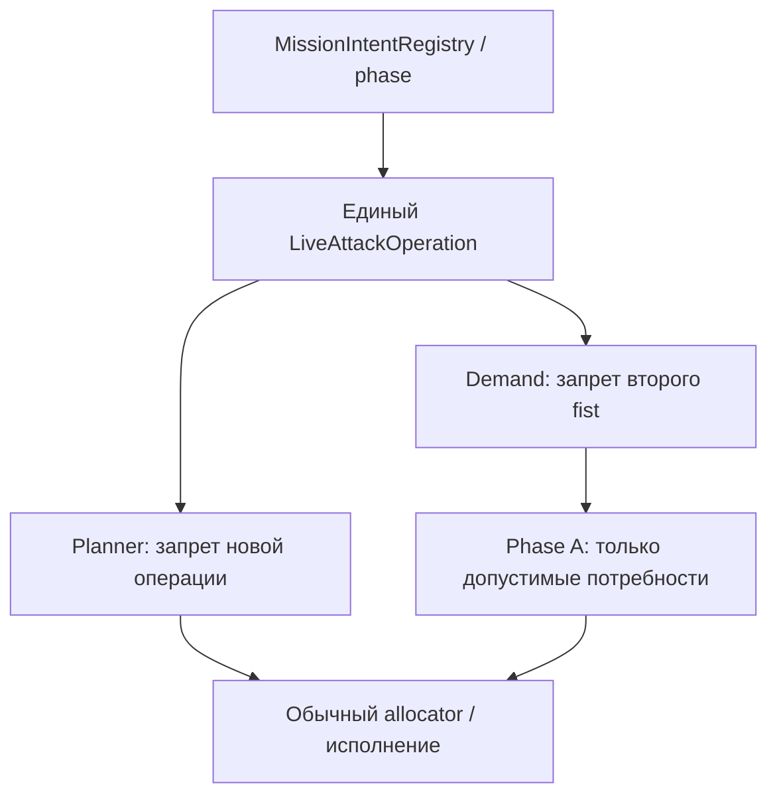

# Исправления F1/F2 финального AI-аудита

Исходная ревизия: `a5e12cd0c3fe701c04207fef957cb1464fc18674`, прочитана через GitHub connector. Изменение поведения в существующих классах; новые архитектурные уровни, менеджеры, allocator и правила баланса не вводятся.

## F1: Economy не видела будущие расходы полезных действий

До исправления `UsefulGain` учитывал только руку и оставшуюся колоду. Рост starvation pressure не мог снять ранний отказ Economy `surplus`. Закрытое окно Development при низком E было корректным следствием недостаточного запаса; ослабление порога исправляло бы симптом.

Поведение после исправления:

Зависимости:

Прямой обход: реальная полезная возможность → её стоимость до budget/window отказа → отдельный прогноз → экономическая ценность дохода → прежние условия выбора и исполнения. Обратный обход: отказ по доходу → тот же `UsefulGain` → единый snapshot → исходные свидетельства и канонический доступный банк. Ни один шаг не требует второго калькулятора ресурсов.

### Владельцы и ограничения

| Уровень | Изменение |
|---|---|
| `Strategy/Objectives/` | `DevelopmentOpportunityEvaluator` сначала доказывает полезность цепочки существующими scorers, затем применяет исходные budget/window ограничения. Один лучший прогноз вместо суммы каталога. Equipment: число разных законных полезных получателей, максимум `devFacilityExpectedUses`; deployable: ограниченная существующим expected-uses оценка. |
| `Materialization/`, `Execution/` | Существующие `GenerationSource.Enumerate` и `CardPlayExecutor.Preflight` имеют явно обозначенный forecast режим: допускают описание затрат до проверки сегодняшнего бюджета, сохраняют владение, реальные facility/operator, совместимость и placement. Обычные вызовы и исполнение используют прежние проверки. |
| `Missions/`, `Recon/` | Воздушный прогноз производится до allocation, только для существующих крыльев и задач. Recon использует подтверждённый `PlanAirCandidate`, а не запасной notional cost. Один actor под альтернативными целями считается один раз. |
| `State/` | Существующий `ResourceStarvationRegistry` хранит прогнозы отдельно от starvation hits и current-block preservation. Producer заменяет свой набор; пустой набор удаляет его. Срок: текущий или предыдущий ход, чтобы связать turn-start scan с последующей оценкой потребителей. |
| `Analysis/` | `ForecastOperationalNeed` входит в IncomeTarget как скорость, income gap, runway и один общий `UsefulGain`, включая удержание коллектора. |
| `Analysis/` — invalidation | Полезность дохода и конкретный прогноз включены в `EconomyOpportunityRows`, общие для typed invalidation и admission fingerprint; изменение потребности видно даже при насыщении физической прибавки участка. |

Прогноз не является резервом, не увеличивает физический банк и не разрешает покупку. Стоимость facility/operator карты из руки/колоды не добавляется повторно; extra cost включает лишь capacity tier и создание отсутствующего оператора через существующий источник. Активные ledger rows остаются отдельным исходным входом. Прогноз не добавляет pressure hits и не влияет напрямую на `ResidualResourcePreservationValue`.

Авиация: оплаченная sortie продолжает полёт за 0 Energy; такой шаг не создаёт повторную плату. При оценке будущих запусков цикл не короче ETA и безопасного endurance span. Максимальная частота ограничена текущим economy runway horizon. Это прогноз повторения полезной задачи, а не обязанность самолёта летать каждый ход.

Снимок читает обратную связь при следующем settled scan либо в начале следующего хода. Порядок Orchestration не изменён. При исчезновении полезного источника/получателя следующая оценка владельца удаляет прогноз; если владельца больше не вызывают, действует конечный срок хранения.

### Пример из лога

Tessek T24: AP 22 → 12, запас H/E/M/T = 12/1/12/9, Energy income = 1, колода пуста, Laboratory staffed, `window_closed(E)`, 10 Economy surplus rejections. Рука Factory + два Watcher Drone; третий разведчик запрещён текущим лимитом, у Assault после боя исчерпаны MP.

При подтверждённой цепочке с суммарным будущим E-расходом 6 и hand E-need 1 модель меняется так:

- раньше: 1 need против 1 stock + 3 income → полезность нового E-дохода 0;
- теперь: 1 + 6 need против того же покрытия 4 → полезная прибавка до 1 E/turn;
- если доступный E-запас уже 10, полезность снова 0.

Это проверка арифметики на банке из лога с явно заданным свидетельством, не воспроизведение партии. Какой именно прогноз выберет новая сборка, устанавливается в Unity. Рост дохода не гарантирован: строитель, маршрут, риск, окупаемость и allocator сохраняют право отказа. Все 50 оставшихся AP за T20–T24 исправление не обязано превратить в расходы.

## F2: Demand мог готовить второй Attack при живом Assault

Корень: Demand проверял только `Preparation && Gather`, planner — весь `LiveAttackOperation`. Исправление в `Strategy/Demand/`: `AppendUnboundAttackDemand` читает существующий `AggressionMissionLayer.LiveAttackOperation` вместо собственного узкого predicate.

Прямой и обратный обходы теперь сходятся на одном predicate. Bound preparation, pre-commit reinforcement и разрешённый hand-only local refit остаются на прежнем пути. Return-фазы трактуются ровно как в planner. Raid, ActiveDefence и существующая поддержка текущего Assault не подавляются.

Tessek T24: после боя #52 по пути к Base(-3,1) больше не появится unbound запрос усилить #49 на 61,4 силы для Citadel(3,3). Действующий Assault продолжит прежний цикл. В исходном эпизоде лишнего расхода по запросу не было; исправление устраняет противоречие до появления подходящих карт.

## Проверки и границы

- Повторно проверены уникальные точки: `UsefulGain`, `CalculateResource`, `BuildEconomy`, `DevelopmentOpportunityEvaluator`, `GenerationSource`, `CardPlayExecutor.Preflight`, `LiveAttackOperation`; partial-классы не считаются дубликатами.
- Проверены вызовы bank/spendability и execution preflight; прогноз не пишет ledger, не дебетует ресурсы и не меняет права владельцев.
- Проверены snapshot refresh, общий economy fingerprint/invalidation и snapshot-keyed ForceNeed cache; отдельный межснимковый кеш scorers не добавлен.
- `git diff --check`: успешно.
- Арифметическая проверка случая E=1/income=1/handNeed=1/forecast=6: успешно; это не Unity simulation.
- Добавлено 7 тестовых случаев в существующие EditMode test classes: три фазы live Attack; будущая E-потребность; замена/expiry/независимость от резервов; existing-wing/endurance/paid continuation; источник без бюджета при закрытом окне и исчезнувшем операторе.
- Компиляция и EditMode тесты **не запущены успешно**: .NET/Mono отсутствуют; `setup.sh` завершился ошибкой установки. `compile_check.sh --baseline` без dotnet печатает ошибочно пустой набор; это не compile baseline и не доказательство компиляции. Отдельный старый aggression-refactor check требует историческую ревизию, отсутствующую в connector snapshot, и также не считается пройденным.
- Unity и повторный игровой прогон выполняет владелец проекта.

### Повторный прогон в Unity

1. Случай Tessek late game: пустая колода, низкий E, staffed Laboratory и полезные получатели. Проверить `economy.forecast`, surplus rejections и появление экономической оценки E-источника; окно Development остаётся закрытым до штатных двух turn-start observations.
2. Убрать оператора, полезного получателя или допустимую воздушную задачу: прогноз должен исчезать при переоценке владельца; без такой переоценки — не переживать срок хранения.
3. Запустить multi-turn helicopter/Dreadnought sortie: продолжение не добавляет activation Energy, обязательное возвращение сохраняется.
4. Assault с израсходованными MP и другим слабым fist на собственной базе: нет второго unbound Attack demand. Отдельно проверить bound preparation, pre-commit reinforcement, local refit, Raid и ActiveDefence.
5. Проверить known E-site при новом прогнозе без изменения руки/stock и смену полезности при достаточном запасе; кеш должен пропускать соответствующую переоценку.
