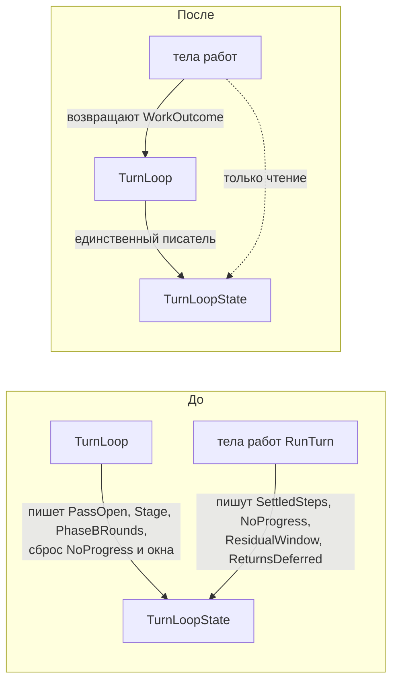
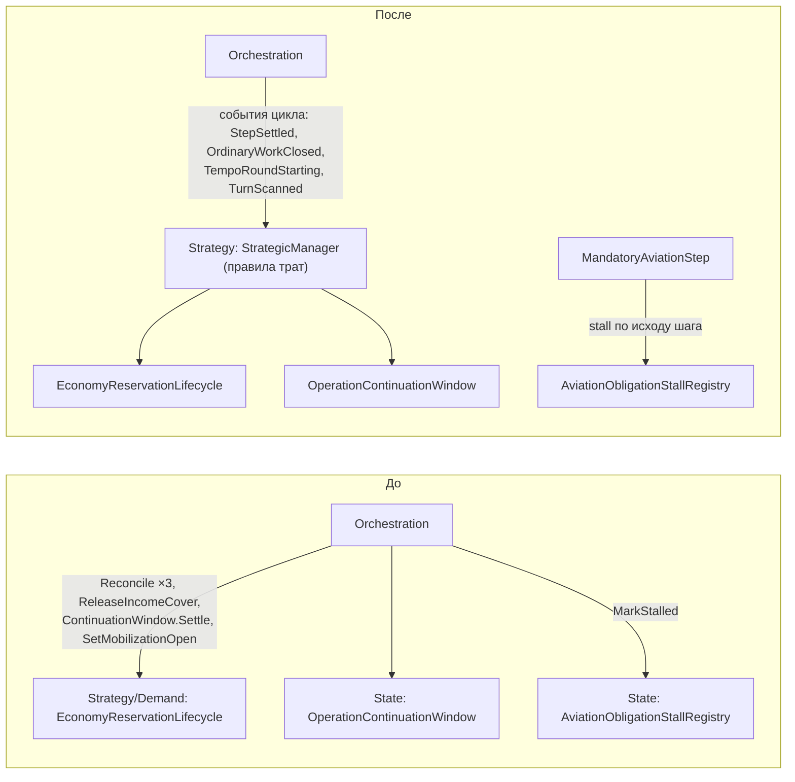
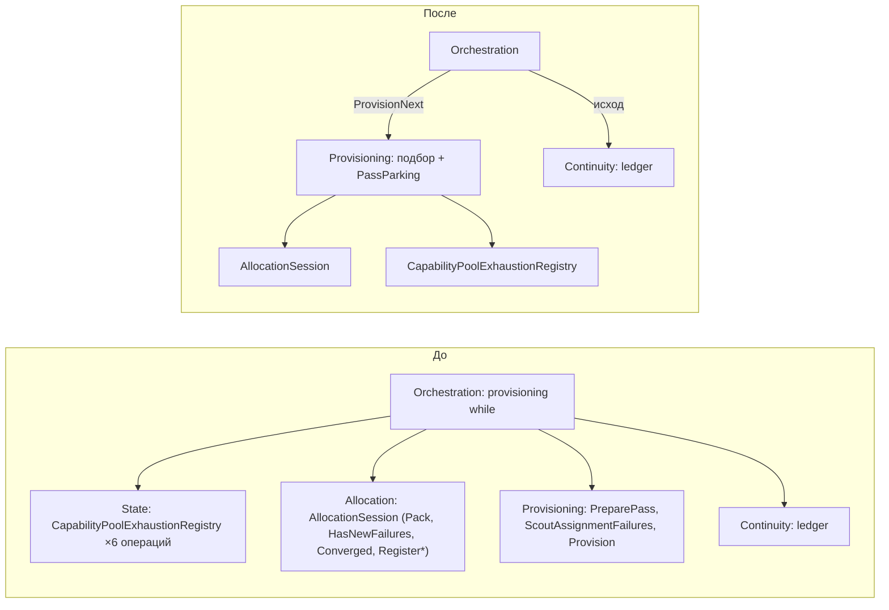
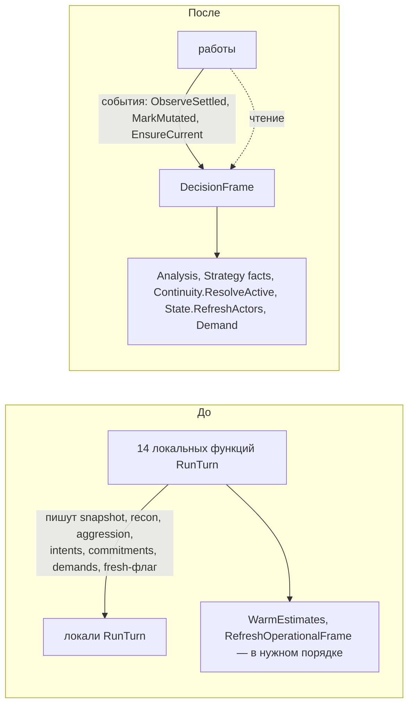
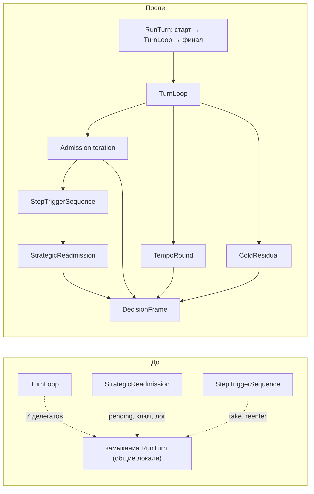

# AI V2 — план развязки уровней (без изменения кода)

Статус: **план реализованных этапов Э1–Э6**; результаты и ограничения проверки — в `Docs/ai-v2-decoupling-final-report.md`, доказательства — в `Docs/ai-v2-decoupling-evidence.md`. База плана: `master` @ `54be196f`. [Исходный анализ связности](https://github.com/HolyPenguin21/turnbased-ae-style/blob/54be196f/Docs/ai-v2-pipeline-simplification-coupling.md) сохранён в истории Git.

## 0. Цель и правила

Цель — уменьшить знание уровней о внутреннем устройстве друг друга, а не число стрелок. Правила:
- **Не считается устранением:** перенос тех же вызовов в helper той же папки; замена прямого вызова делегатом/интерфейсом при том же знании.
- **Считается устранением:** уровень перестаёт ссылаться на тип или операцию другого уровня (проверяется `D:/aiv-work/coupling/deps.py` по типам), а правило переходит к владельцу, у которого оно и меняется; либо исчезает общий изменяемый объект с несколькими писателями.
- **Необходимые связи остаются:** Orchestration → `StrategicManager.FulfillDemands/UseSurplus`, allocator (`BeginTurn`/`Pack`), executors, `WorldAnalysis.ObserveSettled`, `AiTurnSession` (fan-out фактов), Housekeeping; диагностика (`AiFrameLog`, `AiV2Trace`, `ReservationInvariants.CheckBoundary`).
- Не меняются: оси, Radar, формулы, bounds, порядок работ, число пар take→reenter, состав ключей допуска, writers банка.

## 1. Что оркестратор знает сейчас (`AiStrategyV2Pipeline.cs` @ `54be196f`)

| Знание | Операции, вызываемые из Orchestration | Чьё это правило на самом деле | Этап |
|---|---|---|---|
| Учёт управляющих счётчиков из тел работ | `loop.NoProgressCycles`, `loop.ResidualWindow` пишут и `TurnLoop`, и тела `RunTurn`; `SettledSteps`, `ReturnsDeferred` пишут тела | цикл хода | Э1 |
| Когда банк меняет стадии резервов | `EconomyReservationLifecycle.ReconcileEconomyCompletionReservations` ×3, `ReleaseDeferredEconomyIncomeCover` ×1, `OperationContinuationWindow.Settle` ×1, `SetMobilizationOpen` ×1 — вызывает **только** оркестратор | банк / Strategy (правила трат) | Э2 |
| Состояние «заброшенных» авиаобязательств | `AviationObligationStallRegistry.MarkStalled` | авиация | Э2 |
| Как подбирается исполнимая миссия | `CapabilityPoolExhaustionRegistry` ×8 (6 операций), `cycleSession.HasNewFailures/Converged/Pack/Register*` ×9, `cycleProvisioning.*` ×5, два бюджета realloc, время жизни retry-set | Provisioning / Allocation (ТЗ §10) | Э3 |
| Как собирается и оценивается набор миссий | 4 планировщика, `EffectiveValue = BaseValue × RadarValueScale` (оценка в оркестраторе), `AttackPreparationPriority`, `StrategyLayer.RefreshReconLanePressures/RefreshAggressionOperationalFacts` перед планировщиками, `LifecycleReturnPolicy.SelectWaiting/RecordWait` + `MissionContinuityLayer.MarkProtectedThisTurn` | Missions (+ Continuity для защиты от stall) | Э4 |
| Как и в каком порядке обновляется кадр решения | `RefreshStrategicKnowledge` → `CombatOpportunityAnalyzer.WarmEstimates` → `ReconObjectiveEvaluator` → `StrategyLayer.RefreshAggressionOperationalFacts` → `RaidObjectiveEvaluator` → `ResolveActive` → `RefreshActors`; флаг `ownershipFreshAfterPhaseA` (3 писателя + сброс); 6 локалей кадра пишут 14 локальных функций | владелец кадра | Э5 |
| Тела работ живут в замыканиях `RunTurn` | 7 делегатов `TurnLoopWork`; `StrategicReadmission.Decide(pending, fingerprintOf, onUnchanged)`; `StepTriggerSequence.Run(take, reenter, …)` | компоненты цикла | Э6 |

Учёт исхода миссии в ledger (`cycleLedger.Register*/Record*/FinalizeSteps`, `SettleStep`) — правило Continuity, но его порядок («публикация наблюдения до финализации ledger») закреплён ТЗ как часть шага миссии; после Э3 оркестратор передаёт в ledger готовый исход provisioning, остальное остаётся (необходимая связь шага с Continuity).

## 2. Этапы

Порядок — по риску и зависимостям: Э1 → Э2 → Э3 → Э4 → Э5 → Э6. Каждый этап — отдельный checkpoint с gate (§4).

### Э1. Один писатель управляющего состояния цикла

**Владелец:** `TurnLoop` (Orchestration).
**Устраняется:** общий изменяемый `TurnLoopState` с двумя сторонами-писателями.
**Как:** тела работ перестают писать поля состояния и возвращают исход (`settled: bool`, `progressed: bool`, `stopPass: bool`, `residualVerdict: bool?`, `returnsDeferred: bool`); `TurnLoop` применяет его (`SettledSteps++`, `NextNoProgress`, окно, возвраты). Для строк лога, которые печатают счётчики посреди тела (`step=N`, `noProgress=N`), тело читает **только-чтение** вид состояния и вычисляет значение той же чистой функцией.



**Пример:** изменить правило no-progress (например, считать раунд Phase B без изменений шагом без прогресса). До — `TurnLoop` + 3 тела (авиация, миссия, отказ provisioning) + вердикт; после — только `TurnLoop`.

**Доказательства.** Игровой луп: исход применяется в конце работы, а до Э1 запись шла внутри тела — между записью и концом тела читатели — только строки лога (переводятся на вычисленное значение); `Phase`/`ColdEligible` читают после возврата. Транскрипционный тест `AiTurnLoopTests` расширяется: тела-заглушки возвращают исходы вместо записи; 20 000 сценариев против той же транскрипции baseline. Банк и кеши: не затрагиваются (счётчики не банк и не кеш).

### Э2. Банк узнаёт о фазах хода, а не получает команды о своих стадиях

**Владелец:** Strategy — существующий фасад трат `StrategicManager` (правила «что держать до какого момента» уже живут в Strategy/Demand и State).
**Устраняется:** знание Orchestration о `EconomyReservationLifecycle` и `OperationContinuationWindow` (типы уходят из зависимостей Orchestration), о `AviationObligationStallRegistry`.
**Как:** оркестратор сообщает **свои** события, о которых он и так владелец: `MissionStepSettled`, `OrdinaryWorkClosed` (первый Phase B), `TempoRoundStarting`, `TurnScanned(mobilizationGate)`. Что освободить/пересчитать на каждом событии, решает Strategy:
- `MissionStepSettled` → `ReconcileEconomyCompletionReservations`;
- `OrdinaryWorkClosed` → `Reconcile…`, `ReleaseDeferredEconomyIncomeCover`, `OperationContinuationWindow.Settle`;
- `TempoRoundStarting` → `Reconcile…`;
- `TurnScanned` → `OperationContinuationWindow.SetMobilizationOpen`.
Stall авиации: `MandatoryAviationStep` получает исход шага (`progressed`) и сам отмечает stall (`AviationObligations` — владелец обязательств).

Это не helper: имена событий — словарь цикла, а список операций банка переезжает к владельцу правил; Orchestration перестаёт ссылаться на типы банка.



**Пример:** новая резервация, которая должна жить до первого Phase B (например, удержание AP следующего шага Attack preparation). До — Orchestration (новый вызов в settle window) + Strategy/State; после — только Strategy/State.

**Доказательства.**
- *Луп:* события стоят ровно в прежних точках вызовов (таблица «событие → операции» = прежняя последовательность строк L817, L858–L865, L887, L137). Тело события — те же вызовы в том же порядке.
- *Банк:* writers резервов не меняются; меняется только место вызова. Managed: `AiEconomyReservationLifecycleTests`, `AiStrategicSpendabilityApTests` без изменений + тест «событие вызывает те же стадии в том же порядке» на реальных `StrategicResourceReservationLedger`/`OperationContinuationWindow` (managed-классы). Нативно: скрипт позиций банка (`DeferredIncomeCover` только между закрытием первого прохода и раундом 1; `EXPIRE EndOfTurn` после цикла; переходы deferred → completion) — тот же результат, что на `6e223cc2` (§12.4 отчёта L5).
- *Кеши:* банк не кеш; ключ допуска Economy читает ledger (`ReasonDigest`) — момент чтения не меняется.

### Э3. Provisioning владеет подбором исполнимой миссии и парковкой прохода

**Владелец:** Provisioning (`ProvisioningManager`) вместе с Allocation (`AllocationSession`) — ТЗ §10 называет их владельцами retry.
**Устраняется:** знание Orchestration о `CapabilityPoolExhaustionRegistry` (6 операций), протоколе repack (`HasNewFailures`, `Converged`, `RegisterProvision*`), двух бюджетах realloc, времени жизни retry-set.
**Как:** `ProvisioningManager.ProvisionNext(allocationSession, provisioningSession, passParking, …)` возвращает `ProvisioningOutcome` (выбранная миссия или «нет», последняя аллокация, отказы для ledger и телеметрии, попытанные ключи, все funded-паки хода). Retry-set прохода — объект `PassParking`, созданный при открытии прохода и принадлежащий Provisioning; фильтр «retry next turn» в начале итерации (`ShouldSkipRetried` + причина отказа durable-ноги) — тоже `PassParking`. Оркестратор записывает исход в ledger и телеметрию.



**Пример:** новая `ProvisionDisposition` (например, «повторить после следующего pack») или изменение срока парковки. До — Orchestration (оба хвоста учёта отказа, фильтр) + Provisioning + State; после — Provisioning (+ State-реестр).

**Доказательства.**
- *Луп:* тело цикла подбора переносится к владельцу без изменения порядка операций; два бюджета и их независимость сохраняются; `ProvisioningSession` по-прежнему живёт одну итерацию (создаётся и закрывается оркестратором вокруг вызова). Managed: существующие allocator/Recon assignment fixtures + новые тесты `ProvisionNext` на последовательностях отказов (batch Scout, reprice, RetryNextTurn, сходимость) против транскрипции текущего цикла (как `AiTurnLoopTests`).
- *Банк:* tentative claims (`ProvisioningSession`), `AllocationSession` и их порядок не меняются; durable ownership — по-прежнему через ledger → `SettleStep` в той же точке шага.
- *Кеши:* `ShouldSkipRetried` читает тот же снапшот; парковка прохода сбрасывается при открытии прохода, ходовая — как прежде.

### Э4. Missions владеет набором миссий, оценкой и ожиданием возвратов

**Владелец:** Missions (фасад набора миссий), Continuity — для защиты отложенной ноги от stall.
**Устраняется:** оценка в оркестраторе (`EffectiveValue = BaseValue × RadarValueScale`, `AttackPreparationPriority`), знание о четырёх планировщиках и их порядке, об обновлении фактов Strategy перед ними, о реестре ожиданий возвратов и защите от stall.
**Как:** `BuildMissionSet` → `MissionPortfolio.Build(frame, radar, returnsMayWait, passParking, trace)` → (missions, deferrals). Внутри — те же шаги в том же порядке: refresh Recon/Aggression facts → 4 планировщика → `AttemptId` → `EffectiveValue` → `AttackPreparationPriority` → `TaskScores` → корреляция; затем ожидание возвратов (`LifecycleReturnPolicy.SelectWaiting` → `RecordWait` → `MissionContinuityLayer.MarkProtectedThisTurn`, вынесено в Continuity-операцию «отложить ногу без stall») и фильтр парковки (Э3). `returnsMayWait` — вход от цикла (необходимая связь).

```mermaid
flowchart LR
    subgraph До
      OA["Orchestration: BuildMissionSet + ожидание возвратов + фильтр"] --> PL["Missions: 4 планировщика"]
      OA --> SL["Strategy: Refresh*Facts"]
      OA --> RV["RadarValueScale, AttackPreparationPriority"]
      OA --> LRP["LifecycleReturnPolicy (RecordWait)"]
      OA --> MCL["Continuity: MarkProtectedThisTurn"]
    end
    subgraph После
      OB["Orchestration"] -->|Build(frame, radar, returnsMayWait)| MP["Missions: MissionPortfolio"]
      MP --> PL2["планировщики"]
      MP --> SL2["Strategy facts"]
      MP --> RV2["оценка"]
      MP --> MCL2["Continuity: отложить ногу без stall"]
    end
```

**Пример:** новое семейство миссий или новый множитель ценности. До — Orchestration (`BuildMissionSet`) + Missions; после — Missions.

**Доказательства.**
- *Луп:* вызов стоит в той же точке итерации; внутренний порядок — построчный перенос. Managed: тесты планировщиков и `AiLifecycleReturnPolicyTests` без изменений; новый тест порядка «ожидание → запись ожидания → защита от stall» на managed-реестрах.
- *Банк:* не трогается (оценка не тратит).
- *Кеши:* факты Strategy обновляются из того же снапшота непосредственно перед планировщиками (как сейчас); `TaskScores`/корреляция читают тот же список.

### Э5. Владелец кадра решения

**Владелец:** `DecisionFrame` (Orchestration; согласованность кадра — его единственная ответственность). Ниже его не опустить: кадр собирается из Analysis, Strategy, Continuity, State и Demand, а Analysis не может зависеть от вышестоящих уровней.
**Граница этапа:** Э5 устраняет общие изменяемые данные и протокол свежести (их больше не знают тела работ), но **знание рецепта кадра остаётся в слое Orchestration** — у одного класса вместо 14 локальных функций. Межслойную связность по типам этот этап не уменьшает.
**Устраняется:** 6 общих изменяемых локалей кадра, которые пишут 14 локальных функций; протокол `ownershipFreshAfterPhaseA` (3 писателя + сброс); знание тел работ о порядке обновления и прогреве кеша оценок.
**Как:** кадр хранит `snapshot`, objectives, intents, commitments, demands и их рецепт; операции: `ObserveSettled(stamp, result)`, `MarkMutated()` (после работы), `EnsureCurrent()` (то, что сейчас делает итерация при `!ownershipFresh`), `RefreshAfterStrategicChange()`, `ReplaceDemands(axes, regenerated)`. Политика обновления **не меняется**: полный refresh в тех же точках; пропуск по ревизии **запрещён** — `ResolveActive` изменяет состояние (удаляет мёртвые intents, меняет ключи), повторный вызов не является чистым чтением.



**Пример:** новая составляющая кадра (например, перечень Development-возможностей на кадр). До — рецепт `RefreshDecisionFrame` + места присваивания + проверка флага свежести во всех читателях; после — только `DecisionFrame`.

**Доказательства** (самый рискованный этап).
- *Луп:* каждая прежняя точка refresh становится вызовом события в той же точке; трасса «точка → refresh да/нет» на транскрипции baseline должна совпасть (флаг свежести переносится 1:1, включая писателей: старт, reentry changed, cold changed, сброс в итерации).
- *Кеши:* `WarmEstimates` вызывается перед каждым `RefreshOperationalFrame`, как сейчас; читатели получают кадр только после события текущей точки; новый тест — «после каждой мутации следующий читатель видит обновлённый кадр» на записи последовательности событий; нативно — сверка ревизий (`bumps == commits`) и `turnorder.py`.
- *Банк:* кадр не пишет резервов; carried reservation остаётся у Phase A/B.

### Э6. Тела работ — компоненты, а не замыкания `RunTurn`

**Владелец:** `TurnLoop` и компоненты работ (итерация допуска, раунд Phase B, cold, повторный допуск), Orchestration.
**Устраняется:** обратные вызовы в замыкания `RunTurn` (7 делегатов `TurnLoopWork`, колбэки `Decide`/`StepTriggerSequence` в локальные функции). Связь `TurnLoop → работа` необходима и остаётся (прямой вызов компонента); исчезает зависимость компонентов от скрытого общего состояния `RunTurn`.
**Как:** после Э1–Э5 тела работ зависят только от `DecisionFrame`, исходов и владельцев доменов — их можно сделать компонентами с явными входами; `StepTriggerSequence` вызывает `StrategicReadmission` напрямую; ключ допуска — прямой вызов `StrategicAdmissionFingerprints.For(frame)`, pending — `AviationObligations.Pending`.



**Пример:** новый вид работы уровня хода. До — `TurnLoop` (enum, `Phase`, ветка, делегат) + тело-замыкание в `RunTurn` + проводка делегата; после — `TurnLoop` (enum, `Phase`, ветка) + новый компонент.

**Доказательства.** *Луп:* `AiTurnLoopTests` переводятся на тестовые реализации компонентов (интерфейс нужен только для тестов; знание не добавляется); транскрипция baseline та же. *Банк, кеши:* не меняются относительно Э5 (компоненты используют те же вызовы).

## 3. Что останется связанным (сознательно)

| Связь | Почему необходима |
|---|---|
| Orchestration → `StrategicManager.FulfillDemands/UseSurplus` | Phase A/B — пакеты, оркестратор выбирает момент |
| Orchestration → allocator `BeginTurn`/`Pack`, executors | одна конкуренция миссий; исполнение шага |
| Orchestration → `WorldAnalysis.ObserveSettled` / `DecisionFrame` | наблюдение после мутации — граница шага |
| Orchestration → Continuity ledger / `SettleStep` для миссий | порядок «публикация → ledger → settle» закреплён ТЗ |
| Порядки внутри видов работ (`CheckBoundary`, observer boundary, reconcile перед тратой) | различия видов — по варианту A; после Э2 «reconcile» становится событием, но место события по виду сохраняется |
| Housekeeping → Reaction → `UseSurplus` | вне ТЗ упрощения; кандидат отдельной задачи |
| Статические реестры хода (`StrategicInterruptRegistry`, ledger, `WorldDeltaLifecycle`, `StrategicTempoBudget`) | единственные владельцы фактов, ревизий, резервов и бюджета |

## 4. Общий порядок проверки каждого этапа

1. До кода: таблица «событие/точка → вызовы» до и после этапа; схема; список знаний, которые исчезают (по типам).
2. Managed: `run.sh` + `patchrun.sh` + `regress.py` против `l5-a-p` и `l0-base-p` (регрессий 0); `compile_check.sh` (28 = 28); `ratchet.py`; новые тесты этапа против транскрипции текущего поведения.
3. Метрики развязки (`deps.py`): исчезнувшие из Orchestration типы других уровней; число писателей общих изменяемых данных; число обратных вызовов в `RunTurn`.
4. Натив: обычная партия → `loopsig.py`, `turnorder.py`, позиции банка, сверка ревизий; сравнение структуры с `native-final` (не по счётчикам разных партий).
5. Unity EditMode/PlayMode — у владельца; до прогона статус «проверено доступными средствами».

## 5. Ожидаемый итог

| Метрика | Сейчас | После Э1–Э6 |
|---|---|---|
| Писатели `TurnLoopState` | 2 класса (2 поля общие) | 1 (`TurnLoop`) |
| Общие изменяемые локали кадра / писатели | 6 / 14 локальных функций + флаг свежести | 0 / `DecisionFrame` |
| Доменные типы, известные Orchestration и уходящие к владельцам (`EconomyReservationLifecycle`, `OperationContinuationWindow`, `AviationObligationStallRegistry`, `CapabilityPoolExhaustionRegistry`, `LifecycleReturnPolicy`, `RadarValueScale`, `AttackPreparationPriority`, `ReconMissionPlanner`, `AggressionMissionLayer`, `EconomyMissionPlanner`, `DevelopmentMissionPlanner`) | 11 | 0 (Э2–Э4) |
| Знание рецепта кадра (`CombatOpportunityAnalyzer`, objective-evaluators, `ResolveActive`, `RefreshActors`) | 14 локальных функций `RunTurn` | 1 класс Orchestration (`DecisionFrame`), слой тот же (Э5) |
| Обратные вызовы в замыкания `RunTurn` | 7 + колбэки допуска | 0 (остаётся прямой вызов компонентов) |
| Уровни, затрагиваемые примерами §2 | 2–3 | 1 |

Число связей между папками может не уменьшиться: необходимые связи остаются, часть операций лишь меняет вызывающего (например, Missions → Continuity вместо Orchestration → Continuity). Целевой результат — что каждое знание принадлежит одному владельцу и меняется в одном уровне.
