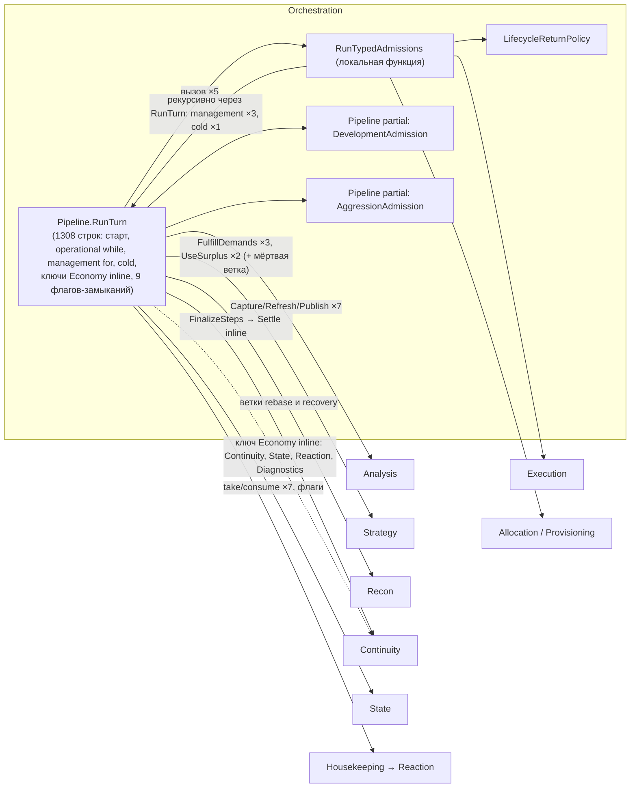
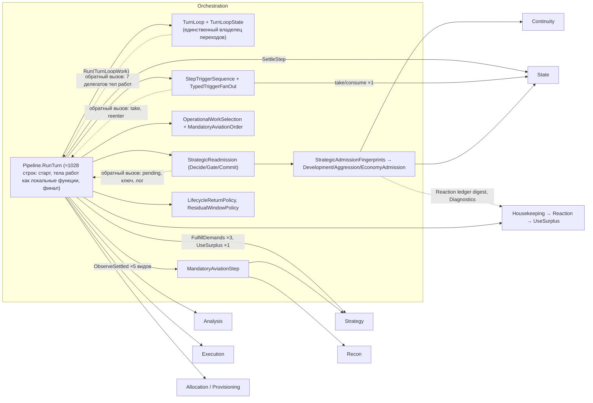

# AI V2 — упрощение пайплайна: связность уровней до и после

До: `fe2ccdf4` (baseline задачи). После: `6e223cc2` (merge уровней 0–5 в `master`). Анализ статический, по коду обеих ревизий; скрипт `D:/aiv-work/coupling/deps.py` (ссылка на тип, объявленный в другой папке `Ai/V2`, считается зависимостью; строки и комментарии исключены).

## 1. Итог в одной таблице

| Показатель | До | После | Вывод |
|---|---|---|---|
| Связи между папками-уровнями `Ai/V2` | 203 | 203 | граф уровней **не изменился**: ни одна связь не добавлена и не удалена |
| Папки, от которых зависит `AiStrategyV2Pipeline.cs` | 14 | 14 | оркестратор по-прежнему знает все уровни |
| Внешние типы `AiStrategyV2Pipeline.cs` | 100 | 84 | 16 ушли в выделенные классы той же папки |
| Внешние типы всей управляющей части `Orchestration/` (без файлов моделей) | 116 | 118 | +`MaterializationReservation`, +`DeferredAdmissionGate`, `InfrastructureFulfillment` → `EconomyReservationLifecycle`, −`StrategicInvalidation` |
| Кто вне `Orchestration/` использует её управляющие типы | никто | никто | новые типы (`TurnLoop`, `StrategicReadmission`, …) — внутренние; внешние ссылки только на модели данных (`MissionProposal`, `Radar`, `DesireAxis`, …) |
| Упоминания делегатных типов (`Func<>`, `Action<>`) в `Orchestration/` — обратные вызовы | 0 | 23 | новые явные каналы обратного вызова (`TurnLoopWork`, `StrategicReadmission.Decide/Gate`, `StepTriggerSequence.Run`, `TypedTriggerFanOut.Split`, `MandatoryAviationStep.Execute`, колбэки результата) |
| Обратные вызовы операционного допуска из Phase B / cold | 4 | 0 | устранены (событие `OpenPass`) |
| Самостоятельные копии протокола наблюдения после мутации | 7 | 1 общая (`ObserveSettled`) + 3 явных исключения | скрыты за интерфейсом Analysis |

**Вывод.** Связность **между архитектурными уровнями не уменьшилась**: те же 203 связи, оркестратор зависит от тех же 14 папок. Уменьшилась связность **внутри Orchestration**: исчезли обратные переходы между циклами, дублированные протоколы сведены к одному владельцу, управляющее состояние получило владельцев. Цена — новые явные обратные вызовы (23 упоминания делегатных типов) (инверсия: новые классы вызывают тела работ и запросы `RunTurn` через делегаты) и общий изменяемый объект `TurnLoopState`.

## 2. Связи по видам

Статус: **устранена** — связи больше нет; **скрыта** — осталась, но проходит через один интерфейс/владельца вместо нескольких мест; **сохранена** — как была.

### 2.1 Прямые вызовы между уровнями

| Связь (до) | Мест вызова до → после | Статус |
|---|---|---|
| Orchestration → Analysis: Capture → `RefreshStrategicKnowledge` → Capture → `PublishStepObservationDelta` после мутации | 7 → 1 функция `WorldAnalysis.ObserveSettled` (вызов в 5 видах работ) | **скрыта** за интерфейсом Analysis |
| Orchestration → Recon/Strategy: `ReconAirExecutor.RunActorStep`, `AviationRebasePlanner.ExecuteContinuation` для обязательной авиации | 2 ветки → `MandatoryAviationStep.Execute` | **скрыта** (адаптер в Orchestration) |
| Orchestration → Continuity: `FinalizeSteps` → `Settle` по каждому результату | inline → `AiTurnSession.SettleStep` (State) | **скрыта** |
| Orchestration/Provisioning → Strategy: резервы Economy (`InfrastructureFulfillment.Reserve*/Reconcile*/Release*`) | те же вызовы → `EconomyReservationLifecycle` | **сохранена** (переадресована внутри Strategy) |
| Orchestration → Continuity/State/Reaction/Diagnostics: входы ключа допуска Economy (inline в `RunTurn`) | inline → `EconomyAdmission` через `StrategicAdmissionFingerprints.For` | **скрыта** (зависимости перенесены в доменный класс той же папки, не исчезли) |
| Orchestration → Strategy: `StrategicManager.FulfillDemands` | 3 места (первый Phase A, повторный допуск, cold) | **сохранена** |
| Orchestration → Strategy: `StrategicManager.UseSurplus` | 1 (раунд) | **сохранена** |
| Housekeeping → Reaction → Strategy (`UseSurplus` после Reaction) | 1 | **сохранена** (уровни не трогали) |
| Orchestration → Allocation/Provisioning/Execution (`Pack`, provisioning retry, `TaskExecutor`, `ReconAir`) | без изменений | **сохранена** |
| Orchestration → State: `StrategicInterruptRegistry` через `AiTurnSession` (take/consume) | 7 inline-вызовов take → 1 (`TakeTypedSplit` из `StepTriggerSequence`) | **скрыта** |

### 2.2 Обратные вызовы и обратные переходы

| Связь | До | После | Статус |
|---|---|---|---|
| Phase B (management) → операционный допуск (`RunTypedAdmissions`) | 3 вложенных вызова | 0; раунд возвращает итог, `TurnLoop` открывает проход | **устранена** |
| Cold → операционный допуск | 1 вложенный вызов | 0; событие `OpenPass(ColdChanged)` | **устранена** |
| Цикл хода → тела работ `RunTurn` | — (код inline) | `TurnLoopWork`: 7 делегатов (`OpenPass`, `Iteration`, `TerminalForce`, `FirstPhaseBSettle`, `TempoRound`, `ColdAxisCount`, `Cold`) + 3 обратных результата (`stopPass`, `TempoRoundOutcome`, `changed`) | **новая** (инверсия; скрывает тела работ за интерфейсом) |
| Протокол допуска → оркестратор | — | `StrategicReadmission.Decide(pending, fingerprintOf, onUnchanged)`; `StepTriggerSequence.Run(take, reenter, reentryChanged, done)` | **новая** (инверсия) |
| Протокол допуска → Recon | inline `AviationObligations.Pending` | делегат `pending` в `Gate` (читается лениво) | **скрыта** |
| Fan-out → Continuity | inline проверка готовности builder | делегат `EconomyBuilderReadyForCompletion` в `TypedTriggerFanOut.Split` | **скрыта** |
| Авиационный шаг → результат | `moved` / `Mutated` разных исполнителей | один `Action<bool> actionChanged` | **скрыта** |

### 2.3 Общие изменяемые данные

| Данные | Писатели до | Писатели после | Статус |
|---|---|---|---|
| Кадр решения (`snapshot`, objectives, intents, commitments, demands) — локали `RunTurn` | ~6 мест в замыканиях | те же локали; рецепт обновления — `RefreshDecisionFrame` (1) | **сохранена** (общий кадр замыканий; рецепт объединён) |
| Управляющие счётчики/флаги (`settledSteps`, `noProgress`, окно cold, возвраты, `phaseBHandled`, `released`, переменная раунда) | 9 переменных + `managementRound`, писатели — разные места `RunTurn` | `TurnLoopState`: `PassOpen`, `PassCause`, `Stage`, `PhaseBRounds` пишет только `TurnLoop`; `SettledSteps`, `ReturnsDeferred` пишут только тела работ (`TurnLoop` читает); `NoProgressCycles` (сброс по вердикту раунда) и `ResidualWindow` (сброс при открытии прохода) пишут обе стороны | **скрыта частично**: 4 поля с одним писателем-владельцем цикла, 2 — с одним писателем-телом работ, 2 — общие для двух классов |
| Состояние допуска (отложенные оси, последний ключ оси) | 2 переменные-замыкания | `StrategicReadmission` (пишут только его методы) | **скрыта** |
| `MaterializationReservation` (carried) Phase A / Phase B / Housekeeping | 4 выражения `phaseB ?? phaseA` | `CarriedReservation()` (1), запись — у владельцев Phase A/B | **сохранена** (доступ объединён) |
| Статические реестры: `StrategicInterruptRegistry`, `CapabilityPoolExhaustionRegistry`, `AviationObligationStallRegistry`, `LifecycleReturnPolicy.LastWait`, `OperationContinuationWindow`, `StrategicResourceReservationLedger`/`MissionLeaseBook`, `WorldDeltaLifecycle`, `StrategicTempoBudget` | без изменений | без изменений | **сохранена** |

### 2.4 Обязательный порядок обновлений

| Порядок | До | После | Статус |
|---|---|---|---|
| Наблюдение после мутации: Capture → refresh → Capture → publish до ledger/settle | 7 копий | `ObserveSettled` | **скрыта** |
| Снимок pending-фактов → fan-out всем → consume только снятого; пары take→reenter | 4 inline-копии | `TypedTriggerFanOut` + `StepTriggerSequence` (пары — константы по виду) | **скрыта** |
| Ключ допуска: после refresh кадра и до `Generate`; `Commit` после прохода | inline | `Decide`/`Commit` API; сам порядок вызовов — в `ReenterStrategicAxes` | **скрыта частично** |
| Свежесть кадра (`ownershipFreshAfterPhaseA`: писатель обязан выставить после refresh, итерация сбрасывает) | протокол в `RunTurn` | тот же | **сохранена** |
| Settle window перед первым Phase B | позиция в коде | `TurnLoop` при `PhaseBRounds == 0` | **скрыта** |
| Возвраты ждут до конца первого раунда Phase B | флаг `released` | `TurnLoopState.ReturnsMayWait` | **скрыта** |
| `TerminalForce` в конце каждого прохода; проход раньше раунда и cold | позиция в коде | `TurnLoop.ClosePass`, `TurnLoop.Phase` | **скрыта** |
| Cold — после всех раундов, по окну последнего прохода | позиция + флаг | `Stage` + сброс окна в `OpenPass` | **скрыта** |
| `ReconcileEconomyCompletion` перед `UseSurplus` и после шага миссии; места `CheckBoundary` и `ObserverBoundary` по видам | в каждом виде | в каждом виде | **сохранена** (различия видов — по замыслу) |
| Миссия: refresh/публикация → ledger → `SettleStep` → reconcile → boundary → триггеры | inline | inline (тело итерации) | **сохранена** |
| Время жизни `ProvisioningSession` = одна итерация | `using` в теле `while` | `using` в `RunAdmissionIteration` | **сохранена** |
| Housekeeping → Reaction → освобождение её резерва → повтор Phase B → `AuditTurnEnd` → `CompleteReservations` | — | — | **сохранена** |

## 3. Схемы зависимостей

Стрелка — «зависит / вызывает». Уровни вне Orchestration показаны одним узлом на папку; связи между ними не менялись и опущены.

До (`fe2ccdf4`):

После (`6e223cc2`):

Сравнение: исчезла петля `RunTypedAdmissions ↔ RunTurn` (обратные переходы); вместо неё появились три петли обратного вызова (`TurnLoop`, `StrategicReadmission`, `StepTriggerSequence` → `RunTurn`). Рёбра к другим уровням те же; часть из них теперь выходит не из `RunTurn`, а из выделенных классов Orchestration (`MandatoryAviationStep` → Recon/Strategy, `*Admission` → Continuity/State/Reaction).

## 4. Сколько уровней менять при расширении

Уровень = папка `Ai/V2`. «Места» — точки правки.

| Изменение | До: уровни / места | После: уровни / места | Оценка |
|---|---|---|---|
| **Новый вид работы внутри прохода** (как обязательная авиация: оплачен заранее, идёт до миссий) | Orchestration + доменный исполнитель (2 уровня); места: новая ветка в `RunTypedAdmissions` с собственной копией завершения (Capture → refresh → publish → `settled++` → `CheckBoundary` → take/reenter → progress → stall, ~50 строк) | Orchestration + доменный исполнитель (2 уровня); места: значение `MandatoryAviationKind`/`OperationalWorkKind`, `Select`/`Next`, `MandatoryAviationStep` (адаптер), число пар; каркас шага и наблюдение переиспользуются | уровней столько же; мест больше, копируемого кода меньше |
| **Новый вид работы уровня хода** (пакет, как Phase B или cold) | Orchestration + доменный владелец (2); места: новый блок в `RunTurn`, свои флаги, свои вложенные вызовы `RunTypedAdmissions`, своя проверка bounds | Orchestration + доменный владелец (2); места: `TurnPhase`/`TurnStage`, `TurnLoop.Phase`, ветка в `TurnLoop.Run`, делегат в `TurnLoopWork`, тело в `RunTurn`, при повторном допуске — правило в вердикте/`AdmissionCause`; тесты-транскрипция `AiTurnLoopTests` | уровней столько же; обратных вызовов допуска писать не нужно, но правка идёт в двух классах и в тестах |
| **Новое последствие наблюдения** (что-то, что каждая мутация должна обновить/опубликовать) | Orchestration, 7 копий | Analysis (`ObserveSettled`, 1 место) + 3 явных исключения (первый Phase A, formation, повторный допуск) | меньше мест; уровень тот же |
| **Новое последствие после триггеров** (для всех работ после take/reenter) | Orchestration, 4 копии | Orchestration, `StepTriggerSequence.Run` (1) | меньше мест |
| **Новое доменное последствие шага** (например, reconcile после каждой работы) | Orchestration, 8 последовательностей | Orchestration, 7 последовательностей (по месту в каждом виде: миссия, авиация, Phase B, cold, recall, первый Phase A, formation) — узкий U | почти без изменений; это сознательный выбор варианта A |
| **Новый тип факта / новый потребитель** (новая причина invalidation и ось, которая на неё реагирует) | Strategy (маска оси) + Orchestration (inline take/reenter; ключ Economy inline или partial `Pipeline`) | Strategy (маска оси) + Orchestration (`TypedTriggerFanOut` — только при особом правиле, доменный `*Admission`, строка в `StrategicAdmissionFingerprints.For`); `RunTurn` не меняется | уровней столько же; `RunTurn` не трогается |
| **Новое ограничение цикла** (bound / условие остановки) | Orchestration, 3 места (`while`, management `for`, cold guard) | Orchestration, `TurnLoopState.WithinStepBounds` / `TurnLoop` (1–2) | меньше мест |

## 5. Ответ на вопрос

Устройство проекта **на уровне архитектурных слоёв не стало менее связанным**: граф зависимостей между папками тот же (203 связи), оркестратор по-прежнему зависит от 14 уровней, общие статические реестры и порядок их обновления не менялись. Рефакторинг уменьшил связность **внутри слоя Orchestration**:
- устранены обратные переходы между циклами (4 вложенных вызова операционного допуска);
- семь копий протокола наблюдения и четыре копии take→reenter сведены к одному владельцу в правильном слое (Analysis, State-через-`StepTriggerSequence`);
- состояние допуска инкапсулировано в `StrategicReadmission`, четыре управляющих поля цикла пишет только `TurnLoop`.

Цена и оставшиеся связи:
- новые обратные вызовы (23 упоминания делегатных типов): `TurnLoop`, `StrategicReadmission` и `StepTriggerSequence` вызывают код `RunTurn` через делегаты — зависимость не исчезла, а инвертирована и скрыта за интерфейсом;
- `TurnLoopState` — изменяемый объект, общий для `TurnLoop` и тел работ: `NoProgressCycles` и `ResidualWindow` пишут обе стороны, `SettledSteps` и `ReturnsDeferred` пишут тела работ, а читает `TurnLoop`;
- кадр решения остаётся набором локалей `RunTurn`, общих для 14 локальных функций;
- обязательные порядки внутри видов работ (reconcile, `CheckBoundary`, observer boundary, ledger) остаются явными по местам — по решению о варианте A.

Практический эффект: изменения, которые раньше требовали правки нескольких копий в `RunTurn` (наблюдение, триггеры, bounds, новый потребитель факта), теперь делаются в одном месте; число затрагиваемых уровней при добавлении нового вида работы или последствия не уменьшилось.
