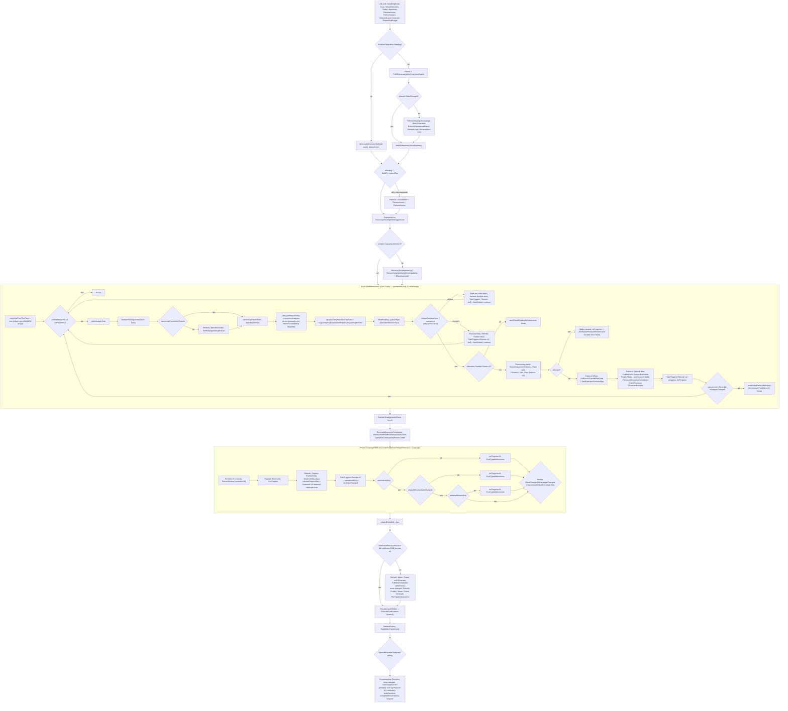

# Упрощение пайплайна AI V2 — Уровень 0 (baseline и карта фактической схемы)

Статус уровня 0: **проверен доступными средствами — native не выполнен** (см. §16–§17). Поведение не менялось; вынесены чистые единицы с тестами (§9).
База: `master` @ `fe2ccdf4`. ТЗ проверялось на `1e77ed0a`; между ними изменены только
`Analysis/WorldAnalysis.Knowledge.cs`, `.Observation.cs`, `WorldSnapshot.cs`,
`Continuity/MissionContinuityLayer.Raid.cs`, `Execution/RaidExecutor.cs`,
`Provisioning/RaidProvisioner.cs`, `Strategy/Objectives/RaidObjectiveEvaluator.cs`
(Hex Event knowledge). `Orchestration/` идентична ревизии ТЗ.
Среда: Unity 6000.5.4f1 (ProjectSettings/ProjectVersion.txt). Все номера строк — `AiStrategyV2Pipeline.cs` @ `fe2ccdf4`.

## 0. Дополнения владельца (2026-10-09)

1. **Разнести/уменьшить крупные классы** — часть объёма рефакторинга. Разделение по ответственности в отдельные классы (не просто `partial`: по ТЗ §4 п.5 partial не засчитывается как упрощение). Первые кандидаты: `Pipeline.RunTurn` (~1300 строк) с вложенными локальными функциями (`StrategicAdmissionFingerprint`, `TakeTypedTriggers`, `ReenterStrategicAxes`, `RunTypedAdmissions`); размеры остальных классов — измерить на Уровне 0 и внести в SRP-таблицу. Новый класс допустим только после поиска существующего владельца и фиксации входов/выходов/срока жизни (ТЗ §1).
2. **После каждого уровня — проверка реализации снизу вверх** (от банка/кешей и вызываемых владельцев к оркестрации) на соответствие ожидаемому результату ТЗ: пункты объёма, инварианты §3, gate §5.4. Результат проверки — раздел в отчёте уровня.

## 1. Фактическая схема `Pipeline.RunTurn`

Вызывающий: `AiTurnController` → `RunEstimateCached(Pipeline.RunTurn)` → затем внешний
`WaitAtObserverActionBoundary` → `onDone`. **Поправка (Уровень 5, 2026-10-09):** Reaction запускается **внутри** `RunTurn` — из Housekeeping (`HousekeepingManager.RunHousekeeping` → `StrategicReactionPass.ExecuteIfPending`; затем освобождение резерва Reaction и повтор Phase B `UseSurplus`, ≤ `maxEndOfTurnTempoReruns`), после `SettleAfterTurn` и до `AuditTurnEnd`/`CompleteReservations`. Прежняя запись «Reaction вне `RunTurn`» была ошибочной.



## 2. Метрики раздела 2 (исходные значения)

| # | Метрика | Значение @fe2ccdf4 | Где |
|---|---|---|---|
| 1 | Самостоятельные циклы решения | **8** (6 в `RunTurn` + 2 вложенных внутри `StrategicManager`; см. §10.0):  operational `while` (L599); management `for` (L1090); provisioning `while` (L827) с двумя независимыми бюджетами realloc (≤3 и ≤3); `foreach` recall (L1255); Phase A re-entry (вложенный `FulfillDemands`); `foreach` cold (однопроходный, не цикл). Владельцев: Pipeline (4), Allocator/Provisioning (внутренний retry), StrategicManager (внутри Phase A/B) |
| 2 | Входы в strategic re-admission | **10** вызовов `ReenterStrategicAxes`: L609 flush, L725 rebase, L775/L788 recovery (x2), L1018/L1030 task (x2), L1058 force, L1069 capacity unlock, L1129/L1144 management (x2). `TakeTypedTriggers` — 7 вызовов (L722,772,782,1015,1024,1124,1134); 4 раза подряд «take → reenter → take → reenter» (дублирование compound-fan-out) |
| 3 | Самостоятельные последовательности завершения | **8**: Phase A (L223-246), formation (L252-271), rebase (L708-742), recovery (L754-806), ordinary task (L964-1048), Phase B round (L1094-1119), cold (L1211-1248), recall (L1257-1270) |
| 4 | Обходные пути обратно в operational admission | **5** точек `RunTypedAdmissions()` (L1073 основной, L1158, L1167, L1173 из management, L1243 из cold) + flush на входе итерации |
| 5 | Сохраняемые флаги/счётчики | `ownershipFreshAfterPhaseA` (writers: init L294, L541, L623, L1241; reader L613), `zeroRadarResidualWindow` (writers L566 reset, L810, L953, L1043; reader L1188), `lifecycleReturnsReleased` (writer L1122; reader L631), `lifecycleReturnsDeferred` (writer L639; reader L1121), `phaseBHandled` (writer L1180; reader L1291), `reentryStateChanged` (L449/453/561), `settledSteps`, `noProgressCycles` (12 writers), `deferredAdmission`, `lastStrategicAdmissionFingerprint`, `retryNextTurnThisPass` (сбрасывается при каждом входе в RunTypedAdmissions) — всё замыкания внутри `RunTurn`, reset owner = сам `RunTurn` |

Размер: `RunTurn` L89-1395 (~1300 строк в одном методе) с вложенными локальными функциями.

## 3. Наблюдения уровня 0 (подлежат проверке тестами, не готовые решения)

1. **`if (!phaseBHandled)` (L1291-1306) — вероятно, мёртвая ветка.** Блок L289-1283 безусловный, `phaseBHandled = true` (L1180) выполняется всегда, при отсутствии `yield break` между ними. Но нельзя удалять без characterization-проверки (ТЗ: не удалять флаг только потому, что он кажется лишним) — исключение может выйти только через throw, где ветка не достигается тоже. Кандидат на уровень 4/5.
2. **Порядок в ordinary-шаге (L964-1012), закреплён ТЗ как baseline:** capture before → execute → `RefreshStrategicKnowledge` → capture after → `PublishStepObservationDelta` → `RecordExecution`/telemetry → `RecordDeferrals` → `RefreshObjectiveStatesLive` → `FinalizeSteps`→`turnSession.Settle` → `ReconcileEconomyCompletionReservations` → `CheckBoundary` → `WaitAtObserverActionBoundary` → triggers.
3. **Rebase/recovery отличаются от ordinary** (ключ к Уровням 1–2):
   - нет ledger/`Settle`/`ReconcileEconomyCompletionReservations`;
   - нет `WaitAtObserverActionBoundary` после шага (есть только в ordinary и в Phase A/B);
   - нет `RefreshOperationalFrame` (в ordinary тоже нет — кадр освежается в начале следующей итерации через `!ownershipFreshAfterPhaseA`);
   - recovery: два прогона take→reenter; rebase: один;
   - прогресс = `moved || strategicChanged`, а не `er.Outcome.StateChanged`;
   - no-progress → `MarkStalled` per-wing, `continue` (без `break`);
   - обе ветки выполняются ПОСЛЕ `BuildMissionSet/BindFunding/Pack` (L628-691), то есть аллокация считается и выбрасывается.
4. **Cold-ветка (L1186-1250)** запускает `FulfillDemands` без `deferFreshZeroRadar`, а затем `RunTypedAdmissions` — единственный «поздний» вход, зависящий от `zeroRadarResidualWindow` (три писателя с разной семантикой: «нет Funded», «отказ без positive/commitment», «остальные Funded только zero»).
5. **`retryNextTurnThisPass` пересоздаётся на каждый вход в `RunTypedAdmissions`**, а межвходная память — только `CapabilityPoolExhaustionRegistry`. Любое слияние циклов в один обязано сохранить эту границу сброса (ТЗ 3.1).
6. **Raw resource ratchet:** `Assets/Editor/AiRawResourceReadRatchetTests.cs:55` допускает ровно 6 raw-чтений в `Orchestration/AiStrategyV2Pipeline.cs` — перенос fingerprint (Уровень 3) должен учесть ratchet.
7. `LifecycleReturnPolicy.LastWait` — статический словарь без привязки к ходу, чистится `ClearAll()`; граница «ждал вчера» = `last == turn-1`.

## 3a. Покрытие тестами оркестрации и размеры классов

**Покрытие `RunTurn`.** Ни один тест в `Assets/Editor` не вызывает `Pipeline.RunTurn`, `RunTypedAdmissions`, `ReenterStrategicAxes` или `TakeTypedTriggers` (это локальные функции внутри корутины). Тестируются только вынесенные статические куски: `DevelopmentAdmissionFacts/Fingerprint`, `AggressionAdmissionFingerprint`, `StrategicAdmissionNeeded`, `RefreshDevelopmentOpportunities`, `LifecycleReturnPolicy`. Вывод: **порядок действий в самом цикле сейчас не защищён тестами**. Любой уровень, меняющий порядок, сначала обязан вынести проверяемую единицу (класс с явными входами/выходами) и добавить на неё характеризационные тесты на baseline. Это совпадает с требованием владельца разнести крупные классы: выделение классов — предпосылка тестируемости, а не косметика.

Размеры самых крупных файлов `Ai/V2` (строки): StrategicCardEvaluator 2090; DemandLayer.Economy 1723; **AiStrategyV2Pipeline 1568**; ReconAssignmentPlanner 1499; StrategicEffectRegistry 1437; MissionContinuityLayer.Attack 1409; InfrastructureFulfillment 1219; DevelopmentOpportunityEvaluator 1213; WorldSnapshot 1161; StrategicPhaseA 1144; ResourceAllocator 1072; GroundCombatAssaultTransaction 1021; TaskExecutor 1004; MissionContinuityLayer 977. В объём этой задачи входят только файлы из таблицы ТЗ §1 (Pipeline, InfrastructureFulfillment, StrategicPhaseA, ResourceAllocator, TaskExecutor, MissionContinuityLayer*); остальные крупные классы — вне объёма, пока владелец не скажет иначе.

Сопоставление сценариев §12 с существующими fixtures (имена файлов подтверждены): AiReconAirLifecycleTests, AiAviationSortieCycleTests, AiWorldDeltaTests, AiLifecycleIngressTests, AiMissionLeaseLifecycleTests, AiEconomyReservationLifecycleTests, AiAggressionReadmissionTests, AiDevelopmentReadmissionTests, AiLifecycleReturnPolicyTests, AiRouteCacheIsolationTests, AiCombatCacheLifecycleTests, AiObserverPauseTests, AiTurnSessionIsolationTests, AiHousekeepingMissionContractTests. Fixture для bounded-loop и для порядка rebase/recovery отсутствует — создаётся.

## 4. Bounds (читать из `AiConfigV2`)

| Константа | Значение |
|---|---|
| `maxMidTurnStepsPerTurn` | 96 |
| `maxMidTurnNoProgressCycles` | 2 |
| `maxEndOfTurnTempoReruns` | 1 (⇒ 2 management-раунда) |
| `maxReallocIterations` | 3 (отдельно assignment и reprice) |
| `lifecycleReturnHomeThreatSeverity` | 0.25 |
| yield budget | 0.008 с (локальная const L596) |

Важно: `settledSteps`/`noProgressCycles` объявлены вне `RunTypedAdmissions` и **разделяются** всеми пятью входами (management обнуляет `noProgressCycles = 0` перед входом, `settledSteps` — нет). Это и есть «глобальные bounds» ТЗ.

## 5–6. Банк, кеши и список работ Уровня 0

Полные таблицы банка — §11, кешей — §12, DRY/SRP — §13, сценарии — §14, сигнатуры — §15, проверка снизу вверх — §16. Статус пунктов:

- [x] Baseline тестов (§7); `compile_check.sh` (Linux) и Unity не запускались.
- [x] Карта переходов, банк, кеши, DRY/SRP, план разделения классов, сигнатуры.
- [x] Characterization-тесты чистых единиц (§9); цепочка `RunTurn` — только нативно (§14).
- [ ] Нативный эталон `[AI][V2][Loop]` (владелец, Unity).

## 7. Результаты baseline

Ревизия `fe2ccdf4`, сборка net472 + mono из Unity 6000.5.4f1, 0 ошибок компиляции. Native Unity не запускался.

| Прогон | Всего | Прошло | Упало |
|---|---|---|---|
| `run.sh l0-base` (без патчей) | 2043 | 1370 | 673 |
| `patchrun.sh` (`D:/aiv-work/l0-base-p`, **эталон для сравнения**) | 2043 | 1571 | 472 |

Падения — тесты, которым нужен настоящий движок (UnityEngine.Object и т. п.). Baseline не обновлять после изменений; сравнивать через `regress.py`.

## 9. Вынесенные под тесты единицы (Уровень 0, без смены поведения)

| Единица | Было | Стало | Владелец/срок жизни |
|---|---|---|---|
| `MandatoryAviationOrder.RebaseFirst(int?, int?)` | inline `rebaseFirst` в `RunTypedAdmissions` | статическая чистая функция, `Orchestration/` | без состояния |
| `ResidualWindowPolicy.AfterNoProvisionedTask / AfterSettledTask` | две inline-формулы `zeroRadarResidualWindow` (L953, L1043) | чистые предикаты над `Funded`; флаг и его сброс остаются у `RunTurn` | без состояния |
| `LifecycleReturnPolicy.SelectWaiting(missions, intents, player, turn)` | inline `Where(IsDeferrableReturn ∧ MayWait)` в `RunTypedAdmissions` | метод существующего владельца политики | статический `LastWait` как раньше |
| `TypedTriggerFanOut.Split(reasons, Func<bool> economyBuilderReady)` → `TypedTriggerSplit` | тело локальной `TakeTypedTriggers` (-32 строки в `RunTurn`) | чистая функция; `Consume` остаётся в `turnSession` через `split.Consumed` | без состояния |

Логика перенесена построчно; `EconomyBuilderReadyForCompletion` по-прежнему вызывается лениво и только при `Actor`-only для Economy. Оба вызова из `RunTurn` сохранены, порядок действий не менялся.

Тесты: `Assets/Editor/AiPipelineOrchestrationUnitTests.cs` (14 случаев: приоритет и tie-break по Id, Actor-only для Economy, ленивость вызова, compound fan-out, формулы residual-окна, `SelectWaiting` с «ждал вчера», baseline-значения bounds). **Оговорка:** это тесты нового кода, на ревизии baseline они не компилируются; ожидаемые значения выведены чтением прежнего inline-кода, а не запуском на baseline. Эквивалентность держится на построчном переносе и ревью диффа.

Прогон (патченный, `D:/aiv-work/l0-cur2-p`): 2057 тестов, 1585 прошло, 472 упало; относительно baseline `l0-base-p` регрессий 0, новых прошедших 14. Unity не запускался.

## 10. Полная карта циклов и границ (дополняет §1–§4)

### 10.0 Вложенные циклы, не видные в `RunTurn`

| Цикл | Где | Граница | Область действия счётчика |
|---|---|---|---|
| Phase A `while (chainAttempts < 3)` | `StrategicPhaseA.FulfillDemands` L541 | `maxDemandFulfillmentActionsPerTurn = 3` | **локальный `int chainAttempts = 0` на каждый вызов** (L540). Несмотря на имя «PerTurn», каждый re-entry (`ReenterStrategicAxes`, cold) получает свои 3 действия |
| Phase B arbiter `while (!budget.TotalCapHit && iter <= 11)` | `StrategicPhaseB.UseSurplus` L120 | `maxEndOfTurnTempoActionsPerTurn = 10` + `StrategicTempoBudget.For(player, turn)` | бюджет — на ход (`StrategicTempoBudget`), `iter` и `parkedAt` — локальные на вызов. Парковка привязана к `WorldDeltaLifecycle.Current`, поэтому при новой мутации устаревает сама |

Следствие для Уровня 4: «Phase B budget» из ТЗ = `StrategicTempoBudget` (ходовой); «turn-scoped парковка» для Scout/миссий = `CapabilityPoolExhaustionRegistry` и `retryNextTurnThisPass`, а парковка Phase B живёт в пределах одного `UseSurplus`. Менять область действия счётчиков нельзя (ТЗ §3.1) — это изменение лимитов.

### 10.1 Переходы с guard-ами (для каждой стрелки)

| # | Переход | Guard | Приоритет / условие | Что меняет | Bound | Persistent flags |
|---|---|---|---|---|---|---|
| T1 | старт → Phase A | `!AviationObligations.Pending` | иначе `deferredAdmission.Defer(all)` | carried `Reservation`, AP | chainAttempts ≤ 3 | `ownershipFreshAfterPhaseA = phaseA.StateChanged` |
| T2 | Phase A → кадр | `phaseA.StateChanged` | полный `RefreshStrategicKnowledge` + `Generate(все оси)` | snapshot, demands | — | — |
| T3 | formation | `!Pending` | `BuildFormationPlan != null` | wing | — | — |
| T4 | loop top flush | `deferredAdmission.HasAxes ∧ !Pending` | раньше всего остального в итерации | demands (dirty axes) | settledSteps < 96 ∧ noProgress < 2 | `deferredAdmission` |
| T5 | кадр | `!ownershipFreshAfterPhaseA` | иначе кадр уже свежий | snapshot, 4 переменные кадра | — | `ownershipFreshAfterPhaseA = false` |
| T6 | BuildMissionSet → отложить возвраты | `!lifecycleReturnsReleased ∧ !HomeThreatened` | `SelectWaiting` (не ждал вчера) | `missionDeferrals`, `RecordWait`, `MarkProtectedThisTurn` | — | `lifecycleReturnsDeferred = true` |
| T7 | фильтр retry | `retryNextTurnThisPass ∪ ShouldSkipRetried` | durable-ноги получают причину отказа | `missions` | — | `retryNextTurnThisPass` (сброс на каждый вход) |
| T8 | mandatory aviation | `FindMandatoryContinuations` / `FindMandatoryRecoveryActors` | `MandatoryAviationOrder.RebaseFirst` | wing, `settledSteps++` | stall → `MarkStalled`, `continue` | `noProgressCycles` |
| T9 | нет funded | `Funded.Count == 0` | `break` | — | — | `zeroRadarResidualWindow = true` |
| T10 | provisioning | `scoutFailures` / `Provision` | realloc ≤ 3 (assignment) и ≤ 3 (reprice), независимо | аллокация, retry-set | 3 + 3 | `provisioningFailures`, `fundedKeysThisTurn` |
| T11 | не выбрано | `selected == null` | `break` без траты `settledSteps` | `noProgressCycles++` | — | `zeroRadarResidualWindow = AfterNoProvisionedTask` |
| T12 | исполнение + post-step | — | порядок — §3 п.2 | AP, мир, ledger | `settledSteps++` | — |
| T13 | triggers | `operational == None ∧ !strategicChanged` | `break` | — | — | `zeroRadarResidualWindow = AfterSettledTask` |
| T14 | force-flush после loop | `deferredAdmission.HasAxes` | admit даже при pending | demands | — | — |
| T15 | capacity unlock | `phaseA.CapacityUnlocks > 0` | сбросить fingerprint Development, re-enter | fp | — | `lastStrategicAdmissionFingerprint` |
| T16 | `RunTypedAdmissions` №1 | безусловно | основной operational | — | общие bounds | — |
| T17 | settle block | безусловно | `ReconcileEconomyCompletion`, `ReleaseDeferredEconomyIncomeCover`, `OperationContinuationWindow.Settle` | резервы (§11) | — | — |
| T18 | management round | `round ≤ maxEndOfTurnTempoReruns (1)` | Refresh → UseSurplus → Refresh → triggers | hand/AP/мир | 2 раунда | `lifecycleReturnsReleased = true` |
| T19 | operational re-admit | `operationalDirty` ∨ `phaseBRound.StateChanged` ∨ `releaseReturnsNow` | три отдельных `if`; вторая и третья ветки — только при `!operationalDirty` | `noProgressCycles = 0` | общие bounds | — |
| T20 | выход из management | `!StateChanged ∧ !strategicChanged` ∨ `!operationalDirty ∧ !strategicDirty` | | | | `phaseBHandled = true` |
| T21 | cold | `zeroRadarResidualWindow ∧ coldAxes > 0 ∧ settledSteps < 96 ∧ noProgress < 2` | Fulfill без `deferFreshZeroRadar` | AP/карты | chainAttempts ≤ 3 | `ownershipFreshAfterPhaseA = true` (если changed) |
| T22 | recall | `RecallUnsafeStrikes` | бесплатно (sortie оплачен) | wing | — | — |
| T23 | финал | — | `RefreshActors`, `SettleAfterTurn(∅)`, Housekeeping, `AuditTurnEnd`, `CompleteReservations` | старение (`LastReconciledTurn == turn` не стареет дважды) | — | — |

**Границы сброса флагов.** Все флаги — замыкания `RunTurn`; создаёт и сбрасывает только он сам (на ход). `retryNextTurnThisPass` — единственный флаг со сбросом на каждый вход в `RunTypedAdmissions`. `LifecycleReturnPolicy.LastWait`, `CapabilityPoolExhaustionRegistry`, `AviationObligationStallRegistry`, `OperationContinuationWindow` — статические, ключ (player, turn); закрываются в `AiTurnSession.Dispose`.

**`zeroRadarResidualWindow`:** три писателя с тремя формулами (T9 — `true`; T11 — `AfterNoProvisionedTask`; T13 — `AfterSettledTask`), а в начале каждого входа в `RunTypedAdmissions` флаг сбрасывается (L566). Поэтому cold-ветка видит значение **последнего** входа, а не всего хода. Поведение сохранить. Формулы покрыты тестами `ResidualWindowPolicy`; цепочка «последний вход» — нет (см. §14).

## 11. Банк: writers/readers и сквозная цепочка

### 11.1 Цепочка (сверху вниз)

`PlayerRoot` (физический запас AP/H/E/M/T) → `TurnResourceBook.Physical` → `Free = Physical − Σ claims, которые spender не вправе тронуть` (`MayDrawOn`: своя запись; `EconomyCompletesNow` вправе тратить чужие `EconomyDeferred`) → `StrategicSpendability.SpendableAp / SpendableAmount / FitsSpendable*` → распределение (`ResourceAllocator`: `AllocationSession.Pack`, tentative) → tentative claims провижининга (`AiTurnSession.CreateProvisioningClaims` / `PassActorSet`, не durable) → каноническая трата (gameplay-примитив, `PlayerRoot`) → durable ownership (`MissionLeaseBook.Reserve / Upsert` → `StrategicResourceReservationLedger`) → release/expiry (`Retire`, `ReleaseByOwner / ByReason`, `ReplaceReasonOwner`, `ExpireStage`) → следующая трата.

Виды claims в `TurnResourceBook`: `EconomyDeferred` (H/E/M/T, не AP), `EconomyCompletion` (H/E/M/T + AP), `Reaction`, плюс **производный** `OperationContinuation` (не в ledger; AP следующей ноги Hard-операции; «младший» claim ≤ `AP − committed ledger AP`; закрывается `OperationContinuationWindow.Settle`). Mandatory-авиация ничего не держит (исполняется до карт).

### 11.2 Writers резервов (все — через `MissionLeaseBook`)

| Writer | Операция | Reason / expiry | Жизненный цикл | Из `RunTurn`? |
|---|---|---|---|---|
| `InfrastructureFulfillment.ReserveEconomyCost` | Upsert AP + H/E/M/T; при Completion сначала `ReplaceReasonOwner(Deferred, owner)` | Deferred / Completion, EndOfTurn | ход | косвенно (Phase A, Provisioning) |
| `…ReserveDeferredEconomyResourcesCore` (+ForPendingHero) | `ReplaceReasonOwner` + `ReserveEconomyCost`; **не понижает** существующий Completion этого owner | Deferred | ход | Phase A |
| `…ReconcileEconomyCompletionOwner` | Completion → Deferred (durable H/E/M/T) или Release | → Deferred | ход | через `ReconcileEconomyCompletionReservations` (3 вызова в Pipeline: L1004, L1076, L1104) |
| `…ReleaseDeferredEconomyIncomeCover` | Upsert `Amount − cover` по строкам Deferred; cover = `IncomeProjection.IncomeFor`; детерминированно по owner | Deferred | один раз на ход, после settle | L1080 (и L1293 — мёртвая ветка) |
| `…ClearDeferredEconomyResources`, `RetainDeferredEconomyOwner` | `ReplaceReasonOwner(owner=null — весь reason)` / `ReleaseReasonExceptOwner` | Deferred | ход | Phase A (единственный writer reconcile) |
| `InfrastructureFulfillment` L269 | `ReleaseByOwner` при `Built` | — | ход | Phase A |
| `TaskExecutor.ReleaseEconomyReservation` L960 | `ReleaseByOwner(pm.ReservationOwner)` | — | шаг | ordinary step |
| `MissionContinuityLayer` L240 (retarget), `.Economy` L507/L530 | `ReleaseByOwner` старого owner | — | шаг/ход | Continuity |
| `MissionIntentState` L38/45/46 | `Leases.Retire(key)` = снять actor-claims **и** ресурсы operation | — | при retire intent | Continuity |
| `StrategicPhaseB.RefreshReactionReservation` | `ReleaseReasonExceptOwner` + Upsert (AP + 4 ресурса) | StrategicReactionPass, EndOfReaction | Phase B → Reaction | `UseSurplus` |
| `StrategicPhaseB` L100 | `ReleaseByReason(Reaction)`, когда реакция неосуществима | | | `UseSurplus` |
| `ReactionRoundExecutor` L48/L79, `StrategicReactionPass` L230 | `ReleaseByReason` / `ExpireStage(EndOfReaction)` | | Reaction | через `RunHousekeeping` (внутри `RunTurn`; поправка Ур. 5) |
| `HousekeepingManager` L77 | `ReleaseByReason(Reaction)` перед tempo rerun | | | через `RunHousekeeping` |
| `AiTurnSession.CompleteReservations` / `Dispose` | `ExpireStage(EndOfTurn)` + `AssertClearAtTurnEnd` | EndOfTurn | конец хода | L1376 |

Единственное хранилище строк — `StrategicResourceReservationLedger`; actor-claims — единственная таблица `MissionLeaseBook._actors`; provisioning pass-claims — отдельные `MissionLeaseBook` (`_passClaims`), закрываются вместе с сессией. Производный claim (`OperationContinuation`) нигде не хранится.

### 11.3 Шаблон таблицы «до/после» и baseline-инварианты

Шаблон строки для отчётов уровней: `turn | operation key | pass key | stock AP/H/E/M/T | ledger rows (owner·reason·amount·expiry) | actor claims | actual debit | результат`. На Уровне 0 зафиксированы схема и инварианты из кода; числовые трассы сценариев **не сняты** (нужен нативный лог, §14).

Baseline-инварианты (подлежат тестам на следующих уровнях):
1. Два owner’а, completion(A) и deferred(B) на одном ресурсе: строка B не мешает завершению A (`EconomyCompletesNow`), строка A вычитается из `Free` для B и для всех не-Economy трат.
2. `ReleaseDeferredEconomyIncomeCover` вызывается один раз после settle, только для строк, которые не смогли завершиться (после `ReconcileEconomyCompletionReservations`). Общий income-cover делится между owner’ами детерминированно (порядок по `Owner`), второй раз не считается.
3. Reaction-envelope живёт до EndOfReaction; освобождается в `UseSurplus` при неосуществимости, в Reaction round и в Housekeeping; на конец хода — `ExpireStage(EndOfTurn)` и `AssertClearAtTurnEnd` (страховка: ни одна резервация не переживает ход).
4. Deferred может превышать stock (защита H/E/M/T на будущее); **AP-deferred нет** (`ReserveEconomyCost` пишет AP только при `buildAp > 0`, то есть при completion).
5. `Retire(operation)` вызывается **после** политики домена, не по завершении ноги (комментарий `MissionLeaseBook.Retire`): завершённая нога ≠ terminal operation.
6. No-op/rollback ресурс не списывает: списывает только gameplay-примитив; ledger лишь отражает резерв.

## 12. Кеши: чтение и запись

### 12.1 Источники и ключи

| Кеш / источник | Писатель | Ключ валидности | Читатели | Граница жизни |
|---|---|---|---|---|
| `WorldSnapshot` | `WorldAnalysis.Scan / RefreshStrategicKnowledge / RefreshOperationalState` | новый объект на каждый refresh; идентичность = (Observer, TurnNumber, Map, `MapPathingVersion`); `Known` / `MapKnowledge` переиспользуются **только** при `KnowledgeVersion == AiMapMemory.KnowledgeVersionFor` | все стадии | кадр |
| `KnowledgeVersion` | `AiMapMemory` | per-player счётчик | Refresh | игра |
| `StrategicInterruptRegistry` (reasons + payload по каждому reason) | `WorldDeltaLifecycle.Apply / Commit / Publish` | (player, turn); `Consume(mask)` чистит только запрошенные reasons и их payload | `TakeTypedTriggers` | ход |
| `WorldDeltaLifecycle.Current` | `Apply` / `CommitMutation` (+1 только при `HasMutation`), commit транзакции | глобальный счётчик; `IsCurrent(planned)` | планы/исполнители, парковка Phase B | процесс |
| `lastStrategicAdmissionFingerprint` | `ReenterStrategicAxes` | строка по оси | допуск | ход (замыкание) |
| Route cache (`SafeStepPathing`) | `EnsureCacheState` | `map.PathingVersion` + `AiMapMemory.RouteMemoryVersionFor(owner)`, профиль Standard/Combat/Attack; ≤ 512 маршрутов | движение, Provisioning | карта/знание |
| Combat estimate cache (`WorthIt.EstimateCache`) | `WorthIt` (MC) | `EstimateCacheKey` (поля зафиксированы тестом `WorthItEstimateCacheTests`), scope = **один ход** | `CombatOpportunityAnalyzer.Analyze`, `WarmEstimates` | ход |
| `CombatOpportunityAnalyzer.PoolCache` | сам | `ConditionalWeakTable<WorldSnapshot, …>` — новый snapshot = новая запись | оценка недостижимости | snapshot |
| `demands` (замыкание) | `DemandLayer.Generate` | заменяется **по dirty axes**, остальные сохраняются | `BuildMissionSet`, Phase A | ход |
| `retryNextTurnThisPass` / `CapabilityPoolExhaustionRegistry` | `RunTypedAdmissions` / Provisioning | (player, turn); registry переживает входы | фильтр миссий | вход / ход |

### 12.2 Цепочка writer → reader (baseline)

gameplay-мутация → `WorldDeltaLifecycle.RecordExecutionMutation / StampAction` (+1 revision, receipt в `ExecutionResult.StateVersionAfter`) → `RefreshStrategicKnowledge` (новый `WorldSnapshot`; Self/Development/TrueWorld/Economy/Threat пересобираются **всегда**, Known/MapKnowledge — по `KnowledgeVersion`) → `CaptureStepObservation(after)` → `PublishStepObservationDelta(before, after, execution)` → `Publish` (факты с `HasMutation = false`, второго revision-bump нет) → `StrategicInterruptRegistry.Record` → `TakeTypedTriggers` → `Consume` → `RefreshOperationalFrame` (`Enumerate`, `RefreshAggressionOperationalFacts`, `ResolveActive`, `RefreshActors`) + `WarmEstimates` → `DemandLayer.Generate(dirty)` → `BuildMissionSet` → `Pack` → следующий reader. В обычном шаге наблюдение/публикация идут **раньше** ledger/settlement (ТЗ §3.1, не менять).

| Mutation | Canonical writer | Receipt | Факты (reasons) | Refresh | Reader / ключ |
|---|---|---|---|---|---|
| Ground/air step | `TaskExecutor` / `ReconAirExecutor` + `WorldDeltaLifecycle` | `StateVersionAfter` | Actor, Contact, ReconKnowledge, Threat (diff snapshot) | Refresh; `RefreshOperationalFrame` на следующей итерации | route key (PathingVersion, RouteMemoryVersion), estimate key |
| Rebase / recovery | `AviationRebasePlanner.ExecuteContinuation` / `ReconAirExecutor.RunActorStep` | revision через air actions | Actor (+Capability) | Refresh (без `RefreshOperationalFrame`) | кадр обновляется на следующей итерации (`!ownershipFreshAfterPhaseA`) |
| Phase A card play / build | `StrategicPhaseA` → `MaterializationExecutor` / `InfrastructureFulfillment` | commit в самих действиях | Hand+Capability, Resources, Infrastructure, Actor | Refresh + Warm + Frame + `Generate(все оси)` (первый Phase A) или `RefreshOperationalFrame` (re-entry) | fingerprint |
| Phase B round | `StrategicPhaseB` / `TempoActionExecutor` | commit в действиях | Hand, Resources… | Refresh до/после + `PublishStepObservationDelta(null)` | demands не пересобираются |
| Cold residual | `StrategicManager.FulfillDemands` | commit в действиях | то же | Refresh, Publish, Warm, Frame, `Generate` | — |
| No-op / rollback | — | `HasMutation = false` ⇒ `Current` не растёт | наблюдаемый факт может публиковаться | — | `IsCurrent` прежний |
| Транзакция | `WorldDeltaLifecycle.BeginTransaction` | commit только outermost | child-факты записываются при commit | — | synchronous, не пересекает `yield` |

Что удерживать: (а) `RefreshStrategicKnowledge` всегда полный по Self/Development/TrueWorld/Economy/Threat — «лёгкого» режима нет, в Уровнях 1–4 селективным не заменять; (б) `PublishStepObservationDelta` вызывается в 7 местах, но не в Phase A и formation (их действия публикуют сами); (в) `WarmEstimates` вне scope кеша — no-op.

## 13. DRY/SRP-аудит (baseline)

| Правило | Canonical owner | Callers | Повтор / другая политика | Решение | Доказательство |
|---|---|---|---|---|---|
| Обновление кадра (snapshot → Warm → `RefreshOperationalFrame` → 4 присваивания) | `RefreshOperationalFrame` | 6 мест `RunTurn` (L231, 494, 536, 617, 1195, 1232) | один рецепт, 4 присваивания × 6 | **merge** (держатель кадра, Ур. 3/4) | grep вызовов |
| Capture → execute → Refresh → Capture → Publish | `WorldAnalysis.Observation` | rebase, recovery, ordinary, reentry, management, cold, recall | в Phase A / formation публикуют сами действия | **merge с явным исключением** (Ур. 1) | §12.2 (б) |
| take → reenter → take → reenter | `TypedTriggerFanOut` (вынесен) + `ReenterStrategicAxes` | 4 пары | второй take нужен, т. к. re-entry публикует свои факты после первого `Consume` | **retain семантику**, оформить одним протоколом (Ур. 3) | комментарии L778–781, L1021–1023 |
| Учёт отказа провижининга | `ProvisioningManager` / `CapabilityPoolExhaustionRegistry` | scout-batch и single-provision | batch зовёт `DeferNoExecutableStep`, single — `RecordProvisionFailure` | **merge хвост, retain различие** (Ур. 1/4) | L835–860 vs L911–927 |
| `foreach fe in Funded → fundedKeysThisTurn.Add` | `Pipeline` (локально) | 3 копии | идентичны | **merge** (helper) | L689, 879, 939 |
| Fingerprint допуска | Dev / Aggression — partial-файлы; Economy — inline в `RunTurn` | 3 оси | три домена, одна оркестрация | **move к доменам** (Ур. 3) | L300–383 |
| Release резервов | `MissionLeaseBook` (API) | 14 writers (§11.2) | разные lifetime — не дубли | **retain** | §11 |
| `ReleaseDeferredEconomyIncomeCover` + `OperationContinuationWindow.Settle` | `InfrastructureFulfillment` / `StrategicSpendability.cs` | L1080/1083 и L1293/1294 | вторая пара — в мёртвой ветке `!phaseBHandled` | **delete вместе с веткой** после проверки (Ур. 4/5) | §3 п.1 |
| Закрытие хода: `LogTransition`, `AuditTurnEnd`, `CompleteReservations` | `AiTurnSession` | один раз | диагностика (~120 строк) живёт в `AiTurnSession` рядом с claims | **split SRP** | `AiTurnSession.cs` |

Спорные связи владельцев (без исправления на Уровне 0): `OperationContinuationWindow` + `SpendAuthority` + `StrategicSpendability` в одном файле `StrategicSpendability.cs`; `StrategicManager` — тонкий фасад (логики нет); `AiTurnSession.Settle` смешивает вызов Continuity, проекцию claims и лог-строку.

### 13.1 План разделения крупных классов (требование владельца)

| Класс (строк) | Смешанные обязанности | Предлагаемое разделение (реальные классы) | Уровень |
|---|---|---|---|
| `AiStrategyV2Pipeline` (1568); `RunTurn` ≈ 1300 | старт кадра; Phase A; operational loop; re-admission; Economy fingerprint; management loop; cold; recall; финал + телеметрия | `TurnStart` (L91–218), `DecisionFrame` (держатель 6 переменных + `Refresh`), `StrategicReadmission` (fan-out + fingerprints + reenter), `OperationalLoop`, `ManagementLoop`, `TurnTelemetry` (L1347–1371); `RunTurn` остаётся последовательностью | 1–4 |
| `InfrastructureFulfillment` (1219) | исполнение инфраструктуры + writers/reconcile резервов Economy + построение кандидатов | `EconomyReservationLifecycle` (L440–687: Reserve* / Reconcile* / Release* / Clear*) | 1/4 |
| `AiTurnSession` (355) | lifecycle + claims + диагностика | `LifecycleAudit` (`LogTransition`, `AuditTurnEnd`, `CollectViolations`) | 1 |
| `StrategicPhaseA` (1144), `ResourceAllocator` (1072), `TaskExecutor` (1004), `MissionContinuityLayer*` (977 + 1409 + 822) | не разбирались на Уровне 0 | оценить на уровне, который их касается (1/2/4); решение — в отчёте этого уровня | 1–4 |

Принцип: каждое выделение — класс с явными входами/выходами и тестами; `partial`-переносы не считаются (ТЗ §4 п. 5).

## 14. Сценарии раздела 12: baseline-порядок (из кода) и покрытие

| Сценарий | Baseline-порядок по коду | Покрытие тестами | Пробел |
|---|---|---|---|
| Rebase + recovery конкурируют | T8: `RebaseFirst` (tie → rebase), одно действие за итерацию, затем `continue` | `MandatoryAviationOrder` (**новые**: tie, null, Id); `AiReconAirLifecycleTests`, `AiAviationSortieCycleTests` | исполнение внутри `RunTurn` не тестируется |
| Blocked wing не блокирует остальное | no-progress → `MarkStalled` → `continue`, миссии идут дальше | `AviationObligationStallRegistry` в lifecycle-тестах | цепочка в цикле |
| Launch committed, wing погибла; rollback / no-op | `HasMutation = false` ⇒ без bump | `AiWorldDeltaTests`, `AiLifecycleIngressTests` | — |
| Completed support leg сохраняет операцию | `ReconcileStep` → `Retire` только после политики домена | `AiMissionLeaseLifecycleTests`, `AiRaidIntentStateTests`, `AiAttackLaneTests` | — |
| Два Economy owner | `ReconcileEconomyCompletionOwner`, `ReserveEconomyCost` | `AiEconomyReservationLifecycleTests`, `AiEconomyOwnershipTests` | income-cover между двумя deferred owner — проверить на Ур. 1/4 |
| Compound invalidation → несколько consumers | `TypedTriggerFanOut.Split` | **новые** (compound, Actor-only, ленивость); `AiAggressionReadmissionTests`, `AiDevelopmentReadmissionTests` | «второй take» в цикле |
| Fingerprint unchanged не запускает pass | `StrategicAdmissionNeeded` | тесты Dev / Aggr fingerprint | Economy fingerprint (inline) не покрыт |
| Первый Phase B раньше return; ждал вчера | T6 + `SelectWaiting` | **новые** (`OnlyDeferrableReturns…`), `AiLifecycleReturnPolicyTests` | порядок «Phase B → release» в цикле |
| Phase B меняет hand без operational trigger | T19, вторая ветка (`phaseBRound.StateChanged ∧ !operationalDirty`) | нет | **не покрыто** — целевой тест на Ур. 4 |
| Cold после ordinary + tempo; zero Radar не запрет | T9 / T11 / T13 формулы + T21 guard | **новые** формулы (`ResidualWindowPolicy`) | guard T21 и «последний вход» |
| RetryNextTurn / RepriceThisTurn | `retryNextTurnThisPass`, `repriceReallocPass` | allocator / Recon fixtures | в цикле |
| Bounds | константы | **новые** (`TheTurnLoopBoundsKeepTheirBaselineValues`) | счётчики внутри цикла |
| Fresh route / combat read | ключи §12.1 | `AiRouteCacheIsolationTests`, `AiCombatCacheLifecycleTests` | — |
| Observer pause; cancellation | `WaitAtObserverActionBoundary` после settle; `AiTurnSession.Dispose` | `AiObserverPauseTests`, `AiTurnSessionIsolationTests` | — |
| Housekeeping / Reaction видят финал | L1276 `RefreshActors`, L1375 audit | Housekeeping fixtures | — |

**Граница возможного на Уровне 0.** Тесты не вызывают `RunTurn` (корутина, зависит от движка), поэтому baseline-трассы **цепочки** T8–T21 в managed-харнессе получить нельзя. Для них нужна трасса `AiDebugLog.log` из Unity со строками `[AI][V2][Loop]` на фиксированном seed (нативная приёмка, **не выполнена**). До тех пор порядок защищён: (1) построчным переносом, (2) тестами вынесенных чистых единиц, (3) обязательным before/after сравнением `[Loop]`-логов на нативе на каждом уровне.

## 15. Сигнатуры интерфейсов уровней 1–4 (на основе текущих типов; реализации нет)

Правило: ни одного нового result / session / store типа. Допустимы тонкие статические операции над существующими типами и **держатель кадра** (переменные `RunTurn`, не хранилище).

**Уровень 1 — общий протокол завершения шага**
```csharp
// Analysis/WorldAnalysis.Observation.cs — Analysis владеет наблюдением
internal static WorldSnapshot ObserveSettled(WorldSnapshot snapshot, PlayerSetupData player,
    PlayerRoot root, AiHandData hand, AiTurnContext ctx,
    StepObservationStamp before, ExecutionResult execution /* nullable */);
// = RefreshStrategicKnowledge -> CaptureStepObservation(after) -> PublishStepObservationDelta; возвращает новый snapshot.
// Явное исключение: Phase A и formation его не вызывают — их действия публикуют сами.

// State/AiTurnSession.cs — доменное завершение mission-шага остаётся здесь
internal void SettleStep(IEnumerable<MissionStepResult> outcomes, ISet<StableMissionKey> attempted,
    WorldSnapshot snapshot, IReadOnlyList<ReconObjective> objectives); // FinalizeSteps -> Settle(each)
```
В протокол не входят: Economy repayment, Attack retirement, AA-политика, формулы цены. Для rebase/recovery — `ObserveSettled` + `ReservationInvariants.CheckBoundary`; ledger / `Settle` нет (нет intent) — это сохраняющееся различие.

**Уровень 2 — mandatory aviation в общем выборе**
```csharp
internal enum MandatoryAviationKind { None, Rebase, Recovery }
internal static (MandatoryAviationKind Kind, ArmyData Actor) MandatoryAviationOrder.Next(
    IReadOnlyList<ArmyData> rebaseContinuations, IReadOnlyList<ArmyData> recoveries);
// Исполнение — существующие AviationRebasePlanner.ExecuteContinuation / ReconAirExecutor.RunActorStep.
```

**Уровень 3 — единый допуск**
```csharp
// Economy fingerprint переезжает к доменному владельцу (как Dev / Aggr):
internal static string EconomyAdmissionFingerprint(WorldSnapshot s, IReadOnlyList<MissionIntent> intents,
    PlayerRoot root, AiHandData hand, PlayerSetupData player, AiTurnContext ctx);
// Один протокол re-admission с явной причиной, а не набором bool:
internal enum ReadmissionCause { Trigger, DeferredFlush, TerminalForce, CapacityUnlock, ColdResidual }
// IEnumerator StrategicReadmission.Run(ReadmissionCause cause, StrategicInvalidationReason reasons, HashSet<DesireAxis> dirty);
```

**Уровень 4 — один цикл**
```csharp
internal enum TurnWork { MandatoryAviation, PhaseA, Mission, PhaseB, ColdResidual }
// Таблица §10.1 переносится в код порядком проверок в одном цикле. settledSteps / noProgressCycles
// остаются общими; retryNextTurnThisPass сбрасывается на входе в вид работы «Mission», как сейчас.
// Внутренние циклы Phase A / B и provisioning остаются раскрытыми.
```
`DecisionFrame` (класс-держатель): поля `Snapshot, Recon, Aggression, Intents, Commitments, Demands` + `Refresh(...)` (рецепт из §13, 6 копий). Вводится на Уровне 3, когда им заменяются повторные присваивания.

## 16. Проверка Уровня 0 снизу вверх (по пунктам ТЗ §6 и gate §5.4)

| Пункт ТЗ | Статус | Основание |
|---|---|---|
| Инструкции / архитектура / README, SHA, версии | выполнено | base `fe2ccdf4` (ТЗ: `1e77ed0a`, `Orchestration/` идентична), Unity 6000.5.4f1 |
| Трассировка `AiTurnController → RunTurn → Phase A/B → … → Housekeeping` | выполнено | `RunTurn` целиком (§1, §10.1), внутренние циклы `StrategicPhaseA/B` (§10.0), `AiTurnSession`, `InfrastructureFulfillment`, `WorldAnalysis` |
| Для каждой стрелки: guard, приоритет, bounds, reserve effect, snapshot, флаги | выполнено | §10.1 (T1–T23), §11, §12 |
| Раскрыть flush/force, ownershipFresh, zeroRadar, returns, phaseBHandled, retry sets, deferred admission | выполнено | §10.1 и §3 (мёртвая `!phaseBHandled`) |
| Порядок observation → settlement | выполнено | §3 п. 2 |
| Baseline-трассы §12 и characterization assertions | **частично** | чистые единицы покрыты (§9, §14); трассы цепочки — только нативно, **не выполнено** |
| Метрики §2 и карта SRP / дублей | выполнено | §2, §13, §13.1 |
| Compile / test baseline | выполнено доступными средствами | §7 |
| Банк: writers / lifetime | выполнено | §11 |
| Кеши: карта источников и refresh | выполнено | §12 |
| Сигнатуры уровней 1–4 | выполнено | §15 |

**Статус Уровня 0: «проверен доступными средствами — native не выполнен».** Единственное оставшееся ограничение — нативная трасса `[AI][V2][Loop]` и полный EditMode в Unity: пока их нет, цепочка T8–T21 защищена построчным переносом, тестами вынесенных единиц и ревью; полный gameplay parity для Уровня 0 не заявляется. Рекомендация владельцу: до начала Уровня 1 снять один нативный лог (фиксированный seed, ≥ 10 ходов, `frameLogEnabled`) как эталон для сравнения `[Loop]`-строк.

## 17. Нативный эталон (Unity), снят 2026-10-09 14:08–14:12

Файл: `Logs/AiDebug.log`, копия `D:/aiv-work/native-baseline/AiDebug.master-fe2ccdf4-plus-L0.log` (2,6 МБ, 11 692 строк). Код — ветка `refactor/ai-v2-pipeline-simplification` с извлечениями Уровня 0 (номера строк `RunTurn:433/:759` в логе принадлежат этому коду). Два ИИ-игрока (Korrin, Grimm), ходы 1–11 у каждого, всего 22 хода. Seed не фиксировался.

**Это эталон для Уровней 1+, а не сравнение «до/после» извлечений Уровня 0** (лога до извлечений нет): параллельно он показывает, что с извлечёнными единицами нативный прогон идёт без нарушений.

| Показатель | Значение |
|---|---|
| `[AI][V2][Invariant]` | 22 строки, `violations=0` во всех; `revision bumps == commits` во всех 22 ходах; `ERROR` нет |
| Входов в `RunTypedAdmissions` (`begin — typed operational admission`) | 50 |
| Чем закончились эти 50 входов | `admission stopped — no provisioned task`: 38; `stop — no funded typed mission`: 12; `stop — settled task produced no typed invalidation`: **0**; bounded stop (96 шагов / no-progress): **0** |
| `noProgress` | только 0 (175 раз) и 1 (39); значения 2 не было |
| Максимум `step=` за ход | 23 (лимит 96) |
| Раундов management | round=1: 22, round=2: 18; `operationalReadmit=1` в раунде 1 — в 15 из 22 |
| Возвраты | `lifecycle returns wait`: 9 (Economy ReturnBuilder, Raid Return); `released after the tempo pass`: 2 |
| Recovery (авиация) | 5 шагов `recovery actor=#35` подряд в одном ходу; сопутствующие `re-admission deferred — aviation obligations pending`: 5; затем при flush `Development skipped ... settled_state_unchanged` |
| `ReleaseDeferredIncomeCover` | 16 записей |

**Не покрыто этим логом** (нужен второй прогон или целевой тест, прежде чем менять эти пути): `aviation-rebase` (0), `cold Radar residual` (0), force-flush (`admitting the deferred axes anyway`, 0), `RecallUnsafeStrikes` (0), `Phase A deferred` на старте хода (0), любой bounded stop (0), ветка `settled task produced no typed invalidation` (0 — все 50 входов закончились на `selected == null` или `Funded == 0`).

Следствия для планирования:
1. Баунды (96 / 2) и ветка T13 в обычной игре не срабатывают — их удаление или перенос нельзя проверять этим логом; нужен characterization-тест на уровне 4.
2. Пути rebase, cold и force-flush на нативе не наблюдались: Уровни 2 (rebase) и 3–4 (cold, force) требуют отдельного сценария с авиацией (перебазирование wing) и нулевым Radar-осью до начала правок этих мест.
3. Сравнение «после» на Уровне 1 делать по структуре: последовательность типов `[Loop]`-строк на ход, `step=` с `progress/stop`, `management round` и итоговые `[Invariant]`. Совпадение числа `begin`, видов остановок и `violations=0` — минимальный критерий.

## 18. Дополнение: compile baseline командой ТЗ §12 (сессия Уровня 2)

`Tools/ai-verify/compile_check.sh --baseline fe2ccdf4` (неизменяемая база Уровня 0, `AI_VERIFY_WORK=D:/aiv-work/ai-verify`): **passed, 28 ошибок baseline** (UI/editor-заглушки, как в README). Файл `compile_baseline.txt` не пересоздавался после изменений; уровни 1 и 2 сравнивались с ним (Уровень 2: 28 = 28, новых 0).
Остаются **not run**: `test_regress.sh <sha>` (нужен `mono` в PATH; использован эквивалент `run.sh`/`patchrun.sh`/`regress.py` с baseline `l0-base-p`, 1571), Unity compile/EditMode, baseline-трассы сценариев §12 (нативные).
