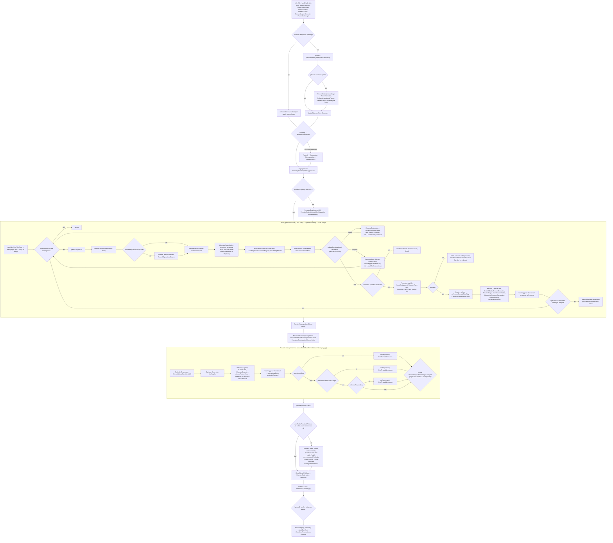

# Упрощение пайплайна AI V2 — Уровень 0 (baseline и карта фактической схемы)

Статус уровня 0: **черновик в работе** (сессия 1). Gameplay-код не менялся.
База: `master` @ `fe2ccdf4`. ТЗ проверялось на `1e77ed0a`; между ними изменены только
`Analysis/WorldAnalysis.Knowledge.cs`, `.Observation.cs`, `WorldSnapshot.cs`,
`Continuity/MissionContinuityLayer.Raid.cs`, `Execution/RaidExecutor.cs`,
`Provisioning/RaidProvisioner.cs`, `Strategy/Objectives/RaidObjectiveEvaluator.cs`
(Hex Event knowledge). `Orchestration/` идентична ревизии ТЗ.
Среда: Unity 6000.5.4f1 (ProjectSettings/ProjectVersion.txt). Все номера строк — `AiStrategyV2Pipeline.cs` @ `fe2ccdf4`.

## 0. Дополнения владельца (2026-10-09)

1. **Разнести/уменьшить крупные классы** — часть объёма рефакторинга. Разделение по ответственности в отдельные классы (не просто `partial`: по ТЗ §4 п.5 partial не засчитывается как упрощение). Первые кандидаты: `Pipeline.RunTurn` (~1300 строк) с вложенными локальными функциями (`StrategicAdmissionFingerprint`, `TakeTypedTriggers`, `ReenterStrategicAxes`, `RunTypedAdmissions`); размеры остальных классов — измерить на Уровне 0 и внести в SRP-таблицу. Новый класс допустим только после поиска существующего владельца и фиксации входов/выходов/срока жизни (ТЗ §1).
2. **После каждого уровня — проверка реализации снизу вверх** (от банка/кешей и вызываемых владельцев к оркестрации) на соответствие ожидаемому результату ТЗ: пункты объёма, инварианты §3, gate §5.4. Результат проверки — раздел в отчёте уровня.

## 1. Фактическая схема `Pipeline.RunTurn`

Вызывающий: `AiTurnController` → `RunEstimateCached(Pipeline.RunTurn)` → затем внешний
`WaitAtObserverActionBoundary` → `onDone` (Reaction запускается вне `RunTurn`).

## 2. Метрики раздела 2 (исходные значения)

| # | Метрика | Значение @fe2ccdf4 | Где |
|---|---|---|---|
| 1 | Самостоятельные циклы решения | **6**: operational `while` (L599); management `for` (L1090); provisioning `while` (L827) с двумя независимыми бюджетами realloc (≤3 и ≤3); `foreach` recall (L1255); Phase A re-entry (вложенный `FulfillDemands`); `foreach` cold (однопроходный, не цикл). Владельцев: Pipeline (4), Allocator/Provisioning (внутренний retry), StrategicManager (внутри Phase A/B) |
| 2 | Входы в strategic re-admission | **10** вызовов `ReenterStrategicAxes`: L609 flush, L725 rebase, L775/L788 recovery (x2), L1018/L1030 task (x2), L1058 force, L1069 capacity unlock, L1129/L1144 management (x2). `TakeTypedTriggers` — 7 вызовов (L722,772,782,1015,1024,1124,1134); 4 раза подряд «take → reenter → take → reenter» (дублирование compound-fan-out) |
| 3 | Самостоятельные последовательности завершения | **8**: Phase A (L223-246), formation (L252-271), rebase (L708-742), recovery (L754-806), ordinary task (L964-1048), Phase B round (L1094-1119), cold (L1211-1248), recall (L1257-1270) |
| 4 | Обходные пути обратно в operational admission | **5** точек `RunTypedAdmissions()` (L1073 основной, L1158, L1167, L1173 из management, L1243 из cold) + flush на входе итерации |
| 5 | Сохраняемые флаги/счётчики | `ownershipFreshAfterPhaseA` (writers: init L294, L541, L623, L1241; reader L613), `zeroRadarResidualWindow` (writers L566 reset, L810, L953, L1043; reader L1188), `lifecycleReturnsReleased` (writer L1122; reader L631), `lifecycleReturnsDeferred` (writer L639; reader L1121), `phaseBHandled` (writer L1180; reader L1291), `reentryStateChanged` (L449/453/561), `settledSteps`, `noProgressCycles` (12 writers), `deferredAdmission`, `lastStrategicAdmissionFingerprint`, `retryNextTurnThisPass` (сбрасывается при каждом входе в RunTypedAdmissions) — всё замыкания внутри `RunTurn`, reset owner = сам `RunTurn` |

Размер: `RunTurn` L89-1395 (~1300 строк в одном методе) с вложенными локальными функциями.

## 3. Наблюдения уровня 0 (подлежат проверке тестами, не готовые решения)

1. **`if (!phaseBHandled)` (L1291-1306) — вероятно, мёртвая ветка.** Блок L289-1283 безусловный, `phaseBHandled = true` (L1180) выполняется всегда, при отсутствии `yield break` между ними. Но нельзя удалять без characterization-проверки (ТЗ: не удалять флаг только потому, что он кажется лишним) — исключение может выйти только через throw, где ветка не достигается тоже. Кандидат на уровень 4/5.
2. **Порядок в ordinary-шаге (L964-1012), закреплён ТЗ как baseline:** capture before → execute → `RefreshStrategicKnowledge` → capture after → `PublishStepObservationDelta` → `RecordExecution`/telemetry → `RecordDeferrals` → `RefreshObjectiveStatesLive` → `FinalizeSteps`→`turnSession.Settle` → `ReconcileEconomyCompletionReservations` → `CheckBoundary` → `WaitAtObserverActionBoundary` → triggers.
3. **Rebase/recovery отличаются от ordinary** (ключ к Уровням 1–2):
   - нет ledger/`Settle`/`ReconcileEconomyCompletionReservations`;
   - нет `WaitAtObserverActionBoundary` после шага (есть только в ordinary и в Phase A/B);
   - нет `RefreshOperationalFrame` (в ordinary тоже нет — кадр освежается в начале следующей итерации через `!ownershipFreshAfterPhaseA`);
   - recovery: два прогона take→reenter; rebase: один;
   - прогресс = `moved || strategicChanged`, а не `er.Outcome.StateChanged`;
   - no-progress → `MarkStalled` per-wing, `continue` (без `break`);
   - обе ветки выполняются ПОСЛЕ `BuildMissionSet/BindFunding/Pack` (L628-691), то есть аллокация считается и выбрасывается.
4. **Cold-ветка (L1186-1250)** запускает `FulfillDemands` без `deferFreshZeroRadar`, а затем `RunTypedAdmissions` — единственный «поздний» вход, зависящий от `zeroRadarResidualWindow` (три писателя с разной семантикой: «нет Funded», «отказ без positive/commitment», «остальные Funded только zero»).
5. **`retryNextTurnThisPass` пересоздаётся на каждый вход в `RunTypedAdmissions`**, а межвходная память — только `CapabilityPoolExhaustionRegistry`. Любое слияние циклов в один обязано сохранить эту границу сброса (ТЗ 3.1).
6. **Raw resource ratchet:** `Assets/Editor/AiRawResourceReadRatchetTests.cs:55` допускает ровно 6 raw-чтений в `Orchestration/AiStrategyV2Pipeline.cs` — перенос fingerprint (Уровень 3) должен учесть ratchet.
7. `LifecycleReturnPolicy.LastWait` — статический словарь без привязки к ходу, чистится `ClearAll()`; граница «ждал вчера» = `last == turn-1`.

## 3a. Покрытие тестами оркестрации и размеры классов

**Покрытие `RunTurn`.** Ни один тест в `Assets/Editor` не вызывает `Pipeline.RunTurn`, `RunTypedAdmissions`, `ReenterStrategicAxes` или `TakeTypedTriggers` (это локальные функции внутри корутины). Тестируются только вынесенные статические куски: `DevelopmentAdmissionFacts/Fingerprint`, `AggressionAdmissionFingerprint`, `StrategicAdmissionNeeded`, `RefreshDevelopmentOpportunities`, `LifecycleReturnPolicy`. Вывод: **порядок действий в самом цикле сейчас не защищён тестами**. Любой уровень, меняющий порядок, сначала обязан вынести проверяемую единицу (класс с явными входами/выходами) и добавить на неё характеризационные тесты на baseline. Это совпадает с требованием владельца разнести крупные классы: выделение классов — предпосылка тестируемости, а не косметика.

Размеры самых крупных файлов `Ai/V2` (строки): StrategicCardEvaluator 2090; DemandLayer.Economy 1723; **AiStrategyV2Pipeline 1568**; ReconAssignmentPlanner 1499; StrategicEffectRegistry 1437; MissionContinuityLayer.Attack 1409; InfrastructureFulfillment 1219; DevelopmentOpportunityEvaluator 1213; WorldSnapshot 1161; StrategicPhaseA 1144; ResourceAllocator 1072; GroundCombatAssaultTransaction 1021; TaskExecutor 1004; MissionContinuityLayer 977. В объём этой задачи входят только файлы из таблицы ТЗ §1 (Pipeline, InfrastructureFulfillment, StrategicPhaseA, ResourceAllocator, TaskExecutor, MissionContinuityLayer*); остальные крупные классы — вне объёма, пока владелец не скажет иначе.

Сопоставление сценариев §12 с существующими fixtures (имена файлов подтверждены): AiReconAirLifecycleTests, AiAviationSortieCycleTests, AiWorldDeltaTests, AiLifecycleIngressTests, AiMissionLeaseLifecycleTests, AiEconomyReservationLifecycleTests, AiAggressionReadmissionTests, AiDevelopmentReadmissionTests, AiLifecycleReturnPolicyTests, AiRouteCacheIsolationTests, AiCombatCacheLifecycleTests, AiObserverPauseTests, AiTurnSessionIsolationTests, AiHousekeepingMissionContractTests. Fixture для bounded-loop и для порядка rebase/recovery отсутствует — создаётся.

## 4. Bounds (читать из `AiConfigV2`)

| Константа | Значение |
|---|---|
| `maxMidTurnStepsPerTurn` | 96 |
| `maxMidTurnNoProgressCycles` | 2 |
| `maxEndOfTurnTempoReruns` | 1 (⇒ 2 management-раунда) |
| `maxReallocIterations` | 3 (отдельно assignment и reprice) |
| `lifecycleReturnHomeThreatSeverity` | 0.25 |
| yield budget | 0.008 с (локальная const L596) |

Важно: `settledSteps`/`noProgressCycles` объявлены вне `RunTypedAdmissions` и **разделяются** всеми пятью входами (management обнуляет `noProgressCycles = 0` перед входом, `settledSteps` — нет). Это и есть «глобальные bounds» ТЗ.

## 5. Баланс (банк) и кеши — инвентаризация (предварительно)

Банк: `AiTurnSession.Begin/Dispose`, `PhaseAApBudget` (carried follow-up), `StrategicManager.FulfillDemands(...reservation)` (carried Reservation: `phaseB.Reservation ?? phaseA.Reservation`), `InfrastructureFulfillment.ReconcileEconomyCompletionReservations` (3 вызова в Pipeline: L1004, L1076, L1104; плюс внутри Phase A/B), `ReleaseDeferredEconomyIncomeCover` (L1080 и L1293), `OperationContinuationWindow.Settle` (L1083 и L1293), `ReservationInvariants.CheckBoundary` (после каждого шага/фазы), `turnSession.CompleteReservations` (L1376). **TODO уровня 0:** таблица writer/lifetime по каждой точке.

Кеши: `RefreshStrategicKnowledge` — 15 вызовов в RunTurn; `CombatOpportunityAnalyzer.WarmEstimates` — 7; `RefreshOperationalFrame` — 6; `CaptureStepObservation`/`PublishStepObservationDelta` — пары в rebase, recovery, ordinary, reentry, management, cold, recall (не в Phase A/formation — там публикуют сами действия). **TODO:** карта snapshot/knowledge/route/combat ключей.

## 6. Остаётся сделать на Уровне 0

- [ ] Baseline: тесты (`D:/aiv-work/run.sh l0-base fe2ccdf4` + patchrun) — запущено, результат ниже в §7.
- [ ] `Tools/ai-verify/compile_check.sh --baseline` (Linux-инструмент; на этой машине — `run.sh` как compile+test gate; решить, нужен ли отдельный Linux baseline).
- [ ] Трассы по сценариям раздела 12 (характеризационные тесты на порядок: rebase vs recovery tie-break по Id, delayed flush, previous-turn waited return, cold window, лимиты).
- [ ] Таблицы bank/cache/DRY-SRP на ключевых стрелках (§5 — каркас).
- [ ] Сигнатуры интерфейсов уровней 1–4 (до первого implementation patch).

## 7. Результаты baseline

Ревизия `fe2ccdf4`, сборка net472 + mono из Unity 6000.5.4f1, 0 ошибок компиляции. Native Unity не запускался.

| Прогон | Всего | Прошло | Упало |
|---|---|---|---|
| `run.sh l0-base` (без патчей) | 2043 | 1370 | 673 |
| `patchrun.sh` (`D:/aiv-work/l0-base-p`, **эталон для сравнения**) | 2043 | 1571 | 472 |

Падения — тесты, которым нужен настоящий движок (UnityEngine.Object и т. п.). Baseline не обновлять после изменений; сравнивать через `regress.py`.

## 8. Проверка Уровня 0 снизу вверх (по пунктам ТЗ §6 и gate §5.4)

| Пункт ТЗ | Статус | Основание |
|---|---|---|
| Прочитаны инструкции/архитектура/README, зафиксированы SHA и версии | выполнено | base `fe2ccdf4`, Unity 6000.5.4f1 |
| Трассировка `AiTurnController → RunTurn → … → Housekeeping` по callers | частично | `RunTurn` прочитан целиком; внутренности `StrategicManager`, `ResourceAllocator`, `ProvisioningManager`, `TaskExecutor`, `Reaction` не разобраны |
| Для каждой стрелки guard/приоритет/bounds/reserve effect/snapshot state | частично | guards и bounds — есть (§1, §4); reserve effect и snapshot/revision по стрелкам — нет |
| Раскрыть flush/force, ownershipFresh, zeroRadarWindow, returnsReleased/Deferred, phaseBHandled, retry sets, deferred admission | частично | писатели/читатели перечислены (§2); семантика reset boundary раскрыта для retry set и bounds |
| Порядок observation → settlement | выполнено | §3 п.2 |
| Baseline-трассы сценариев §12 + characterization assertions | **не выполнено** | тестов, вызывающих `RunTurn`, нет (§3a); трассы не сняты |
| Метрики §2 и карта SRP/дублей | метрики выполнены; SRP-карта — частично | таблица размеров есть, DRY/SRP-таблица по правилам — нет |
| Compile/test baseline | выполнено доступными средствами | §7; Linux `compile_check.sh` и Unity не запускались |
| Банк: инвентаризация writers/lifetime | не выполнено | только каркас §5 |
| Кеши: карта источников и refresh | не выполнено | только счётчики вызовов §5 |
| Сигнатуры интерфейсов уровней 1–4 | не выполнено | |

**Статус Уровня 0: «реализован — проверки незавершены»**. Gate на Уровень 1 не пройден: нет characterization-тестов порядка и таблиц банка/кешей. Следующие шаги: (1) вынести из `RunTurn` тестируемую единицу (минимально — выбор mandatory aviation: rebase vs recovery по Id, и разбор trigger fan-out) без смены поведения и покрыть её на baseline; (2) заполнить банковскую и кеш-таблицы по `StrategicManager`/`InfrastructureFulfillment`/`WorldAnalysis.Observation`; (3) описать сигнатуры.
