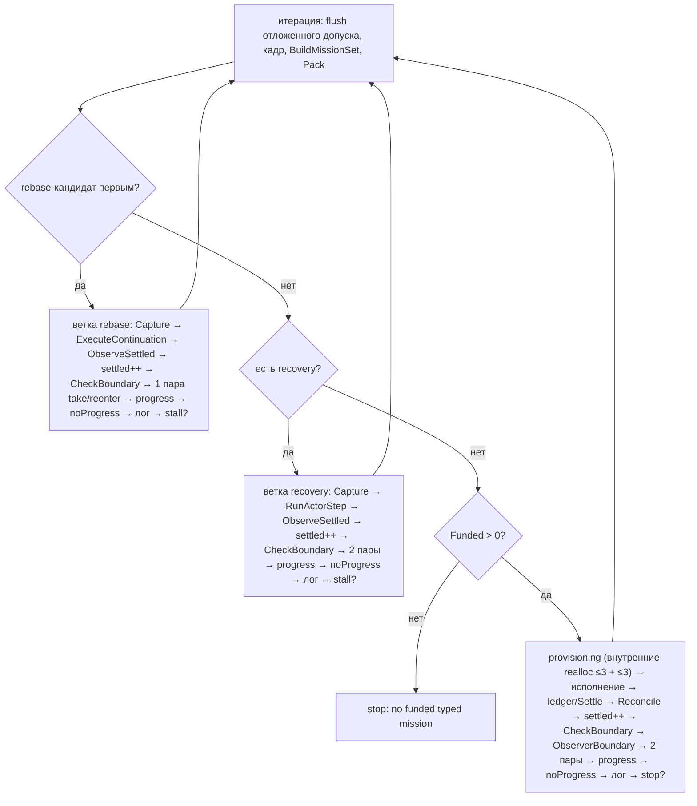
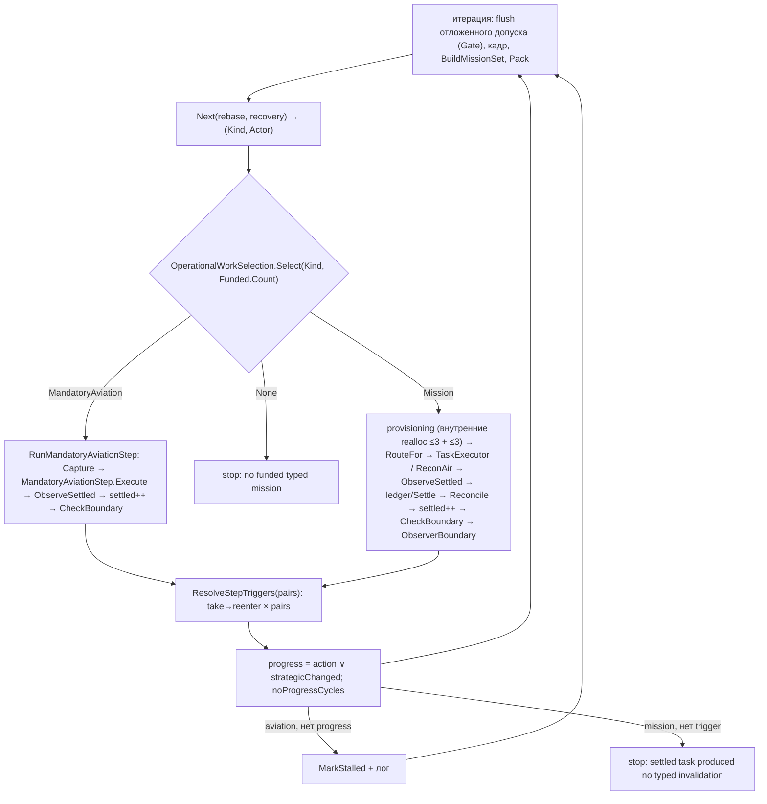

# AI V2 — упрощение пайплайна, Уровень 2: обязательная авиация в общем операционном выборе

Статус: **реализован — проверен доступными средствами; native не выполнен** (авиационный путь не наблюдался ни в одном нативном логе на коде Уровня 2).
Ветка `refactor/ai-v2-pipeline-simplification`. База: `4c99fe10` (конец Уровня 1). Результат кода: `b50ba49b` (общий выбор вида авиации и шаг) и `598483ee` (общая граница выбора работы, общий исход шага, ворота отложенного допуска); отчёт — коммит после `598483ee`.
Среда: Unity 6000.5.4f1 (`ProjectSettings/ProjectVersion.txt`); прогон — net472 + mono из Unity; Unity-редактор не запускался.

## 1. Объём: что изменено

| Файл | Изменение |
|---|---|
| `Orchestration/MandatoryAviationOrder.cs` | `MandatoryAviationKind {None, Rebase, Recovery}`; `Next(rebase, recoveries)` → `(Kind, Actor)`; `TriggerPairs(kind)` (rebase 1, recovery 2), `Label`, `StallMessage` — чистые, без доступа к миру |
| `Orchestration/MandatoryAviationStep.cs` (новый, 40) | Статический адаптер: `Execute(kind, actor, …, Action<bool> actionChanged)` вызывает существующие `AviationRebasePlanner.ExecuteContinuation` / `ReconAirExecutor.RunActorStep`. Без policy, состояния и кеша |
| `Orchestration/OperationalWorkSelection.cs` (новый, 53) | `Select(mandatory, fundedMissions)` — **единая граница выбора** (`MandatoryAviation` / `Mission` / `None`); `RouteFor(kind, executor)` — маршрут исполнения (`AirRecon` / `Task`); `StepTriggerOutcome` — переходное значение исхода (`Progressed`, `NextNoProgress`) |
| `Recon/AviationObligations.cs` | `DeferredStrategicAdmission.Gate(triggered, flush, force, hasDeferredAxes, obligationsPending)` → `Skip / Defer / Admit / AdmitDespitePending` — решение ворот отложенного допуска, вынесенное из `ReenterStrategicAxes` |
| `Orchestration/AiStrategyV2Pipeline.cs` (1505 → 1457) | две ветки rebase/recovery заменены `Select` → `RunMandatoryAviationStep`; общий `ResolveStepTriggers(pairs)` обслуживает обычный шаг (2 пары), rebase (1), recovery (2); маршрут Scout — через `RouteFor`; ворота отложенного допуска — через `Gate` |
| `Editor/AiMandatoryAviationOrderTests.cs`, `AiOperationalWorkSelectionTests.cs` (новые), `AiAviationSortieCycleTests.cs` (+1 тест) | см. §7 |

## 2. DRY/SRP-таблица до патча (baseline `4c99fe10`)

| Правило | Canonical owner | Callers / копии | Повтор / другая политика | Решение |
|---|---|---|---|---|
| Какие wings обязаны действовать | `AviationRebasePlanner.FindMandatoryContinuations`, `ReconAirExecutor.FindMandatoryRecoveryActors`; оба уже исключают stalled через `AviationObligationStallRegistry.IsStalled` (`AviationRebasePlanner.cs:81-82`, `ReconAirExecutor.cs:244`) | `RunTypedAdmissions`, `AviationObligations.Pending/ActivationAp` | списки не дублируются | **retain** |
| Порядок двух видов | `MandatoryAviationOrder.RebaseFirst` | `RunTypedAdmissions` собирал «вид + актор» вручную | — | **move** → `Next` |
| Граница «авиация → миссия → стоп» | нет единого владельца: три последовательных `if` в цикле | `RunTypedAdmissions` | порядок неявный | **merge** → `OperationalWorkSelection.Select` |
| Каркас шага авиации (Capture → execute → `ObserveSettled` → `settledSteps++` → `CheckBoundary` → fan-out → progress → `noProgress` → лог → stall) | нет | 2 копии (~100 строк) | различия: исполнитель, число пар, источник `actionChanged`, тексты | **merge** → `RunMandatoryAviationStep` |
| take→reenter×N + progress + `noProgressCycles` | нет | **3 копии**: обычный шаг (2 пары), rebase (1), recovery (2) | число пар — поведение baseline | **merge** → `ResolveStepTriggers(pairs)`; число пар **retain** (унификация — Уровень 3) |
| Маршрут исполнения Scout | `AirReconPlanner`/`ReconAirExecutor.ExecutePlanStep` vs `TaskExecutor` | inline `if` в цикле | — | **name** → `RouteFor` (тот же предикат) |
| Решение отложенного допуска | `ReenterStrategicAxes` (inline внутри корутины) | 7 вызовов | логика не тестируема | **extract** чисто → `Gate`; побочные эффекты (Defer, лог, Take) остаются в вызывающем |
| Исполнение шага | прежние владельцы | — | `moved` callback vs `AirReconExecutionResult.Mutated` | **retain** + адаптер `MandatoryAviationStep` |
| Финансирование | — (оплачено при sortie) | — | оба пути после `Pack`, без ledger/`Settle`/observer boundary | **retain**: не финансировать |

## 3. Схема до/после (внутренние циклы раскрыты)

До (`RunTypedAdmissions`, одна итерация цикла, после `BuildMissionSet → BindFunding → Pack`):

После:

Удалённые узлы: 2 независимые ветки авиации; 3 копии take→reenter→progress→noProgress; неявный порядок трёх `if`. Остаются явно: разное число пар (1/2/2), отсутствие ledger/Settle/observer boundary у авиации, разные условия остановки (stall против `break`), внутренние realloc-циклы provisioning, Phase A/B и cold residual (Уровни 3–4).

## 4. Связанные механики (baseline → после)

| Механика / сценарий | Baseline-порядок | После | Доказательство |
|---|---|---|---|
| Rebase и recovery конкурируют | `RebaseFirst`: rebase первым, при равных Id — rebase | `Next` (тот же `RebaseFirst`) | `AiMandatoryAviationOrderTests` (6) |
| Авиация против миссии | сначала авиация, потом `Funded == 0 → stop`, потом провижининг | `Select` | `AiOperationalWorkSelectionTests` (4 параметра + stalled → Mission) |
| Blocked/stalled wing не блокирует остальное | `FindMandatory*` не возвращают stalled; no-progress → `MarkStalled` → `continue` | то же; после stall `Kind=None` → `Mission` | engine-bound тест `MandatoryRebase_StalledWingsStopCounting_ForTheirTurnOnly` (Unity); `AiReconAuditBugTests` (реестр); чистая часть — managed |
| Последнее обязательство разрешилось без dirty trigger | `flush: true` в начале итерации → допуск | `Gate(triggered:false, flush:true, hasDeferred:true, pending:false) = Admit` | тесты `Gate` (5) |
| Terminal force-flush при ещё pending | админит с логом | `AdmitDespitePending` | тест `Gate` |
| Air Scout / обычная ground-задача | `Kind==Scout ∧ executor≠Ground → ExecutePlanStep`, иначе `TaskExecutor` | `RouteFor` | параметризованный тест (6 случаев); Explore не Scout-executor |
| Число пар take→reenter | ordinary 2, rebase 1, recovery 2 | `ResolveStepTriggers(StepTriggerSequence.StandardPairs=2 / TriggerPairs)` | тесты `TriggerPairs`, `MissionTriggerPairs` |
| Progress / noProgress | `StateChanged ∨ strategic`; rebase `moved ∨ strategic`; recovery `Mutated ∨ strategic` | `StepTriggerOutcome.Progressed(actionChanged)`, `NextNoProgress` | тест `StepProgress…` |
| Тексты `[Loop]` и stall | как в baseline | `Label`, `StallMessage` (идентичны) | тест + диф |

## 5. Банк (отдельный проход)

Цепочка (снизу вверх): physical stock → free/spendable → allocation (`Pack`) → tentative claims → canonical spend → durable ownership → release/expiry → следующая трата.

| Граница | До | После | Изменение |
|---|---|---|---|
| `Pack` перед mandatory-шагом | считается, результат выбрасывается для авиации | то же | нет |
| Mandatory-шаг (rebase / recovery) | не резервирует, не списывает через банк; физика — внутри aviation owners (sortie оплачен при запуске) | то же | нет |
| `ReconcileEconomyCompletionReservations`, `ReleaseDeferredEconomyIncomeCover`, `OperationContinuationWindow.Settle` | после loop / после обычного шага | то же | нет |
| Обычный шаг: tentative pass claims → ledger → Settle | `cycleProvisioning` закрывается using-областью итерации | то же | нет |
| Два одновременных owner (Economy completion + deferred) | не затрагивается авиацией | не затрагивается | нет |
| Abort/rollback | `actionChanged = false` → `MarkStalled`; ресурсов нет | то же | нет |

Writers/readers резервов не добавлены и не удалены. Числовая таблица stock/ledger «до/после» по ходам **не снималась**: авиационный шаг в нативных логах не наблюдался, и изменённый код его банк не затрагивает по построению (вызовов `MissionLeaseBook` нет в изменённых методах — проверено поиском).

## 6. Кеши (запись/чтение)

| Mutation | Canonical writer | Receipt | Dirty facts | Refresh | Reader / ключ | До → после |
|---|---|---|---|---|---|---|
| Rebase-шаг (wing двинулась/приземлилась) | `AviationRebasePlanner.ExecuteContinuation` (`WorldDeltaLifecycle`) | revision через air actions | Actor (+Capability) | `ObserveSettled` → `RefreshStrategicKnowledge` | snapshot (identity + `KnowledgeVersion`), airfield/pathing ключи; кадр обновится на следующей итерации (`!ownershipFreshAfterPhaseA`) | не изменено |
| Recovery-шаг | `ReconAirExecutor.RunActorStep` | revision, `Mutated` | Actor, ReconKnowledge | то же | то же | не изменено |
| Отказ хода (`actionChanged=false`) | executor | `HasMutation=false` → `Current` не растёт | — | `ObserveSettled` всё равно выполняется | — | не изменено; ложного revision нет |
| Fan-out причин | `StrategicInterruptRegistry` | — | compound → `TypedTriggerFanOut.Split` | `ReenterStrategicAxes` | demands/fingerprint | не изменено; порядок take→reenter тот же, число пар по виду |
| Ворота отложенного допуска | `DeferredStrategicAdmission` | — | `deferredAdmission` axes | при `Admit`: Take → fingerprint → Warm → Frame | demands | решение вынесено в чистую функцию; побочные эффекты и порядок не менялись; `Pending` читается только когда допуск возможен (как раньше) |

Проверено: одна публикация каждого факта (`ObserveSettled`); `WarmEstimates` не затронут; полный refresh не заменён селективным; stale-turn: stall-реестр закрывается `AiTurnSession.Dispose` (`EndTurn`), ключ (player, turn) — как раньше.

## 7. Команды и результаты

| Проверка | Результат |
|---|---|
| `compile_check.sh --baseline fe2ccdf4` (команда ТЗ §12, база Уровня 0) | passed: 28 ошибок baseline (UI/editor-заглушки, как в README) |
| `compile_check.sh` на `598483ee` | **passed**: 28 ошибок, новых 0 (скрипт на Windows не нормализует `\` в путях — сравнение выполнено вручную после нормализации) |
| `run.sh l2-b` (net472 + NUnitLite) | build errors 0; 2086 тестов, 1412 прошло до патча Unity-null |
| `patchrun.sh l2-b l2-b-p` | **1613 прошло**, 473 упало |
| `regress.py l1-b-p l2-b-p` | **регрессий 0**, новых проходящих 23 |
| 473 упавших | 472 прежних engine-bound + 1 новый engine-bound `MandatoryRebase_StalledWingsStopCounting_ForTheirTurnOnly` (нужен `ArmyController` MonoBehaviour: падает здесь `NullReferenceException`, выполнится только в Unity) |
| `test_regress.sh <sha>` (ТЗ §12) | **not run** (нужен `mono` в PATH и патчи Unity-null; использован эквивалент `run.sh`/`patchrun.sh`/`regress.py`) |
| Unity compile / EditMode / PlayMode | **not run** |
| Нативный прогон на коде Уровня 2 (`AiDebug.level2.log`, 20 ходов) | **passed в части «нет нарушений»**: `violations=0`, `ERROR` 0, 1 bounded stop по обычной задаче; **авиации в партии не было** (`airborne 0/0`), `RunMandatoryAviationStep` не вызывался |
| Нативный сценарий с rebase/recovery | **not run** |

## 8. Проверка Уровня 2 снизу вверх (ТЗ §8)

| Пункт ТЗ | Статус | Основание |
|---|---|---|
| Зафиксировать baseline-арбитраж rebase/recovery | выполнено | §2, тесты `Next`/`RebaseFirst` |
| Reuse routing, без нового `TaskExecutor`/store | выполнено | `MandatoryAviationStep` — статический адаптер без состояния; `StepTriggerOutcome` — переходное значение |
| Ordering-тесты: два вида | выполнено | managed, passed |
| … blocked/stalled actor | **написан, not run** (engine-bound) | тест в `AiAviationSortieCycleTests` собирается; выполнить можно только в Unity |
| … last obligation resolves без dirty trigger | выполнено на чистой части | `Gate`-тесты; интеграция с `Pending` — тот же engine-bound тест (`Pending=false` после stall последнего) |
| … air Scout и обычный ground task | выполнено на чистой части | `RouteFor` (6 случаев) |
| Общий select/execute/post-step без финансирования | выполнено | `Select` + `RunMandatoryAviationStep` + `ResolveStepTriggers`; ledger/`Settle` не добавлены |
| Сохранить delayed Phase A flush и продолжение обычных задач | выполнено | `Gate` эквивалентен baseline (все ветки покрыты); stall → `Kind=None` → `Mission` |
| Удалить прежние post-step ветки; каждый item — один маршрут | выполнено | grep: `ExecuteContinuation`/`RunActorStep` в цикле только в адаптере; `MarkStalled` в Pipeline один; inline-копий take→reenter в work step нет (все — `ResolveStepTriggers`); пара take→reenter в management-раунде осталась своей — это Уровни 3–4 |
| Ожидаемый результат: один operational selection boundary и одна обработка исхода для миссии/авиации | **выполнено в части выбора и fan-out/progress**; domain-специфичное завершение остаётся у каждого вида | ledger/`Settle`/`Reconcile`/observer boundary — только у миссии (авиация оплачена, нет intent); условия остановки различаются (stall vs break) |
| Нативное подтверждение | **not run** | авиации в нативных логах нет (rebase — нигде; recovery — только лог Уровня 0) |

## 9. Ограничения и зависимость следующего уровня

1. Нет нативного лога с авиацией на коде Уровня 2. Просьба владельцу (не блокирует): партия с вылетевшей разведкой/перебазированием wing, затем `python D:/aiv-work/loopsig.py <лог>` — ожидаются `violations=0`, без `ERROR`, строки `aviation-rebase`/`recovery` прежнего вида.
2. Engine-bound тест stalled-крыльев выполнить в Unity EditMode.
3. Число пар take→reenter (ordinary 2 / rebase 1 / recovery 2) оставлено: унификация — Уровень 3, там же — fingerprints и единый протокол допуска.
4. `RunMandatoryAviationStep`, `ResolveStepTriggers` и `RunTypedAdmissions` остаются замыканиями `RunTurn` (используют `settledSteps`, `noProgressCycles`, `reentryStateChanged`); вынос в классы — Уровни 3–4 вместе с держателем кадра.
5. Уровень 3 опирается на: `StepTriggerOutcome`/`ResolveStepTriggers` (единая точка fan-out), `DeferredStrategicAdmission.Gate`, `MandatoryAviationOrder.TriggerPairs` (различие пар).

Масштаб: изменение оркестрации (поведение, порядок и тексты сохранены; состав вызовов и условий — те же).

## 10. Поправка (найдена при проверке Уровня 3)

`MandatoryAviationStep.cs` содержит одно перенесённое чтение физического AP (`root.ActionPoints` перед шагом recovery), которое `AiRawResourceReadRatchetTests` не знал; утверждённое число добавлено (Уровень 3, §12). Раздел §7 о «0 регрессий» не охватывал этот тест: он падал и на baseline.
