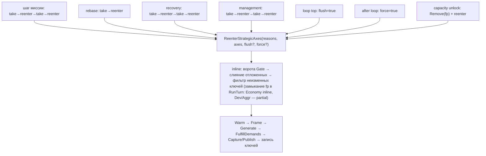
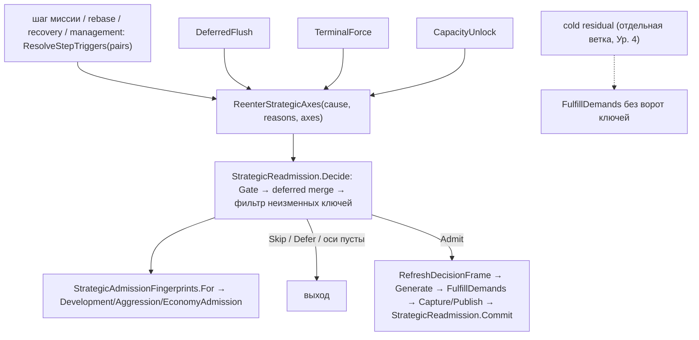

# AI V2 — упрощение пайплайна, Уровень 3: единый протокол повторного стратегического допуска

Статус: **реализован — проверен доступными средствами; native не выполнен** (нужен один обычный нативный лог на этом коде: путь повторного допуска исполняется в любой партии).
Ветка `refactor/ai-v2-pipeline-simplification`. База: `d16a044b` (конец Уровня 2). Результат кода: `8df4344b`; отчёт — коммит после него.
Среда: Unity 6000.5.4f1 (`ProjectSettings/ProjectVersion.txt`); прогон — net472 + mono из Unity; Unity-редактор не запускался.

## 1. Объём: что изменено

| Файл | Изменение |
|---|---|
| `Orchestration/StrategicReadmission.cs` (новый, 87) | `ReadmissionCause {Trigger, DeferredFlush, TerminalForce, CapacityUnlock}`; класс `StrategicReadmission`: решает, какие оси идут в проход (`Decide`), хранит единственное состояние допуска — ключ, с которым ось допущена последний раз (`Seed/Commit/LastAdmitted`), и оси, ждущие авиацию (`Deferred`). Ключей не считает, проход не исполняет |
| `Orchestration/StrategicAdmissionFingerprints.cs` (новый, 37) | `For(axis, …)`: выбирает доменного владельца ключа и строит общий дайджест физического стока (Development и Economy); сам ключей не составляет, состояния нет |
| `Orchestration/EconomyAdmission.cs` (новый, 131) | Ключ Economy (был inline в `RunTurn`, ~85 строк) и `RelevantArmyIds` (был в `Pipeline`) — перенос без изменений |
| `Orchestration/DevelopmentAdmission.cs`, `AggressionAdmission.cs` | Были `partial`-файлами `Pipeline`; стали настоящими классами (`git mv`, `.meta`/GUID сохранены). Тела и состав ключей не менялись |
| `Orchestration/AiStrategyV2Pipeline.cs` (1457 → 1278) | `ReenterStrategicAxes(cause, reasons, axes)` вместо `flush`/`force`; `Decide` вместо inline-ворот/слияния отложенных/фильтра неизменных ключей; management-раунд использует общий `ResolveStepTriggers`; шесть копий «Warm → Frame → 4 присваивания» → `RefreshDecisionFrame` |
| `Orchestration/OperationalWorkSelection.cs` | `MissionTriggerPairs` → `StandardTriggerPairs` (теперь общая для шага миссии и management-раунда) |
| Тесты | `AiStrategicReadmissionTests` (9), `AiEconomyAdmissionFingerprintTests` (8); ссылки существующих тестов переведены на новые классы (`Pipeline.X` → `DevelopmentAdmission.X` и т. п.) |
| `ARCHITECTURE.md` | строка про mid-turn re-admission описывает новых владельцев |

## 2. Все входы в повторный допуск (ТЗ §9, п. 1)

| # | Вход | До | После | Причина отличия |
|---|---|---|---|---|
| 1 | Обычный шаг миссии | `take → reenter → take → reenter` inline | `ResolveStepTriggers(2)` → `Reenter(Trigger)` | второй take нужен: reentry публикует свои факты после первого consume |
| 2 | Mandatory aviation: rebase | inline, 1 пара (Ур. 2: через helper) | `ResolveStepTriggers(1)` | **сохранено**, см. §9 п. 2 |
| 3 | Mandatory aviation: recovery | 2 пары | `ResolveStepTriggers(2)` | как у миссии |
| 4 | Follow-up (вторая пара любого шага) | отдельный take/reenter в трёх местах | вторая итерация цикла `ResolveStepTriggers` | один алгоритм вместо трёх копий |
| 5 | Flush в начале итерации цикла | `flush: true` | `Reenter(DeferredFlush)` | admit без нового триггера, когда последнее обязательство разрешилось |
| 6 | Terminal force после цикла | `force: true` | `Reenter(TerminalForce)` | admit при pending, цикл закончен |
| 7 | Management-раунд (Phase B) | inline take/reenter ×2 (отдельная копия) | `ResolveStepTriggers(2)` | тот же алгоритм; `operationalDirty/strategicDirty` = «объединённые причины ≠ None», что равно прежнему `|=` |
| 8 | Capacity unlock | `Remove(fingerprint)` + `Reenter` с явными reasons | `Reenter(CapacityUnlock, Infrastructure|Capability, {Development})`; сброс baseline внутри `Decide` | то же, причина названа |
| 9 | Cold zero-Radar residual | **не** reenter: прямой `FulfillDemands` | **оставлен отдельной веткой** (до Уровня 4) | см. ниже |

**Почему cold не сведён к `Reenter` (ТЗ §9 п. 6).** Совпадение позднего момента и бюджета не доказано: (а) cold выбирает оси по `RadarValueScale ≤ 0`, а не по грязным осям фактов; (б) он обходит ворота ключей — допуск идёт даже при неизменном ключе; (в) вызывает `FulfillDemands` с `deferFreshZeroRadar: false`, а re-admission — с `true`; (г) сохраняет и дописывает `UnresolvedDemands` положительных осей вокруг прохода; (д) после изменения перегенерирует спрос по всем осям и запускает `RunTypedAdmissions`. Это условия окна Уровня 4, поэтому `ColdResidual` намеренно не входит в `ReadmissionCause`.

Счётчики: вызовов `ReenterStrategicAxes` 6 → 4 (helper, flush, force, capacity); алгоритмов take→reenter 2 → 1 (`ResolveStepTriggers`); флагов-параметров допуска 2 (`flush`, `force`) → явная причина; мест хранения состояния допуска (`lastStrategicAdmissionFingerprint`, `deferredAdmission` — замыкания) → 1 класс; копий рецепта «обновить кадр» 6 → 1; `partial`-фрагментов `Pipeline` в `Orchestration/` 3 → 1.

## 3. DRY/SRP-таблица (до и после)

| Правило | Canonical owner | Callers / копии | Решение | Доказательство |
|---|---|---|---|---|
| Ключ Development | `DevelopmentAdmission.Fingerprint` (был partial `Pipeline`) | диспетчер ключей, 4 тестовых файла | **move** в настоящий класс | тесты `AiDevelopment*` проходят |
| Ключ Aggression | `AggressionAdmission.Fingerprint` | диспетчер, 3 тестовых файла | **move** | тесты `AiActiveDefence*`, `AiAggressionReadmission*`, `AiAttackIntermediateBase*` проходят |
| Ключ Economy | `EconomyAdmission.Fingerprint` (был inline, не покрыт) | диспетчер | **move + покрыть** | `AiEconomyAdmissionFingerprintTests` |
| Какую ось ключом считать | `StrategicAdmissionFingerprints.For` | `AdmissionKey` в `RunTurn` | **single dispatcher**; ключ не составляет | тест маршрутизации (engine-bound) |
| Какие оси идут в проход | `StrategicReadmission.Decide` | `ReenterStrategicAxes` | **extract**, чисто | `AiStrategicReadmissionTests` |
| Состояние допуска (ключ по оси, отложенные) | `StrategicReadmission` | `RunTurn` | **один владелец**, не новое хранилище и не кеш: те же два объекта, что были замыканиями | grep: `lastStrategicAdmissionFingerprint`, `deferredAdmission` = 0 |
| take→reenter | `ResolveStepTriggers` | шаг миссии, rebase, recovery, management | **merge** (3 копии + management → 1) | grep: `TakeTypedTriggers(` в helper + определение |
| Число пар | `TriggerPairs` / `StandardTriggerPairs` | — | **retain** (rebase 1, остальные 2) | §9 п. 2 |
| Обновление кадра | `RefreshDecisionFrame` | 6 мест | **merge** | grep |
| Решение ворот отложенного допуска | `DeferredStrategicAdmission.Gate` | `Decide` | **reuse** (Ур. 2) | тесты Ур. 2 |
| Cold residual | отдельная ветка | 1 | **retain** (§2) | перечень (а)–(д) |

SRP: оркестратор больше не знает составов ключей и правил «ось неизменна»; он исполняет проход и сообщает причину. Правила пригодности оператора, оценка Economy-сайтов, готовность Attack и выбор рецепта Development остаются у доменов (ключи только перечисляют их входы). Физическое расположение доменных ключей — по-прежнему `Orchestration/` (рядом с `StrategicReadmission`); перенос в каталоги `Strategy/*` не делался: это сменило бы владельца файла, а не ответственность, и ТЗ требует переноса расчёта к владельцу, не переноса папок.

## 4. Схема до/после

До:

После:

## 5. Связанные механики (baseline → после)

| Механика | Baseline-порядок | После | Доказательство |
|---|---|---|---|
| Fingerprint не изменился → проход не запускается | `RemoveWhere(unchanged)`; пустой набор → `yield break` до refresh кадра | `Decide` (тот же фильтр); пустой набор → `yield break` | `AnUnchangedKeyDoesNotStartAPass`, `ACommittedKey…` |
| Ключ без baseline | всегда допуск | то же | `OnlyTheAxes…AnUnseenAxisAlwaysRuns` |
| Compound-факт достигает нескольких consumers | один snapshot `Split` → consume `Consumed` | не менялось (`TypedTriggerFanOut`) | существующие L0-тесты + `FactsPublishedByAReentry…` |
| Факты, опубликованные reentry, не стираются старым consume | consume только запрошенных причин | не менялось | `FactsPublishedByAReentryAreNotErased…` |
| Builder arrival → same-turn completion | `Split` спрашивает `economyBuilderReady` только при `Actor` | не менялось | `ActorAloneReadmitsEconomyOnlyWhenTheBuilderArrived` (L0) |
| Operator duty / новый герой / состав армии / донор | входят в ключ Economy | тот же код | `AiEconomyAdmissionFingerprintTests` (7 случаев, каждый вход отдельно) |
| Скаут шагает по waypoint — Economy не переоценивается | позиция только у армий, релевантных Economy | тот же код | `AScoutSteppingItsWaypointDoesNotReadmitEconomy` |
| Оси ждут последнее обязательство; flush без триггера | `flush` при `!Pending` | `DeferredFlush` | `AxesWaitWhile…LastOneReleasesThem…` |
| Terminal force | admit при pending с логом | `TerminalForce` | `TheTerminalForceAdmits…` |
| Capacity unlock | `Remove(Development)` + reenter | `CapacityUnlock` в `Decide` | `ACapacityUnlockForgetsOnlyTheDevelopmentBaseline` |
| `Pending` читается только когда допуск возможен | да | да | `PendingAviationIsNotReadWhenThereIsNothingToAdmit` |
| Radar — исходный per-turn кадр | не менялся | не менялся | код |

## 6. Банк (отдельный проход)

Цепочка: physical stock → free/spendable → allocation → tentative claims → canonical spend → durable ownership → release/expiry. Level 3 не добавляет и не удаляет writers: `StrategicReadmission`/`*Admission` не обращаются к `MissionLeaseBook`/ledger на запись (проверено по диффу). Банк входит в уровень двумя **читаемыми** входами ключа: физический сток (`resources`, `ActionPoints`) и `StrategicResourceReservationLedger.ReasonDigest(StrategicReactionPass)` в ключе Economy — как раньше; собственные строки Economy из ключа исключены (иначе допуск перезапускался бы собственной записью). `FulfillDemands` получает тот же carried `Reservation` (`phaseB.Reservation ?? phaseA.Reservation`) и `deferFreshZeroRadar: true`; пересчёт completion/deferred не добавлен и не потерян (внутри `StrategicPhaseA`, не тронут). Два одновременных owner / rollback / next-turn: не затронуты (изменений в ledger нет); числовая таблица stock/ledger по ходам **не снималась** (нет нативной трассы).

## 7. Кеши (запись/чтение)

| Mutation | Canonical writer | Receipt | Dirty facts | Refresh | Reader / ключ | До → после |
|---|---|---|---|---|---|---|
| Любое действие шага | gameplay-примитив + `WorldDeltaLifecycle` | `StateVersionAfter` | `PublishStepObservationDelta` | `ObserveSettled` | snapshot, route/estimate ключи | не изменено |
| Fan-out причин | `StrategicInterruptRegistry` | — | compound → `TypedTriggerFanOut.Split` | consume только `Consumed` | `Decide` | не изменено |
| Решение «проход нужен» | `StrategicReadmission` | — | ключ по оси | — | `AdmissionKey` читает **текущие** `snapshot/activeIntents/root/hand` | вычисление перенесено, входы и момент чтения те же |
| Baseline допуска | `Commit` после прохода | — | ключ, вычисленный **после** refresh кадра и до `Generate` | — | следующий `Decide` | не изменено (ключ берётся тем же моментом, `admittedFingerprints`) |
| Кадр после reentry | `RefreshDecisionFrame` | — | — | Warm → Frame | demands / миссии | тот же порядок Warm → Frame → 4 присваивания |

Проверено: полный `RefreshStrategicKnowledge` не заменялся селективным; `WarmEstimates` вызывается во всех шести прежних местах (через `RefreshDecisionFrame`); ключ покрывает те же входы (тела не менялись); irrelevant-изменение (скаут) ключ не меняет, relevant — меняет (тесты); потерянных/воспроизведённых фактов нет: consume по-прежнему только `Consumed`.

## 8. Команды и результаты

| Проверка | Результат |
|---|---|
| `compile_check.sh` (baseline `fe2ccdf4`: 28) на `8df4344b` | **passed**: 28 = 28, новых 0 |
| `run.sh l3-b` | build errors 0; 2103 теста, 1428 прошло до патча Unity-null |
| `patchrun.sh l3-b l3-b-p` | **1629 прошло**, 474 упало |
| `regress.py l2-c-p l3-b-p` | **регрессий 0**, новых проходящих 16 |
| 474 упавших | 472 прежних engine-bound + `MandatoryRebase_…` (Ур. 2) + `TheDispatcherRoutesEachAxis…` (читает `root == null`, Unity-object; выполнить в Unity) |
| `test_regress.sh <sha>` | **not run** (нужен `mono` в PATH; использован эквивалент) |
| Unity compile / EditMode / PlayMode | **not run** |
| Нативный прогон на коде Уровня 3 | **not run** |

## 9. Проверка Уровня 3 снизу вверх (ТЗ §9)

| Пункт ТЗ | Статус | Основание |
|---|---|---|
| Перечислить все вызовы reentry с причинами отличий | выполнено | §2 |
| Тесты: compound с несколькими consumers, unchanged fingerprint, builder arrival, operator duty, donor release, capacity unlock | выполнено | §5 (managed passed; dispatcher-тест engine-bound) |
| Один snapshot pending evidence, fan-out всем consumers до consume; факты reentry — следующей итерацией | выполнено (не менялось + тест) | `FactsPublishedByAReentry…` |
| Доменные расчёты fingerprint — к policy owners; общая часть сравнивает ключи и управляет lifetime | выполнено в части ответственности | `*Admission` + `StrategicReadmission`; расположение — `Orchestration/` (§3) |
| Состав fingerprint не менять | выполнено | тела перенесены без правок; тесты ключей passed |
| Объединить reentry через один протокол с явными причинами | выполнено | `ReadmissionCause` |
| Cold — остаточная eligibility того же пути либо явная ветка до Ур. 4 | выполнено как явная ветка | §2 (а)–(д) |
| Удалить заменённые fan-out/fingerprint копии и устаревшие callbacks/flags | выполнено | grep: `flush:`/`force:` параметры, `lastStrategicAdmissionFingerprint`, `deferredAdmission`, `StrategicAdmissionFingerprint` closure = 0 |
| Изменение числа проходов только при доказанно лишних | **не менялось** | число пар и порядок сохранены |
| Нативное подтверждение (builder arrival, hand/capability, neutral destruction, delayed axes) | **not run** | нужен обычный нативный лог |

## 10. Ограничения и зависимости

1. **Решение владельца (не принято мной):** rebase по-прежнему делает 1 пару take→reenter, остальные — 2. Вторая пара для rebase безвредна, когда reentry не публикует новых фактов (take пуст → `Skip`), но при составном факте это изменит момент их обработки; baseline-прохода «лишним» я не доказал, а путь rebase нативно не наблюдался, поэтому различие оставлено и вынесено в одну константу (`TriggerPairs`). Если нужна унификация до 2 пар — это отдельная правка одной строки с нативной проверкой.
2. Критерий progress (action ∨ strategicChanged) уже единый по форме; источник «действие изменило мир» различается по виду работы — доменное свойство.
3. Cold branch, фазы Phase B и operational loop остаются раздельными — Уровень 4.
4. Engine-bound тесты (`MandatoryRebase_…`, `TheDispatcherRoutesEachAxis…`) выполнить в Unity EditMode.
5. Просьба владельцу (не блокирует): один обычный нативный лог на этом коде; `python D:/aiv-work/loopsig.py <лог>`: `violations=0`, без `ERROR`, строки `strategic re-admission axes=…`, `skipped … settled_state_unchanged` и (если встретится авиация) `re-admission deferred` присутствуют прежнего вида.
6. Уровень 4 опирается на: `StrategicReadmission` (допуск как событие), `ResolveStepTriggers`, `RefreshDecisionFrame`, `OperationalWorkSelection`.

Масштаб: изменение архитектуры оркестрации допуска (поведение, ключи, порядок и тексты сохранены).
