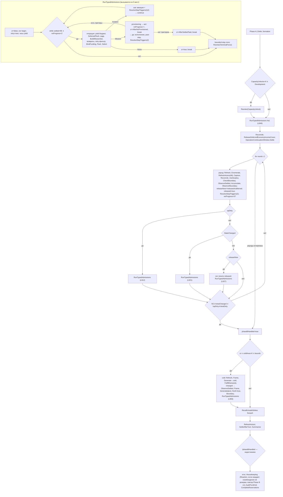
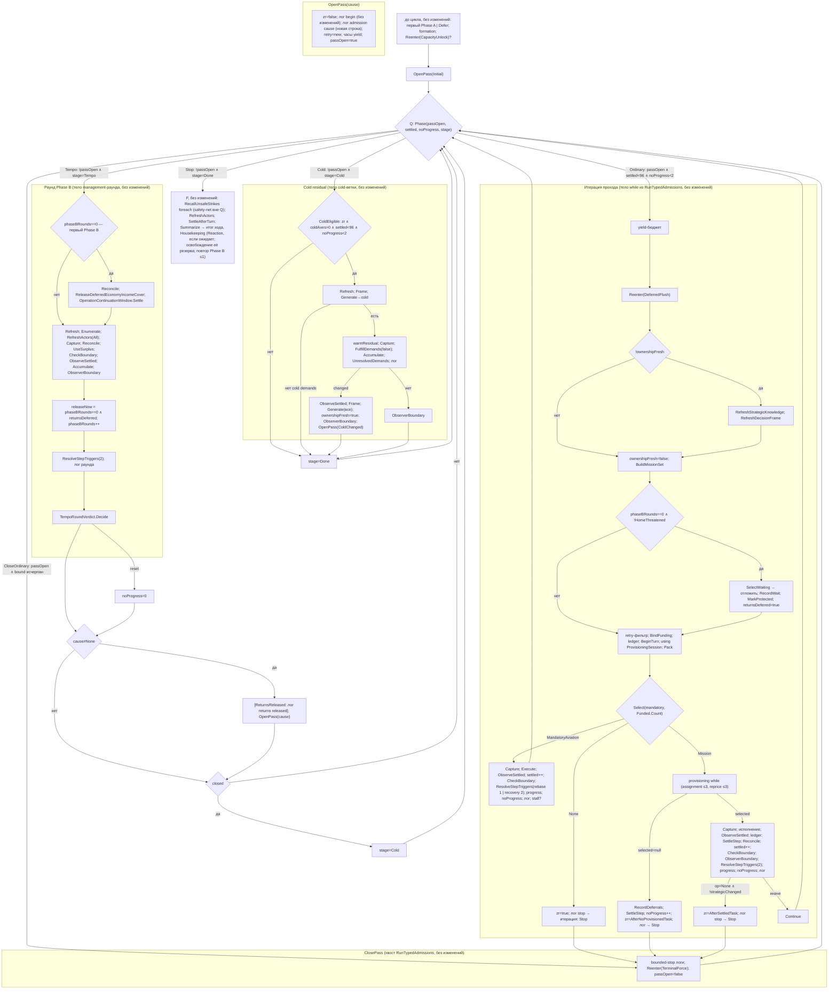

# AI V2 — упрощение пайплайна, Уровень 4: один основной цикл вместо operational и management loops

Статус: **проверен доступными средствами — native не выполнен** в полном объёме ТЗ (Unity EditMode/PlayMode и сценарная приёмка не выполнены); обычная нативная партия на коде уровня проверена структурно (§13.7). План одобрен владельцем с уточнениями §0a; шаги 1–3 выполнены (§12); отчёт §13.
Ветка `refactor/ai-v2-pipeline-simplification`. База: `c3cdde46` (конец Уровня 3).
Среда: Unity 6000.5.4f1 (`ProjectSettings/ProjectVersion.txt`); проверки — net472 + mono из Unity; Unity-редактор не запускался.
Строки — по `Orchestration/AiStrategyV2Pipeline.cs` @ `c3cdde46`.

## 0. Решения владельца (2026-10-09)

1. **Вариант A**: узкий U (общий только разбор триггеров), Phase A через протокол повторного допуска. Сохранение порядка важнее буквального совпадения с приложением A ТЗ. A **не** считается автоматическим выполнением всей цели ТЗ; вариант B — возможная доработка только при доказанной пользе.
2. **`AdmissionCause` — в диагностику**: строка `[AI][V2][Loop] begin — typed operational admission` сохраняется без изменений; причина выводится отдельной следующей строкой. Диагностика не участвует в решениях.
3. **Старт хода**: вынос отложен до Уровня 5 и не обязателен; на этом уровне — проверка SRP и существующих владельцев (§8).
4. **Новые классы заранее не одобрены**: для каждого кандидата — ответственность, существующие владельцы, зависимости, необходимость (§8). Чистые переносы отделены от изменения алгоритма и отложены, если не нужны этому уровню.

## 0a. Уточнения владельца при одобрении

1. Удаление `lifecycleReturnsReleased`: показать, каким состоянием выражается допуск возвратов после первого Phase B; проверить угрозу дому, tactical retreat, ActiveDefence return, ожидание предыдущего хода. Функция флага не должна исчезнуть.
2. Эталон для 32 комбинаций — исходная последовательность условий baseline (или независимо зафиксированные результаты), а не выписанная формула.
3. Проверять последовательности нескольких итераций: сброс retry-set, `TerminalForce` на выходе, накопление `phaseBRounds`, no-progress, глобальный лимит шагов.
4. Актуальность чтения: проверить весь интервал refresh → читатель на новых writers (claims, резервы, intents, рука, публикация фактов).
Узкий U, отдельный cold-путь и Pass + Stage допустимы при одном владельце переходов. В отчёте прямо указать, что число управляющих состояний не сократилось.

## 1. Baseline: фактическая схема

Проверено подсчётом скобок: bounded-stop логи и `ReenterStrategicAxes(TerminalForce)` (L825–L832) находятся **внутри** `RunTypedAdmissions` (тело закрывается на L834) и выполняются в конце **каждого** входа. Входов пять: L846, L912, L921, L927, L983. Три `if` management-раунда (L909, L918, L923) **взаимоисключающие**. `yield break` между L285 и L1019 — только внутри вложенного `ReenterStrategicAxes` (L350, L355, L362).



## 2. Схема A: один цикл с раскрытыми внутренними переходами

Изменение алгоритма — только структура управления: одно `while` в `TurnLoop.Run` (вызывается из `RunTurn`), решение «что дальше» — чистая функция `TurnLoop.Phase` (размещение пересмотрено на шаге 1, §8). Тела работ — существующие локальные функции/блоки `RunTurn`, перенесённые без изменений текста и порядка.



Чистые функции (новые, `Orchestration/TurnLoop.cs`):
```
Phase(passOpen, settled, noProgress, stage) =
    passOpen ? (settled < maxMidTurnStepsPerTurn && noProgress < maxMidTurnNoProgressCycles ? Ordinary : CloseOrdinary)
  : stage == Tempo ? Tempo : stage == Cold ? Cold : Stop

TempoRoundVerdict.Decide(opDirty, stratDirty, stratChanged, stateChanged, releaseNow, roundsDone, maxReruns):
    cause  = opDirty ? PhaseBTrigger : stateChanged ? PhaseBStateChanged : releaseNow ? ReturnsReleased : None
    reset  = opDirty || stratChanged || cause != None
    closed = (!stateChanged && !stratChanged) || (!opDirty && !stratDirty) || roundsDone > maxReruns

ColdEligible(residualWindow, coldAxisCount, settled, noProgress)     // прежний guard T21
```
Диагностика: сразу после `begin — typed operational admission` — строка `[AI][V2][Loop] admission pass opened — cause=<Cause>`. Текст не содержит подстрок, которые считает `loopsig.py` (`begin — typed`, `returns released`, `stop` и др.), поэтому прежние счётчики не меняются. Значение cause вычисляется из уже принятого решения (какая ветка открыла проход) и никуда не читается.

## 3. Что удаляется, объединяется и остаётся (точка 3 владельца: Pass + Stage)

### 3.1 Управляющие механизмы baseline → после

| Механизм baseline | Где | После | Итог |
|---|---|---|---|
| Цикл `while (settled<96 ∧ noProgress<2)` внутри `RunTypedAdmissions` | L504 | условие перешло в `Phase` (Q) основного цикла; итерация — тело основного цикла | **цикл-оператор удалён**; bound сохранён в Q |
| Цикл `for managementRound ≤ maxEndOfTurnTempoReruns` | L863 | раунд — работа `Tempo` основного цикла; граница — `closed` при `phaseBRounds > maxReruns` | **цикл-оператор удалён**; bound сохранён в вердикте |
| Метод-цикл `RunTypedAdmissions` как вызываемая подпрограмма | L469–L834 | вход → `OpenPass`, итерация → тело цикла, хвост → `ClosePass` | **удалён как подпрограмма** |
| 5 точек вызова операционного цикла | L846, L912, L921, L927, L983 | 1 точка: `OpenPass(cause)` из события (старт / вердикт раунда / cold) | **4 удалены**, 1 осталась |
| Вложенность «operational loop внутри management loop / внутри cold» | L863–L933, L983 | нет вложенности: проход, раунд, cold — соседние работы одного цикла | **удалено** |
| Три `if` повторного допуска + 4 копии `noProgress = 0` | L901–L928 | `TempoRoundVerdict` (`cause`, `reset`) | **объединено** |
| Два выхода из `for` | L929, L931 | `closed` | **объединено** |
| `phaseBHandled` + ветка `if (!phaseBHandled)` | L285, L934, L1027–L1042 | — | **удалено** (§7.4) |
| `lifecycleReturnsReleased` | L299, L531, L890–L891 | `phaseBRounds ≥ 1` | **удалено** (§7.4) |
| Отдельный вход cold после management | L940–L990 | работа `Cold` основного цикла (тело без изменений) | **удалён отдельный вход**, тело сохранено |
| `RecallUnsafeStrikes` foreach | L995 | без изменений, вне Q | **сохранено** (финальный safety-net, ТЗ) |
| Provisioning `while` (≤3 + ≤3) | L625 | без изменений, вложен в Mission | **сохранено** (владелец allocator/provisioning, ТЗ §10) |
| Пакеты Phase A (`chainAttempts ≤ 3`) и Phase B (`UseSurplus`, `StrategicTempoBudget`) | внутри `StrategicManager` | без изменений | **сохранено** |

### 3.2 Состояния: что заменяет что

| Состояние после | Заменяет | Писатели | Читатели | Почему не «закодированный старый цикл» |
|---|---|---|---|---|
| `passOpen` (+ `passCause` только для лога) | позицию «внутри `RunTypedAdmissions`» | `OpenPass`, `ClosePass` | Q | Хранит **время жизни прохода**, которое baseline требует сохранить (ТЗ §3.1): сброс `zr`, новый retry-set, часы yield на входе, `TerminalForce` на выходе. Повторение итераций — общий цикл, не отдельный |
| `stage ∈ {Tempo, Cold, Done}` | позицию «после management / после cold» + `phaseBHandled` | вердикт раунда (`closed`→Cold), cold (→Done) | Q | Хранит **порядок фаз** Tempo → Cold → финал; только вперёд, без возвратов |
| `phaseBRounds` | переменную `managementRound` + флаг `lifecycleReturnsReleased` | раунд, после `ObserverBoundary` | Q (вердикт), итерация (возвраты), раунд (первый Phase B) | Один счётчик вместо счётчика и флага с той же информацией |
| `settledSteps`, `noProgressCycles`, `ownershipFreshAfterPhaseA`, `zeroRadarResidualWindow`, `lifecycleReturnsDeferred`, `reentryStateChanged`, `retryNextTurnThisPass`, часы yield | — | без изменений | без изменений | не меняются |

Итог по метрикам ТЗ §2:

| Метрика | Baseline | После A |
|---|---|---|
| Циклы решения в `RunTurn` (без вложенных у владельцев) | 2 (`while` прохода, `for` management) + recall `foreach` | 1 основной + recall `foreach` |
| Владельцы циклов в `Pipeline` | 2 (`RunTypedAdmissions`, тело `RunTurn`) | 1 (`RunTurn`) |
| Точки входа в операционный допуск | 5 | 1 |
| Обратные пути Phase B/cold → operational | 4 вызова (L912, L921, L927, L983) | 0 вызовов; 1 событие `OpenPass` |
| Сохраняемые флаги/переменные управления | 9 флагов + `managementRound` | 7 прежних + `phaseBRounds` + `stage` + `passOpen` |

**Честная оценка.** Удалены как механизмы: два цикла-оператора, подпрограмма-цикл, четыре обратных вызова, вложенность, три `if`, два выхода, `phaseBHandled`, `lifecycleReturnsReleased`. Число **состояний управления** не уменьшилось (−2 флага −1 переменная цикла, +3 поля). Причина: повторение итераций прохода и раундов Phase B, время жизни прохода и порядок фаз — инварианты baseline (bounds, сброс retry на входе, `TerminalForce` на выходе, cold после Tempo). Их невозможно удалить без смены поведения, они лишь перестают быть отдельными циклами. Если владелец считает такое представление «закодированным старым циклом», пункт упрощения №1 ТЗ §2 выполнен **частично**: сокращены владельцы, входы, обратные пути и вложенность, но не число фаз.

## 4. Последовательности наблюдения и завершения (точка 1 владельца: узкий U)

| Вид работы | Последовательность после исполнения (baseline = после) |
|---|---|
| Mission | Capture → execute (TaskExecutor / ReconAir) → `ObserveSettled` → `RecordExecution` + telemetry → `RecordDeferrals` → `RefreshObjectiveStatesLive` → `SettleStep` → `ReconcileEconomyCompletion` → `settled++` → `CheckBoundary` → `ObserverBoundary` → **U(2)** → progress/noProgress → лог → stop? |
| Rebase / Recovery | Capture → `MandatoryAviationStep.Execute` → `ObserveSettled` → `settled++` → `CheckBoundary` → **U(1 / 2)** → progress/noProgress → лог → stall? |
| Phase B раунд | [первый: Reconcile → ReleaseIncomeCover → ContinuationSettle] → Refresh → Enumerate → `RefreshActors(All)` → Capture → `ReconcileEconomyCompletion` → `UseSurplus` → `CheckBoundary` → `ObserveSettled` → Accumulate → `ObserverBoundary` → releaseNow/rounds++ → **U(2)** → вердикт |
| Cold residual | Refresh → Frame → Generate(cold) → Capture → `FulfillDemands` → Accumulate → лог → [changed: `ObserveSettled` → Frame → Generate(все) → fresh] → `ObserverBoundary` → **U(0)** |
| Повторный допуск (внутри U) | Frame → Generate(dirty) → Capture → `FulfillDemands` → Accumulate → `CheckBoundary` → [changed: Refresh → Frame → fresh] → Capture → `PublishStepObservationDelta` → Commit |
| Recall (F) | Capture → `ExecuteContinuation` → `ObserveSettled` → `CheckBoundary` → `ObserverBoundary` |
| Первый Phase A (до цикла) | `FulfillDemands` → `CheckBoundary` → [changed: Refresh → Frame → Generate(все)] → `ObserverBoundary` (публикуют сами действия) |

| Элемент | Устранён повтор | Сохранено различие | Почему объединение потребовало бы разных правил |
|---|---|---|---|
| Capture → execute → refresh → capture → publish | **Ур. 1**: одна функция `ObserveSettled` для всех видов | вызов есть у Mission, авиации, Phase B, recall; у cold — только при changed; у reentry — publish без refresh при неизменном мире; у первого Phase A — нет (действия публикуют сами) | правило «publish только при changed» (cold, reentry) против «всегда» (Mission, авиация, Phase B, recall) |
| take → reenter × пары | **Ур. 3**: один `ResolveStepTriggers` (`StepTriggerSequence.Run`) | пары: Mission 2, Rebase 1, Recovery 2, Phase B 2, cold 0 | число пар — порядок решений (решение владельца по rebase; cold в baseline триггеры не разбирает) |
| Шаг авиации | **Ур. 2**: один `RunMandatoryAviationStep` для rebase/recovery | — | — |
| `CheckBoundary` | — | Mission: после settle и Reconcile; авиация: после `ObserveSettled`; Phase B: **до** `ObserveSettled`; cold: нет; recall: после | одна точка сменила бы момент проверки инвариантов относительно мутации |
| Ledger / `SettleStep` | — | только Mission (есть intent); у авиации/Phase B/cold intent нет | фиктивный intent ТЗ запрещает |
| `ReconcileEconomyCompletion` | — | Mission: после шага; Phase B: перед `UseSurplus`; первый Phase B: ещё раз в settle window | разные моменты — разные гарантии (после move; перед тратой Phase B) |
| `ObserverBoundary` | — | Mission, Phase B, cold, recall, первый Phase A; авиации нет (baseline) | добавление паузы авиации — изменение поведения |
| `settled++` | — | Mission и авиация; Phase B/cold не считаются шагом | счётчик — bound шагов, не раундов |
| Вызов U | **Ур. 4**: решено **не** выносить U в одну точку цикла | U остаётся в конце каждого K | после U у каждого вида свой хвост (progress/stall/stop/вердикт), которому нужны данные K; общая точка потребовала бы переходного результата и диспетчера хвостов — общий helper с исключениями без устранения повтора (алгоритм уже один). Проверено: `ProvisioningSession` (pass claims в отдельной `MissionLeaseBook`, читается только сессией) на банк не влияет, но и её `Dispose` не сдвигается |

## 5. Повторные входы в Phase A (точка 2 владельца)

| Вход | Путь | Управление |
|---|---|---|
| Первый Phase A | `FulfillDemands(deferFreshZeroRadar:true)` до цикла, при `!AviationObligations.Pending`; иначе `Deferred.Defer(все оси)` | **без изменений**: тот же момент — после scan/radar/objectives/continuity/`Generate`, до formation |
| Capacity unlock | `Reenter(CapacityUnlock)` до первого прохода | протокол Ур. 3 (`StrategicReadmission.Decide`) |
| Flush в начале итерации | `Reenter(DeferredFlush)` | протокол Ур. 3 |
| После работы (Mission, авиация, Phase B) | `ResolveStepTriggers` → `Reenter(Trigger)` | протокол Ур. 3 |
| Закрытие прохода | `Reenter(TerminalForce)` | протокол Ур. 3 |
| Cold residual | прямой `FulfillDemands(deferFreshZeroRadar:false)` на cold-осях | **отдельный путь, выбирается только Q** (`stage=Cold`, `ColdEligible`) |

Все повторные входы, кроме cold, идут через один `ReenterStrategicAxes` → `StrategicReadmission.Decide` с явной причиной. Cold не является повторным допуском: он не вызывается фактом, обходит ворота ключей, выбирает оси по `RadarValueScale ≤ 0`, вызывает Phase A с `deferFreshZeroRadar:false`, сохраняет `UnresolvedDemands` положительных осей (L3 §2 а–д). Объединить его с `Reenter` можно только набором режимных параметров — ТЗ §4 п. 2 это запрещает. Управляемость cold обеспечивается тем, что вход один и выбирается тем же Q.

## 6. Таблица переходов (каждый guard baseline → новый guard/event)

| # | Baseline-переход и guard | Новый guard / event | Ранжирует кандидатов | Счётчики | Terminal |
|---|---|---|---|---|---|
| T1 | старт → Phase A, `!Pending` | без изменений | `StrategicPhaseA` | chainAttempts ≤ 3 | — |
| T2 | Phase A → кадр, `StateChanged` | без изменений | — | — | — |
| T3 | formation, `!Pending ∧ plan` | без изменений | `AviationRebasePlanner` | — | — |
| T4 | flush в начале итерации | тот же вызов в итерации | `Decide` | — | — |
| T5 | кадр, `!ownershipFresh` | без изменений | — | — | — |
| T6 | возвраты ждут: `!released ∧ !HomeThreatened` | `phaseBRounds == 0 ∧ !HomeThreatened` | `LifecycleReturnPolicy.SelectWaiting` | `returnsDeferred` | — |
| T7 | retry-фильтр, сброс на входе | сброс в `OpenPass` | — | — | — |
| T8 | mandatory aviation | без изменений (`Select` → шаг) | `MandatoryAviationOrder.Next` | settled, noProgress | — |
| T9 | `Funded==0` → `zr=true; break` | итерация → `ClosePass` | — | — | конец прохода |
| T10 | provisioning ≤3 + ≤3 | без изменений | allocator / `ProvisioningManager` | бюджеты на итерацию | — |
| T11 | `selected==null` → `break` | итерация → `ClosePass` | — | noProgress++ | конец прохода |
| T12 | исполнение + post-step | без изменений | — | settled++ | — |
| T13 | нет триггеров → `break` | итерация → `ClosePass` | — | — | конец прохода |
| T14 | хвост каждого входа: bounded-логи + `TerminalForce` | `ClosePass` | `Decide` | — | — |
| — | условие `while` | Q: `passOpen ∧ bound исчерпан → CloseOrdinary` | — | bounds без изменений | конец прохода |
| T15 | capacity unlock | без изменений, до `OpenPass(Initial)` | `Decide` | — | — |
| T16 | первый `RunTypedAdmissions` | `OpenPass(Initial)` | — | — | — |
| T17 | settle window между проходом №1 и раундом 1 | раунд при `phaseBRounds == 0` (**первый Phase B**) | — | — | — |
| T18 | `for round ≤ 1` | Q: `!passOpen ∧ stage=Tempo`; `closed` при `phaseBRounds > 1` | `StrategicPhaseB` | `phaseBRounds` | — |
| T19 | три `if` → `RunTypedAdmissions` | `cause ≠ None → OpenPass(cause)` | — | noProgress=0 при `reset` | — |
| T20 | выходы `for`; `phaseBHandled=true` | `closed → stage=Cold` | — | — | конец Tempo |
| T21 | cold guard | Q: `stage=Cold` → `ColdEligible` → тело → `changed → OpenPass(ColdChanged)`; `stage=Done` | Phase A (пакет) | chainAttempts ≤ 3 | конец Cold |
| T22 | recall | без изменений, вне Q | `GroundCombatAirSupport` | — | — |
| T23 | финал; `if(!phaseBHandled)` | без изменений; ветка удалена | — | старение один раз | — |

Точки ТЗ §10: первый Phase B — `phaseBRounds == 0` в раунде (T17) и в итерации (T6); return release — `releaseNow` до инкремента, `cause = ReturnsReleased` только при `!opDirty ∧ !stateChanged`; continuation-window settlement и deferred income-cover release — только первый Phase B (дубли в мёртвой ветке удалены); cold availability — `zr` последнего прохода, `stage=Cold` один раз; safety recall — F вне Q; final aging — `SettleAfterTurn` один раз.

## 7. Доказательства

### 7.1 Внутриходовой порядок

Обозначения: `P` — проход (вход, итерации, хвост), `R` — раунд Phase B, `C` — cold, `F` — финал. Тела P/R/C/F переносятся без изменения текста и порядка вызовов, поэтому достаточно показать, что порядок самих блоков тот же.

Baseline порождает: `[CU] P₀ · R₁ · [P] · ( R₂ · [P] )? · C · [P] · F`, где `[P]` после `Rᵢ` — тогда и только тогда, когда сработал один из трёх `if`, а `R₂` — тогда и только тогда, когда после `R₁` не сработал выход. В `C` `[P]` — тогда и только тогда, когда `ColdEligible ∧ coldDemands>0 ∧ changed`.

Схема A: Q даёт открытому проходу приоритет над `stage`, поэтому:
1. `OpenPass(Initial)` → итерации до `ClosePass` = `P₀` (вход, итерации и хвост в том же порядке; при уже исчерпанном bound — вход, сразу `ClosePass`, как пустой `while` + хвост).
2. `stage=Tempo`, `phaseBRounds=0` → `R₁` с settle window впереди (как L849–L856 перед первым раундом).
3. Вердикт: `cause ≠ None` ⇔ `opDirty ∨ (stateChanged ∧ ¬opDirty) ∨ (releaseNow ∧ ¬opDirty ∧ ¬stateChanged)` ⇔ сработал ровно один из трёх `if`; `OpenPass` → `P` до `ClosePass` — раньше следующего `R` и `C`.
4. `closed` ⇔ прежнее условие `break` или исчерпание `for` (`phaseBRounds > maxEndOfTurnTempoReruns` ⇔ отработано `maxReruns+1` раундов). Входы вердикта — локальные значения раунда, проход их не меняет (это локали `RunTurn`, писатели — только раунд).
5. `stage=Cold` → `C` (guard без изменений) → при `changed` `OpenPass(ColdChanged)` → `P` → `stage=Done` → Q → `F`.
6. `noProgress`: baseline обнуляет при `opDirty ∨ stratChanged` (L901) и перед каждым проходом (L911, L920, L926); `reset = opDirty ∨ stratChanged ∨ cause≠None` — та же функция; обнуление стоит до `OpenPass`, читатели (Q, `ColdEligible`) — после.
7. Мёртвая ветка не исполнялась (§7.4) — её удаление порядок не меняет.

Проверка: сценарные тесты §9 (последовательности блоков по сценариям), `TempoRoundVerdict` по всем 32 комбинациям входов против формулы baseline (три `if` + два выхода, выписанные из L909–L932), `Phase` по bounds. Нативно — `loopsig.py` (необходимо, не достаточно) + новая строка cause.

### 7.2 Банк

| Вызов, трогающий банк | Baseline-момент | После | Изменение |
|---|---|---|---|
| `FulfillDemands` первого Phase A (carried `Reservation`, `PhaseAApBudget`) | до цикла | до цикла | нет |
| `FulfillDemands` повторного допуска (`phaseB.Reservation ?? phaseA.Reservation`) | в U / flush / force / capacity | там же | нет |
| `BindFunding` → `Pack` → provisioning pass claims (`ProvisioningSession`, своя `MissionLeaseBook`, `Dispose` в конце итерации) | итерация | итерация (тот же `using`-scope) | нет |
| `TaskExecutor` / `ReconAir` (canonical spend), `SettleStep` (durable ownership/release) | Mission | Mission | нет |
| `ReconcileEconomyCompletionReservations` | после шага миссии; после первого прохода; перед `UseSurplus` в каждом раунде | те же три места (второе — в settle window первого Phase B) | нет |
| `ReleaseDeferredEconomyIncomeCover` | после первого прохода (+ мёртвая ветка) | settle window первого Phase B | мёртвый дубль удалён |
| `OperationContinuationWindow.Settle` | то же | то же | мёртвый дубль удалён |
| `UseSurplus` (`StrategicTempoBudget` на ход, парковка на вызов) | раунд | раунд | нет; бюджет не обнуляется, раундов не больше 2 |
| cold `FulfillDemands` + `UnresolvedDemands` | после Tempo | после Tempo | нет |
| `RecallUnsafeStrikes` (оплачено при sortie) | F | F | нет |
| `CompleteReservations` / `AuditTurnEnd` | финал | финал | нет |
| next-turn: `LifecycleReturnPolicy.RecordWait`, `CapabilityPoolExhaustionRegistry`, `AviationObligationStallRegistry`, `OperationContinuationWindow` | итерация/провижининг/авиация/финал | те же | нет |

Писателей банка уровень не добавляет и не удаляет (кроме недостижимых дублей). Возвраты не съедают AP Phase B: условие ожидания `phaseBRounds == 0` эквивалентно `!released` (§7.4). Числовая таблица stock/holds/debits на каждой смене вида работы требует нативной трассы — будет `not run`, если её нет.

### 7.3 Актуальность следующего чтения

| Читатель | Что читает | Предшествующий refresh | После |
|---|---|---|---|
| `BuildMissionSet` (итерация) | snapshot, кадр, demands | `ObserveSettled` предыдущей работы; при `!ownershipFresh` — Refresh + `RefreshDecisionFrame`; иначе кадр уже обновлён reentry/cold/первым Phase A | тот же: писатели `ownershipFresh` (старт, reentry changed, cold changed) и сброс в итерации без изменений |
| `UseSurplus` (раунд) | snapshot, recon, actors | Refresh + Enumerate + `RefreshActors(All)` в начале раунда | без изменений |
| cold `Generate` | кадр | Refresh + Frame в начале cold | без изменений |
| `Reenter` → `Generate` | кадр | `RefreshDecisionFrame` внутри | без изменений |
| `ColdEligible` | `zr`, settled, noProgress | `zr` последнего прохода; сброс в `OpenPass` | без изменений |
| Housekeeping / Reaction | claims, snapshot | `RefreshActors` в F; snapshot после recall | без изменений |

Наблюдение не выполняется внутри незавершённого действия: U и следующая итерация — только после возврата корутины исполнителя (порядок внутри K не меняется). `WarmEstimates` вызывается в тех же местах (через `RefreshDecisionFrame`). Отменённая корутина закрывает `using var turnSession` и `ProvisioningSession` так же, как сейчас.

### 7.4 Доказательства удаления флагов

- **`lifecycleReturnsReleased ≡ phaseBRounds ≥ 1`.** Единственный писатель — L891 (`true`, без сброса), в каждом раунде после `ObserverBoundary`; единственный читатель — L531 (итерация). Между `UseSurplus` и L891 итераций нет. Инкремент `phaseBRounds` ставится в ту же точку.
- **`if (!phaseBHandled)` недостижима.** Блок L292–L1019 безусловный; `phaseBHandled = true` (L934) — после `for` без `yield break`/`return` уровня `RunTurn` между L285 и L934 (§1); исключение прерывает корутину целиком.

## 8. SRP и классы (точка 4 владельца)

**Пересмотрено на шаге 1 (уточнение владельца п. 3).** Чтобы тесты последовательностей проверяли **исполняемый** цикл, а не его копию в тесте, сам цикл (переходы, счётчики раундов, открытие/закрытие прохода) должен быть одной единицей, которую можно запустить без мира. Поэтому добавлен один файл `Orchestration/TurnLoop.cs`:

| Тип | Ответственность | Почему не существующий владелец | Состояние / срок жизни | Зависимости |
|---|---|---|---|---|
| `TurnLoop` (static) | единственный владелец переходов: `Phase`, `ColdEligible`, `Run`, открытие/закрытие прохода | `OperationalWorkSelection` выбирает вид работы **внутри** итерации после `Pack` (чистый выбор); исполнение порядка работ и логов цикла смешало бы выбор и оркестрацию | нет | `AiConfigV2`, `AiDebugLog` |
| `TurnLoopState` (sealed class) | управляющие переменные хода (были локалями `RunTurn`): счётчики, `ResidualWindow`, `ReturnsDeferred`, `PhaseBRounds`, `Stage`, `PassOpen`, `PassCause` | — (держатель локалей, не хранилище) | корутина хода | — |
| `TurnLoopWork` (struct делегатов) | тела работ, принадлежащие `RunTurn` | — (переходный носитель входа, как разрешённый ТЗ §8 carrier) | вызов `Run` | — |
| `TempoRoundOutcome`, `TempoRoundVerdict` (readonly struct) | итог раунда и решение после него | заменяют три `if` и два выхода | значения | — |
| `TurnPhase`, `TurnStage`, `AdmissionCause` (public enum) | — | — | — | — |

Тела работ (итерация допуска, `TerminalForce`, settle window, раунд Phase B, cold) остаются локальными функциями `RunTurn` — без переноса.

Оценка кандидатов:

| Кандидат | Ответственность | Существующий владелец | Зависимости | Нужен ли класс сейчас | Решение |
|---|---|---|---|---|---|
| Выбор следующей работы | Q, вердикт раунда, cold eligibility | `OperationalWorkSelection` (Ур. 2) — выбор внутри итерации | `AiConfigV2` | да, вместе с циклом (см. выше) | **`TurnLoop`** (пересмотрено) |
| `TurnLoop` | владелец цикла | `Pipeline.RunTurn` | тела работ через делегаты | да: иначе тесты последовательностей проверяют копию; локали `RunTurn` передаются делегатами, не переносятся | **создан** (`TurnLoop.cs`) |
| `DecisionFrame` | держатель кадра + refresh | `RefreshOperationalFrame` + `OperationalFrame` (уже есть) | Analysis, Strategy, Continuity | только для выноса замыканий; алгоритм не требует | **отложить** (чистый перенос) |
| `TurnRun` | держатель входов хода | — | — | только для выноса замыканий | **отложить** |
| `StrategicReentry` | тело `ReenterStrategicAxes` | `StrategicReadmission` (решение), `StepTriggerSequence` (последовательность) | DemandLayer, `StrategicManager` | нет: решение и последовательность уже у владельцев; остаток — порядок оркестрации | **не создавать** |
| `OperationalAdmissionPass` | вход/итерация/хвост прохода | `RunTurn` | allocator, provisioning, executors, Continuity | нет: состояние прохода — 2 поля | **не создавать** |
| `MissionProvisioning` | provisioning retry + хвост учёта отказа | `ProvisioningManager` / `AllocationSession` (решения); цикл retry — оркестрация | — | нет; перенос цикла в `ProvisioningManager` сменил бы его владельца (ТЗ §10: retry раскрыт) | **не создавать**; DRY хвоста — отдельно (§10) |
| `TempoRound`, `ColdResidualPass` | тела работ | `StrategicManager` (решения) | — | нет | **локальные функции** |
| `TurnActivitySummary` | итог/телеметрия хода | `V2TurnActivityTelemetry`, `ApBudgetTelemetry` | — | перенос сократил бы `RunTurn` без снижения сложности | **отложить** (Ур. 5, при пользе) |
| Старт хода | scan → radar → Phase A → formation | `WorldAnalysis`, `StrategyLayer`, `DemandLayer`, `StrategicManager`, `AviationRebasePlanner` | все | последовательность вызовов существующих владельцев, без собственных правил | **не создавать** (решение владельца: Ур. 5, не обязательно) |

SRP-итог честно: `RunTurn` остаётся большим методом-оркестратором (≈1000 строк). Правил домена, оценки, банка и кеша в нём нет — только порядок и bounds, что соответствует SRP Orchestration (ТЗ §4 п. 3). Его размер — следствие числа шагов, а не смешения ответственностей; разнесение по классам без изменения алгоритма — чистый перенос, отложенный до Уровня 5 и выполняемый только при доказанной пользе.

## 9. Тесты порядка (managed)

| # | Сценарий ТЗ | Тест | Ожидание (baseline) |
|---|---|---|---|
| 1 | Первый Phase B | `TheSettleWindowAndReturnWaitBelongToTheFirstPhaseBRoundOnly` | `phaseBRounds==0` открывает settle window и ожидание возвратов; после раунда 1 — нет |
| 2 | Previous-turn waited returns | существующие `AReturnNeverWaitsTwoTurnsInARow`, `OnlyDeferrableReturnsThatDidNotWaitLastTurnAreSelectedToWait` | без изменений |
| 3 | Urgent defence / tactical retreat | существующие `AnActiveDefenceWithdrawalNeverWaits`, tactical retreat в `AiAttackFieldContactTests`, `OnlyARealHomeThreatStopsTheWait` | без изменений |
| 4 | Return release | `ReturnsReleasedReopensAdmissionOnlyWithoutTriggerOrHandChange` | только при `releaseNow ∧ ¬opDirty ∧ ¬stateChanged` |
| 5 | Phase B hand change без operational trigger | `APhaseBHandChangeWithoutATriggerReopensAdmission` | `cause=PhaseBStateChanged` |
| 6 | Вердикт = baseline | `TheTempoRoundVerdictMatchesTheBaselineBranchesForEveryInput` | 32 комбинации против выписанной формулы трёх `if` и двух выходов |
| 7 | Сброс no-progress | `ARoundResetsNoProgressOnlyWhenItReadmitsOrChangedStrategy` | `reset = opDirty ∨ stratChanged ∨ cause≠None` |
| 8 | Exhaustion cap | `TheTempoRoundsStopAfterTheBaselineCap`; `AnOpenPassClosesWhenTheStepOrNoProgressBoundIsHit`; `ColdIsNotEligibleOnceABoundIsHit` | 2 раунда; при bound — `CloseOrdinary`, не итерация; cold закрыт |
| 9 | Zero-Radar residual | `ColdNeedsAResidualWindowAndAColdAxis`; `AnOpenPassRunsBeforeTheNextRoundOrCold` | guard T21; проход раньше раунда и cold |
| 10 | Последовательности блоков | `TheLoopReproducesTheBaselineBlockOrder` (сценарии: без изменений Phase B; раунд 1 с триггером + раунд 2; returns released; cold changed) | последовательности §7.1 |
| 11 | Bounds | существующий `TheTurnLoopBoundsKeepTheirBaselineValues` | без изменений |

Исполнение цикла с реальным миром (корутины, `PlayerRoot`) — engine-bound: Unity EditMode/PlayMode и нативный лог.

## 10. DRY в затронутой области

| Правило | Копии | Решение на этом уровне |
|---|---|---|
| Вход в operational admission | 5 | **merge** → `OpenPass` (часть алгоритма) |
| Три `if` + 4× `noProgress=0` | 7 строк-копий | **merge** → вердикт |
| `released` / `managementRound` | 2 | **merge** → `phaseBRounds` |
| `phaseBHandled` + дубли settle window | 1 + 2 вызова | **delete** |
| `foreach Funded → fundedKeysThisTurn.Add` (L587, L677, L737) | 3 | **отложить**: вне изменения цикла (чистый DRY-перенос) |
| `phaseB.Reservation ?? phaseA.Reservation` (L391, L881, L957, L965) | 4 | **отложить**: то же |
| Хвост учёта отказа provisioning (batch / single) | 2 с различиями | **отложить**: не связан с циклом; различия — registry-вызов и префикс лога |
| Наблюдение/завершение по видам | §4 | **retain** различия, доказательство §4 |
| cold vs reentry `FulfillDemands` | 2 | **retain**, §5 |

## 11. Порядок реализации и gate

1. Чистые функции (`Phase`, `TempoRoundVerdict`, `ColdEligible`, enum-ы) + тесты §9, не подключены. Gate.
2. Цикл в `RunTurn`: `OpenPass`/`ClosePass`/итерация из `RunTypedAdmissions`, раунд и cold как работы, удаление `phaseBHandled`/ветки/`released`/`managementRound`, строка cause. Gate.
3. Интеграционный проход банк/кеш/порядок по всему ходу и next-turn; отчёт по ТЗ §13; проверка снизу вверх.

Gate: `bash D:/aiv-work/run.sh <имя>` → `bash D:/aiv-work/patchrun.sh <имя> <имя>-p` → `python D:/aiv-work/regress.py D:/aiv-work/l3-e-p/result.xml D:/aiv-work/<имя>-p/result.xml` (регрессий 0); `compile_check.sh` + `cmpcc.py` (28 = 28, новых 0); `python D:/aiv-work/scratch-keep/ratchet.py` — прямые чтения ресурсов по затронутым файлам не растут (ожидается: `Pipeline.cs` без изменений, чтения не переносятся).

## 12. Ход работы

### Шаг 1 — независимый baseline переходов и тесты последовательностей (`a4f8642a`)

| Что | Результат |
|---|---|
| `Orchestration/TurnLoop.cs` (новый, `.meta` с новым GUID) | `TurnLoop.Run/Phase/ColdEligible`, `TurnLoopState`, `TurnLoopWork`, `TempoRoundOutcome/Verdict`, enum-ы |
| `Editor/AiTurnLoopTests.cs` (новый) | эталон — транскрипция управляющих операторов `RunTurn` @ `c3cdde46` (L469–L834, L846–L934, L940–L990: `while`, `break`, три `if`, два выхода, `lifecycleReturnsReleased`, `phaseBHandled`, cold guard) с номерами строк; одинаковые скриптовые тела работ; 20 000 детерминированных сценариев по 0–40 итераций, со стартом у глобальных лимитов; сравнение полных трасс (порядок работ, счётчики на каждой границе, ворота ожидания возвратов, сброс retry-set, `TerminalForce`, причина открытия прохода); проверка, что генератор достиг всех причин, обоих bounds, обоих раундов и cold. Вердикт — 32 комбинации × 2 значения числа раундов против транскрипции L898–L932. Пять трасс выписаны вручную из исходника |
| Чувствительность (мутации `TurnLoop.cs` в копии сборки) | смена приоритета причин — 2 теста падают; без ограничения раундов — 3; без сброса окна при открытии прохода — 3; `releaseNow` после инкремента — 2; settle window в каждом раунде — 3; без мутации — 10/10 |

### Шаг 2 — подключение цикла (`b09a7fc8`)

`RunTurn` вызывает `TurnLoop.Run` с телами работ — локальными функциями, перенесёнными построчно: `OpenAdmissionPass` (retry-set, часы yield), `RunAdmissionIteration` (тело прежнего `while`), `TerminalForceAdmission`, `SettleBeforeFirstPhaseB` (прежние L847–L856), `RunTempoRound` (тело прежнего раунда без `releaseNow`/`released`/трёх `if`/выходов), `ColdAxisCount` + `RunColdResidual` (тело cold-ветки). Дифф без пробелов (`git diff -w`) содержит только: переименование счётчиков в поля `TurnLoopState`, `continue` → `yield break`, `break` → `stopPass(true)`, удалённые управляющие конструкции, вызов `TurnLoop.Run` и удалённую ветку `if (!phaseBHandled)`.

### Шаг 3 — документация и интеграционный проход (этот коммит)

`ARCHITECTURE.md` (абзац «One main loop»), комментарии `ResidualWindowPolicy` и теста приведены к новым владельцам. Интеграционный проход — §13.4–§13.6.

## 13. Отчёт Уровня 4 (форма ТЗ §13)

### 13.1 SHA и объём

База `c3cdde46`; результат кода `b09a7fc8` (шаг 2), тесты `a4f8642a` (шаг 1); документация — коммит после `b09a7fc8`.

| Файл | Изменение |
|---|---|
| `Orchestration/TurnLoop.cs` (новый, 220 строк) | единственный владелец переходов цикла хода (§8) |
| `Orchestration/AiStrategyV2Pipeline.cs` (1263 → 1234) | `RunTypedAdmissions`, management `for`, три `if`, cold-вход, `phaseBHandled` + ветка, `lifecycleReturnsReleased`, 5 локальных счётчиков удалены; тела работ — локальные функции; вызов `TurnLoop.Run` |
| `Orchestration/ResidualWindowPolicy.cs` | комментарий (владелец окна) |
| `Editor/AiTurnLoopTests.cs` (новый, 10 тестов) | §12 шаг 1 |
| `Editor/AiPipelineOrchestrationUnitTests.cs` | комментарий |
| `ARCHITECTURE.md` | абзац «One main loop (level 4)» |

### 13.2 Схема до/после

До — §1; после — §2 (все внутренние переходы раскрыты). Удалённые узлы и переходы — §3.1. Явно сохранённые исключения: provisioning retry внутри Mission (владелец allocator/provisioning), пакеты Phase A/B, разные последовательности наблюдения/завершения по видам работ (§4), отдельный путь cold (§5), `RecallUnsafeStrikes` вне цикла, Housekeeping и Reaction вне цикла, первый Phase A и formation до цикла.

**Сокращение** (метрики ТЗ §2):

| Метрика | До | После |
|---|---|---|
| Самостоятельные циклы решения в `RunTurn` | 2 (`while` прохода, `for` management) | 1 (`TurnLoop.Run`) |
| Владельцы переходов | 2 (`RunTypedAdmissions`, тело `RunTurn` с management и cold) | 1 (`TurnLoop`) |
| Глубина вложенности циклов решения в `RunTurn` | 2 (operational внутри management) | 1 |
| Точки входа в операционный допуск | 5 | 1 (`TurnLoop.OpenPass`) |
| Обратные пути из Phase B / cold в operational | 4 прямых вызова | 0; событие `OpenPass(cause)` |
| Вызовы `ReenterStrategicAxes` в коде | 5 (`Trigger`, `DeferredFlush`, `TerminalForce`, `CapacityUnlock`, объявление) | 5 (без изменений) |
| Самостоятельные последовательности завершения | Mission, авиация, Phase B, cold, recall, reentry | без изменений (§4) |
| Управляющие состояния | 9 флагов/счётчиков + `managementRound` | 7 прежних + `PhaseBRounds` + `Stage` + `PassOpen` |

**Число управляющих состояний не сократилось** (−2 флага, −1 переменная цикла, +3 поля). Взаимодействие упростилось: один владелец переходов; ни одна работа не вызывает другую; повтор прохода — событие с причиной, а не вложенный вызов; все три поля пишет только `TurnLoop` (`PhaseBRounds` — после раунда, `Stage` — по вердикту и после cold, `PassOpen` — открытие/закрытие).

### 13.3 Связанные механики

| Механика | Сценарий / вход | Baseline-порядок | После | Доказательство |
|---|---|---|---|---|
| Первый проход и bounds | старт, `settled` у 96, `noProgress` у 2 | вход → итерации → bounded-логи → `TerminalForce` | то же | транскрипция + 20 000 трасс; `TheGlobalStepCapEndsEveryPassAndBlocksCold`, `TheNoProgressBoundEndsThePass…` |
| Первый Phase B | после первого прохода | settle window → раунд 1 | settle window при `PhaseBRounds==0` → раунд 1 | трассы; мутация «settle в каждом раунде» ловится |
| Ожидание возвратов → release | возврат отложен в первом проходе | ждёт до раунда 1; release-проход только при `¬opDirty ∧ ¬stateChanged`; второй раунд не отпускает повторно | `ReturnsMayWait = PhaseBRounds==0`; `releaseNow` до инкремента | `AWaitedReturnIsReleased…`, трассы (поле `mayWait` в каждой итерации), мутация «release после инкремента» |
| Угроза дому, ActiveDefence return, tactical retreat, ожидание прошлого хода | — | `HomeThreatened`, `IsDeferrableReturn`, `MayWait` | **код не менялся** (вызываются в той же итерации, тем же порядком) | `OnlyARealHomeThreatStopsTheWait`, `AnActiveDefenceWithdrawalNeverWaits`, tactical retreat в `AiAttackFieldContactTests`, `AReturnNeverWaitsTwoTurnsInARow` — проходят |
| Phase B меняет руку без триггера | `stateChanged`, нет `op` | проход до выхода из раунда, затем cold | то же (`cause=PhaseBStateChanged`) | `APhaseBHandChange…`, 32 комбинации |
| Повтор раунда | `stateChanged ∨ stratChanged` и есть dirty | раунд 2 после прохода; не больше 2 раундов | то же | 32 × 2; мутация «без ограничения раундов» |
| Сброс no-progress | раунд с триггером/изменением | 4 места обнуления | `ResetNoProgress` | 32 комбинации |
| Cold | окно последнего прохода | один раз после Tempo; проход при `changed` | то же | трассы; `ColdNeeds…`, мутация «без сброса окна» |
| Retry-set | новый на каждый проход | `new` при входе | `OpenAdmissionPass` | трассы (`retrySet#n` на каждом входе) |
| Rebase/recovery/Mission в итерации | — | без изменений | без изменений | текстовый дифф |
| Нативный порядок действий | обычная партия | — | — | **not run** |

Допустимые отличия логов: новая строка `admission pass opened — cause=…` после каждой `begin`; у строк `begin`, `bounded stop`, `lifecycle returns released` сменилась метка вызывающего файла/метода (`AiDebugLog` пишет caller-атрибуты), текст тот же.

### 13.4 Банк

Цепочка physical stock → spendable → allocation → tentative claims → canonical spend → durable ownership → release/expiry не менялась ни в одном звене: писателей банка уровень не добавлял и не удалял; позиции вызовов — таблица §7.2. Удалены только недостижимые дубли `ReleaseDeferredEconomyIncomeCover` и `OperationContinuationWindow.Settle` в ветке `!phaseBHandled`. Проверено по всей изменённой последовательности (§13.5): между перемещёнными операторами нет вызовов, трогающих банк, кроме тех, что были там и раньше. `StrategicTempoBudget` (на ход) и парковка (на вызов `UseSurplus`) не сбрасываются циклом; раундов Phase B в `TurnLoop` не больше 2. Кроме них `UseSurplus` вызывается ещё в Housekeeping после Reaction (повтор ≤ `maxEndOfTurnTempoReruns`, тот же ходовой бюджет) — Housekeeping уровнями не менялся (поправка Ур. 5). Pass claims `ProvisioningSession` (своя `MissionLeaseBook`, читается только сессией) — тот же `using`-scope итерации. Next-turn: писатели `LifecycleReturnPolicy.RecordWait`, `CapabilityPoolExhaustionRegistry`, `AviationObligationStallRegistry`, `OperationContinuationWindow` не менялись.

Не выполнено: числовая таблица stock/holds/debits на каждой смене вида работы, сценарии «два Economy owner + Attack preparation + reaction protection + Phase B near-zero AP» — нужна нативная трасса (**not run**).

### 13.5 Кеши и актуальность чтения: весь интервал refresh → читатель

Сравнение исполняемой последовательности операторов baseline и после (по транскрипции и диффу). Все отличия — перестановки внутри одного раунда Phase B; в остальном последовательность исполняемых операторов совпадает.

| Перемещённый оператор | Было | Стало | Что исполняется в интервале между старой и новой позицией | Читатели перемещённого значения в интервале |
|---|---|---|---|---|
| `released = true` → `PhaseBRounds++` | после `ObserverBoundary`, до триггеров раунда | после триггеров и лога раунда | `ResolveStepTriggers(2)`: take/consume, `Reenter` (refresh кадра, `Generate`, `FulfillDemands` — AP, карты, carried `Reservation`, claims через Phase A, `Publish`, `Commit`), лог | нет: значение читает только итерация допуска (`ReturnsMayWait`), а её в интервале нет |
| `releaseNow = …ReturnsDeferred` | там же | там же, что инкремент | то же | `ReturnsDeferred` пишет только итерация допуска — в интервале её нет |
| `noProgressCycles = 0` при `opDirty ∨ stratChanged` | до лога раунда | после лога раунда | лог | нет (лог раунда не печатает `noProgress`) |
| `noProgressCycles = 0` перед проходом, лог `returns released` | внутри `if`, перед вызовом | в `TurnLoop` перед `OpenPass` | — | — |
| `zr = false`, лог `begin`, новый retry-set, часы yield | вход `RunTypedAdmissions` | `TurnLoop.OpenPass` + `OpenAdmissionPass` | новая строка cause (только лог) | — |
| `coldAxes` | после выхода из management | в `ColdAxisCount` при `Stage=Cold` | — (тот же момент) | `radar`, `demandAxes` не меняются за ход |

Для каждого читателя кадра (итерация допуска, раунд Phase B, cold, reentry, Housekeeping) интервал от его refresh до чтения состоит из тех же операторов, что и в baseline: новых писателей claims, резервов, intents, руки или фактов в интервалы не добавлено. Факты, опубликованные внутри раунда, по-прежнему берёт его `ResolveStepTriggers` или следующий take; повторной публикации нет (receipt-ы не тронуты). `WarmEstimates` вызывается в тех же местах. Наблюдение и следующий допуск не выполняются внутри незавершённого действия: `TurnLoop` переходит к следующей работе только после возврата корутины работы.

### 13.6 DRY/SRP

Таблица — §3 и §10 (решения выполнены: merge входа прохода, вердикт вместо трёх `if` и четырёх сбросов, `PhaseBRounds` вместо флага и переменной цикла, delete мёртвой ветки; отложены как чистые DRY-переносы — `fundedKeysThisTurn`, `Reservation ??`, хвост учёта отказа provisioning). SRP — §8: один новый файл; `TurnLoop` не оценивает, не финансирует, не исполняет и не наблюдает; тела работ и их владельцы не менялись; `RunTurn` остаётся большим методом-оркестратором (≈1020 строк), что записано как ограничение.

### 13.7 Команды и результаты

| Проверка | Результат |
|---|---|
| `run.sh l4-a` / `l4-b` | build errors 0; 2122 теста |
| `patchrun.sh` → `l4-a-p`, `l4-b-p` | **1648 прошло**, 474 упало (оба) |
| `regress.py l3-e-p l4-b-p`; итоговое дерево `l4-c-p` | **регрессий 0**, новых проходящих 10 (оба) |
| `regress.py l0-base-p l4-c-p` (baseline Уровня 0) | **регрессий 0**, новых проходящих 77 (1571 → 1648) |
| 474 упавших | те же, что на `l3-e-p` (472 engine-bound + 2 из Ур. 2–3); 8 non-engine и `AiRawResourceReadRatchetTests` падают и на baseline (L3 §12) |
| `compile_check.sh` + `cmpcc.py` | **28 = 28**, новых 0 |
| `ratchet.py` | без изменений относительно Ур. 3 (прямых чтений не переносили; в `TurnLoop.cs` их нет) |
| Мутационная проверка тестов цикла | 5/5 мутаций пойманы |
| `test_regress.sh <sha>` | **not run** (нужен `mono` в PATH; использован эквивалент) |
| Unity compile / EditMode / PlayMode | **not run** |
| Нативная партия на `871f2e80` (`Logs/AiDebug.log`, 2026-10-09 17:07–17:12, копия `D:/aiv-work/native-baseline/AiDebug.level4.log`) | **passed (структурно)**: 18 ходов V2; `loopsig.py` — `invariant:violations=0`, `invariant:ERROR` нет, исключений в логе нет; `begin`=38 = `open:Initial` 18 + `open:PhaseBTrigger` 19 + `open:ReturnsReleased` 1; один `Initial` на ход; раунд 1 в каждом ходе (18), раунд 2 — 17, раунда 3 нет; 6 recovery-шагов; 7 ожиданий возвратов, один release-проход. `scratch-keep/turnorder.py` (проверка порядка по ходам: каждый `begin` с причиной; `Initial` до раундов; `PhaseBTrigger` только после раунда с operational trigger; `PhaseBStateChanged`/`ReturnsReleased` только после раунда без него, release — только после раунда 1 и ожидания; ожидание возвратов только до раунда 1; каждый проход закрыт до раунда; шаги только внутри прохода; раунд 2 только при триггерах раунда 1; cold только после Phase B вне прохода) — **0 ошибок**; скрипт ловит обе порчи лога (снятый operational trigger; удалённая строка остановки). Cold и rebase в партии не встретились |

### 13.8 Ограничения и зависимости

1. Нативная партия проверена структурно (§13.7). Это необходимо, но недостаточно: порядок gameplay-действий, банк и кеши по ходам подтверждаются только трассой на одном seed, которой в проекте нет; полное сохранение игрового поведения не заявляется. Unity EditMode/PlayMode — **not run**. Cold residual в нативе не наблюдался (managed-трассы его покрывают).
2. Rebase нативно не подтверждён (как и на Ур. 2–3).
3. Числовой банковский отчёт по ходам — not run (§13.4).
4. Число управляющих состояний не сократилось (§13.2).
5. Уровень 5 зависит от: `TurnLoop` как единственного владельца переходов; отложенных DRY-переносов (§10); решения о выносе тел работ и старта хода из `RunTurn` (§8) — только при доказанной пользе.

Масштаб: изменение архитектуры оркестрации хода (структура управления); порядок работ, тела работ, bounds и тексты прежних логов сохранены.
