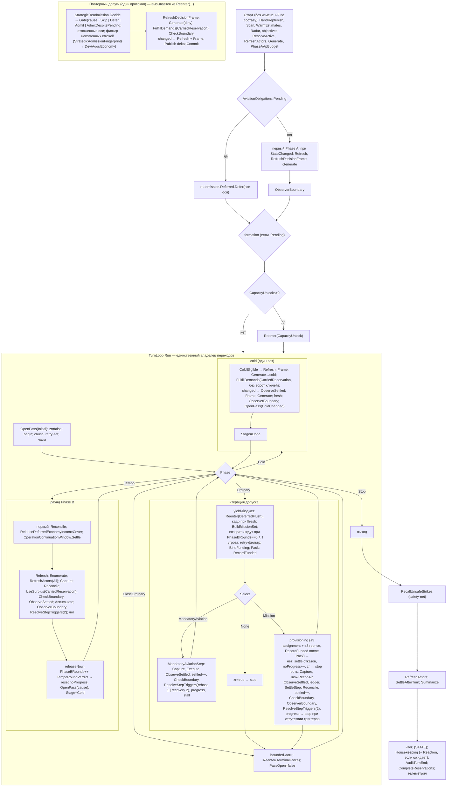

# AI V2 — упрощение пайплайна, Уровень 5: удаление обходов и финальная приёмка

Статус Уровня 5: **проверен доступными средствами — native не выполнен** (на итоговом SHA нет нативного лога; Unity EditMode/PlayMode не запускались).
Статус задачи: **уровни 0–5 проверены доступными средствами; полная приёмка (ТЗ §14) не объявляется** — native и EditMode не выполнены (§9).
Ветка `refactor/ai-v2-pipeline-simplification`. Исходный baseline задачи: `fe2ccdf4`. База уровня: `f46e4529`. Результат кода: `300bb989`; отчёт — коммит после него.
Среда: Unity 6000.5.4f1 (`ProjectSettings/ProjectVersion.txt`); проверки — net472 + mono из Unity; Unity-редактор не запускался.

## 1. Решения владельца (2026-10-09)

K1–K3 — выполнить; D1 — объединить; D2 — объединить, читая текущие reservations в прежних точках (не вычислять один раз и не кешировать); D3, D4 — оставить. Условия: K1 — причина интерпретируется в одном месте, независимые ожидания семи проверок сохраняются, проверить deferred axes, flush после последнего авиационного обязательства, terminal force и составные факты; D1 — прежние моменты регистрации funded keys и накопление за весь ход; K2/K3 — комментарии описывают фактическую реализацию и оставшиеся исключения; общую очистку ранее мёртвого кода не включать.

## 2. Инвентаризация изменённых владельцев и решения

Метод: все объявления в 19 изменённых/новых файлах кода (`fe2ccdf4..f46e4529`) против ссылок по `Assets/` (код / тесты), скрипт `D:/aiv-work/scratch-keep/unused.py`; найденное проверено на `fe2ccdf4` (`git grep`).

| # | Кандидат | Был ли в рабочем коде на `fe2ccdf4` | Решение | Сделано |
|---|---|---|---|---|
| K1 | `DeferredStrategicAdmission.Gate(bool triggered, bool flush, bool force, …)` — адаптер причины в bool-режимы; условие «допуск возможен» продублировано в `Decide` (`wanted`) | вызывался с bool-флагами `ReenterStrategicAxes`; на Ур. 3 флаги заменены причиной, адаптер остался | заменить | `StrategicReadmission.Gate(ReadmissionCause, triggered, hasDeferredAxes, Func<bool> pending)`; `ReadmissionCause` читается только в `StrategicReadmission` (`Gate`: flush/force; `Decide`: сброс baseline при `CapacityUnlock`); `DeferredStrategicAdmission` — только учёт отложенных осей |
| K2 | заголовок `Pipeline` «walking skeleton… every stage is a stub» | неточен давно | исправить | описывает фактический ход: старт, `TurnLoop`, финал, оставшиеся исключения |
| K3 | хвост «Stage stubs…» с указателями на файлы | частично неверен (нет `MissionIntent.cs` и др.) | исправить | короткая ссылка на владельцев и нормативную карту ARCHITECTURE.md |
| K4 | `Pipeline.RefreshDevelopmentOpportunities` (0 код / 2 тест) | **не вызывался и на baseline** | не удалять (общая очистка вне ТЗ) | — |
| K5 | `AiTurnSession.DecisionRevision` (0 / 0) | **не вызывался и на baseline** | не удалять | — |
| K6 | `StrategicReadmission.LastAdmitted` (0 / 1) | создан на Ур. 3 как тестовый доступ | оставить | — |
| K7 | `phaseBHandled`, `RunTypedAdmissions`, `lifecycleReturnsReleased`, `flush:`/`force:`, `TakeTypedTriggers`, inline Economy fingerprint, ветки rebase/recovery | — | уже удалены (Ур. 2–4) | grep = 0 |
| D1 | `foreach Funded → fundedKeysThisTurn.Add` × 3 | — | merge | `RecordFunded(allocation)` в тех же трёх точках (сразу после каждого `Pack`) |
| D2 | `phaseB.Reservation ?? phaseA.Reservation` × 4 | — | merge | `CarriedReservation()` — локальная функция, читает поля при каждом вызове; 4 точки те же. `phaseA.Reservation.UnresolvedDemands.AddRange` (запись именно в Phase A) и `phaseB.Reservation` для Housekeeping — другие выражения, не объединялись |
| D3 | хвост учёта отказа provisioning × 2 | — | retain | различаются registry-политикой (`DeferNoExecutableStep` / `RecordProvisionFailure`) и текстом лога |
| D4 | вынос тел работ/старта хода в классы | — | не делать | польза не показана |

Найдено при проверке K2: **Reaction выполняется внутри `RunTurn`**, из Housekeeping (`HousekeepingManager` → `StrategicReactionPass.ExecuteIfPending`), а не после `RunTurn`, как записано в L0 §1. Утверждение отчёта Уровня 4 «Housekeeping и Reaction вне цикла» верно (вне `TurnLoop`); комментарий `Pipeline` описывает это.

## 3. Доказательства для изменений Уровня 5

### 3.1 K1 — порядок допуска

| Проверка | Результат |
|---|---|
| Ожидания семи прежних проверок `Gate` (независимая таблица: тот же запрос → тот же ожидаемый результат; `flush`→`DeferredFlush`, `force`→`TerminalForce`, ни одного → `Trigger`; запрос «flush и force одновременно» проверен для обеих причин) | не изменились, тесты проходят |
| `TheCauseGateMatchesTheBoolGateForEveryRequestAndReadsPendingAsLazily`: транскрипция bool-`Gate` @ `c3cdde46` вместе с отображением причины и ленивым чтением `wanted && pending()` из `Decide`, все 4 причины × triggered × deferred × pending = 32 запроса | совпадение результата **и числа чтений `pending`** во всех 32 |
| Deferred axes, flush после последнего обязательства, terminal force, capacity unlock (`AiStrategicReadmissionTests`, 9: `AxesWaitWhile…LastOneReleasesThem…`, `TheTerminalForceAdmits…`, `PendingAviationIsNotReadWhenThereIsNothingToAdmit`, `ACapacityUnlockForgetsOnlyTheDevelopmentBaseline` и др.) | 9/9 passed, тесты не менялись |
| Составные факты (`AiStepTriggerSequenceTests`, 7: compound fact всем потребителям; одна/две пары; факт reentry не поглощается) | 7/7 passed, не менялись |
| Учёт отложенных осей (`AiAviationObligationsTests`, 3) | 3/3 passed |

`Decide` после `Gate` не менялся (`TakeWith(triggered ? dirtyAxes : null)`, фильтр неизменных ключей), поэтому набор допущенных осей определяется теми же входами.

### 3.2 D1 — funded keys

Три вызова `RecordFunded(allocation)` стоят ровно на местах прежних циклов: после `Pack` в итерации, после повторного `Pack` в scout-batch realloc и после `Pack` при reprice. Множество — то же `HashSet` хода (объявлено до цикла), поэтому повторное финансирование ключа учитывается один раз, как и раньше; читатели (`MissionsFunded`, итоговая строка хода) не менялись.

### 3.3 D2 — carried reservation

`CarriedReservation()` — выражение `phaseB.Reservation ?? phaseA.Reservation`, вычисляемое при каждом вызове (поле `public MaterializationReservation Reservation` обоих результатов изменяемо). Четыре вызова стоят на местах прежних выражений; порядок вычисления аргументов `FulfillDemands`/`UseSurplus` (слева направо) не изменился. Кеширования нет.

### 3.4 Gate уровня

| Проверка | Результат |
|---|---|
| `run.sh l5-a` + `patchrun.sh` | build errors 0; 2123 теста; **1649 прошло**, 474 упало |
| `regress.py l4-c-p l5-a-p` | регрессий 0, новых проходящих 1 (тест эквивалентности `Gate`) |
| `regress.py l0-base-p l5-a-p` (исходный baseline) | **регрессий 0**, новых проходящих 78 (1571 → 1649) |
| `compile_check.sh` + `cmpcc.py` | 28 = 28, новых 0 |
| `ratchet.py` | без изменений относительно Ур. 3–4 |

## 4. Реальные изменения блок-схемы (L0 → L5)

Исходная схема — L0 §1 (`fe2ccdf4`). Итоговая (`300bb989`):

| Узел / переход L0 §1 | Итог |
|---|---|
| `RunTypedAdmissions` (5 входов, свой `while`) | **удалён**; итерация — работа `TurnLoop`, вход — `OpenPass` (1) |
| management `for` + три `if` + два выхода | **удалены**; раунд — работа `TurnLoop`, решение — `TempoRoundVerdict` |
| `phaseBHandled` + ветка `if (!phaseBHandled)` | **удалены** (ветка была недостижима) |
| ветки rebase / recovery (две копии каркаса) | **объединены** в `MandatoryAviationStep` (Ур. 2) |
| inline take→reenter × 4 места | **объединены** в `ResolveStepTriggers` / `StepTriggerSequence` (Ур. 3) |
| `ReenterStrategicAxes(flush, force)` + inline ворота + inline Economy fingerprint | **заменены** протоколом `StrategicReadmission` (Ур. 3) с причиной, интерпретируемой в одном месте (Ур. 5) |
| post-step Capture → refresh → publish × 7 | **объединены** в `ObserveSettled` (Ур. 1); различия порядка по видам — сохранены (L4 §4) |
| «обновить кадр» × 6 | **объединены** в `RefreshDecisionFrame` (Ур. 3) |
| cold-вход после management | **заменён** работой `Cold` того же цикла; тело и отдельный путь Phase A сохранены |
| `RecallUnsafeStrikes`, Housekeeping (+ Reaction) | **без изменений**, вне цикла |
| provisioning retry, пакеты Phase A/B | **без изменений** (раскрыты) |

## 5. Итоговые метрики ТЗ §2 (L0 → L5)

| Метрика | `fe2ccdf4` (L0 §2) | `300bb989` | Как сосчитано |
|---|---|---|---|
| Самостоятельные циклы решения в `RunTurn` | 4 цикла-оператора (operational `while`, management `for`, provisioning `while`, recall `foreach`) + однопроходный cold | 3 (`TurnLoop.Run`, provisioning `while`, recall `foreach`) | код |
| Вложенные циклы у владельцев | 2 (Phase A `chainAttempts`, Phase B `UseSurplus`) | 2 (без изменений) | код |
| Владельцы переходов цикла хода | 2 (`RunTypedAdmissions`, тело `RunTurn`) | 1 (`TurnLoop`) | код |
| Вызовы `ReenterStrategicAxes` | 10 | 4 (`Trigger` через `StepTriggerSequence`, `DeferredFlush`, `TerminalForce`, `CapacityUnlock`) | grep (11 → 5 с объявлением) |
| Алгоритмы take/consume/fan-out | 4 inline-пары + `TakeTypedTriggers` (7 вызовов) | 1 (`StepTriggerSequence.Run` → `TakeTypedSplit`, 1 вызов) | grep (8 → 2 с объявлением) |
| Места интерпретации причины допуска | bool-флаги `flush`/`force` в 3 местах (вызов, ворота, gate) | 1 класс (`StrategicReadmission`) | код |
| Самостоятельные последовательности завершения | 8 (Phase A, formation, rebase, recovery, task, Phase B, cold, recall) | 7 (rebase + recovery → один шаг авиации) на общем `ObserveSettled` | код, L4 §4 |
| Обходные пути в operational admission | 5 точек вызова | 1 вход (`OpenPass`), 0 вложенных обратных вызовов | grep `RunTypedAdmissions` 6 → 0 |
| Управляющие состояния хода | 11: `settledSteps`, `noProgressCycles`, `ownershipFreshAfterPhaseA`, `zeroRadarResidualWindow`, `lifecycleReturnsReleased`, `lifecycleReturnsDeferred`, `phaseBHandled`, `reentryStateChanged`, `deferredAdmission`, `lastStrategicAdmissionFingerprint`, `retryNextTurnThisPass` (+ `managementRound`) | 11: `SettledSteps`, `NoProgressCycles`, `ownershipFreshAfterPhaseA`, `ResidualWindow`, `ReturnsDeferred`, `reentryStateChanged`, `readmission` (объединил отложенные оси и ключи), `retryNextTurnThisPass`, `PhaseBRounds`, `Stage`, `PassOpen` (+ `PassCause` для диагностики) | код |
| `ObserverBoundary` в `RunTurn` | 9 | 8 (мёртвая ветка удалена) | grep |
| `RunTurn` | L89–L1397 (≈1308 строк), файл 1568 | L94–L1122 (≈1028), файл 1224 | `wc` |

**Число управляющих состояний не сократилось** (11 → 11): удалены `phaseBHandled`, `lifecycleReturnsReleased`, два состояния допуска слиты в `StrategicReadmission`; добавлены `PhaseBRounds`, `Stage`, `PassOpen`. Упростилось их взаимодействие: писатели полей цикла — только `TurnLoop`; состояние допуска — только `StrategicReadmission`; ни одна работа не вызывает другую.

## 6. Итоговая DRY/SRP-карта против Уровня 0 (L0 §13)

| Правило (L0 §13) | Решение L0 | Итог | Где |
|---|---|---|---|
| Обновление кадра × 6 | merge | **сделано** | `RefreshDecisionFrame` (Ур. 3) |
| Capture → execute → refresh → capture → publish | merge с исключениями | **сделано**; исключения сохранены и названы | `ObserveSettled` (Ур. 1); L4 §4 |
| take → reenter × 2 | retain семантику, один протокол | **сделано**; число пар по виду сохранено (rebase 1) | `StepTriggerSequence` (Ур. 3) |
| Учёт отказа provisioning | merge хвост, retain различие | **retain** (решение владельца на Ур. 5, D3) | — |
| `fundedKeysThisTurn.Add` × 3 | merge | **сделано** | `RecordFunded` (Ур. 5) |
| Fingerprint допуска (Economy inline, Dev/Aggr partial) | move к доменам | **сделано** (настоящие классы) | `*Admission`, `StrategicAdmissionFingerprints` (Ур. 3) |
| Release резервов (14 writers) | retain | **retain**, writers не менялись | §7 |
| `ReleaseDeferredEconomyIncomeCover` + `OperationContinuationWindow.Settle` × 2 | delete вместе с веткой | **сделано** | Ур. 4 |
| Закрытие хода в `AiTurnSession` | split SRP | **сделано** | `LifecycleAudit` (Ур. 1) |
| `InfrastructureFulfillment` (reserve/reconcile/release Economy) | split | **сделано** | `EconomyReservationLifecycle` (Ур. 1) |
| `Reservation ??` × 4 | (выявлено на Ур. 4) | **сделано**, чтение при каждом использовании | `CarriedReservation` (Ур. 5) |
| Режимные bool причины допуска | (выявлено на Ур. 5) | **сделано** | `StrategicReadmission.Gate` |
| План разделения `AiStrategyV2Pipeline` (L0 §13.1: `TurnStart`, `DecisionFrame`, `OperationalLoop`, `ManagementLoop`, `TurnTelemetry`) | 1–4 | **частично**: циклы — `TurnLoop`; допуск — `StrategicReadmission`; ключи — `*Admission`; кадр/старт/телеметрия остались в `RunTurn` — решение владельца (польза выноса не показана) | — |
| `StrategicPhaseA`, `ResourceAllocator`, `TaskExecutor`, `MissionContinuityLayer*` | оценить на уровне, который их касается | не затрагивались по существу (правки 2–16 строк: переносы вызовов Ур. 1) | `git diff --stat` |

SRP итог: `Pipeline` упорядочивает и вызывает; `TurnLoop` владеет переходами и bounds; `StrategicReadmission` — решение допуска и его состояние; домены — ключи, оценки, траты, intents. Двух scheduler-ов, двух post-work протоколов, копий хранилищ банка/кеша нет. `RunTurn` остаётся большим методом-оркестратором (≈1028 строк) — ограничение (§9).

## 7. Итоговый банк-аудит (весь ход и следующий ход)

**Сверху вниз** (по цепочке ТЗ §5.2), что меняли уровни:

| Звено | Canonical owner | Изменения уровней 1–5 |
|---|---|---|
| Physical stock | `PlayerRoot` | нет |
| Free / spendable | `TurnResourceBook`, `StrategicSpendability`, `OperationContinuationWindow` | нет; `OperationContinuationWindow.Settle` — та же точка (перед первым Phase B), мёртвый дубль удалён (Ур. 4) |
| Allocation | `ResourceAllocator` / `AllocationSession` | нет |
| Tentative claims | `ProvisioningSession` (pass `MissionLeaseBook`) | нет; тот же `using`-scope итерации |
| Canonical spend | executors, `StrategicManager` (Phase A/B), Housekeeping | нет; carried `Reservation` читается в тех же 4 точках (`CarriedReservation`) |
| Durable ownership | Continuity через `AiTurnSession.SettleStep` (Ур. 1: тот же `FinalizeSteps → Settle`) | перенос без изменения порядка (Ур. 1) |
| Release / expiry | `EconomyReservationLifecycle` (Ур. 1: перенос из `InfrastructureFulfillment` без правок тел), `MissionLeaseBook`, `AiTurnSession.CompleteReservations`, `LifecycleAudit.AuditTurnEnd` | перенос (Ур. 1); точки вызова те же; удалены только недостижимые дубли (Ур. 4) |
| Следующая трата | следующий шаг / раунд / ход | читает то же spendable, что и раньше (точки release не сдвигались) |

**Снизу вверх** (от следующей траты к писателям): трата Phase B раунда N читает spendable после `Reconcile` (тот же вызов перед `UseSurplus`) и после settle window (только перед первым раундом, Ур. 4: `PhaseBRounds==0` — та же точка, что и прежний блок после первого прохода); трата миссии читает tentative claims своей итерации и durable claims после `SettleStep` предыдущего шага; трата Phase A follow-up читает carried `Reservation` в момент вызова. Писатели этих значений и их порядок относительно читателей не менялись (L4 §13.5 — интервалы).

**Следующий ход.** Переходящее между ходами состояние: intents и durable claims (`MissionIntentRegistry`, `MissionLeaseBook`), `LifecycleReturnPolicy.LastWait`, `CapabilityPoolExhaustionRegistry` (RetryNextTurn), `AviationObligationStallRegistry`, `OperationContinuationWindow` (`EndTurn`), `StrategicTempoBudget`, `AiRadarState`, `ForceBaselineRegistry`. Писатели этих хранилищ уровнями не менялись (кроме переноса тел на Ур. 1); финальная `SettleAfterTurn` (старение — один раз), `AuditTurnEnd` и `CompleteReservations` — в прежнем порядке. Нативная партия Ур. 4 (18 ходов): `invariant:turns-audited=18`, `violations=0` — ни одного оставшегося после хода резерва-нарушителя.

Не выполнено: числовая таблица stock/holds/debits по ходам и сценарии «два Economy owner + Attack preparation + reaction protection + Phase B near-zero AP», rollback/abort одного из owner — нужна нативная трасса (**not run**).

## 8. Итоговый кеш-аудит writer → reader

| Mutation | Canonical writer | Receipt | Dirty facts / evidence | Refresh | Reader / ключ | Изменения уровней |
|---|---|---|---|---|---|---|
| Шаг миссии / авиации / Phase B / recall | gameplay-примитив + `WorldDeltaLifecycle` | `StateVersionAfter` | `PublishStepObservationDelta` | `ObserveSettled` (Ур. 1: одна функция) | snapshot, route/estimate-ключи следующего чтения | объединение копий, порядок тот же |
| Phase A / formation | действия публикуют сами | свои receipt-ы | — | `RefreshStrategicKnowledge` + `RefreshDecisionFrame` | кадр, demands | без изменений |
| Pending-факты | `StrategicInterruptRegistry` | — | `TypedTriggerFanOut.Split` (compound → все потребители) | consume только `Consumed` | `StrategicReadmission.Decide` | один алгоритм (Ур. 3); факты reentry ждут следующий take |
| Решение «допуск нужен» | `StrategicReadmission` | — | ключ оси (`*Admission`) | — | читает текущие `snapshot/intents/root/hand` | ключи — без изменений состава (Ур. 3); причина — в одном месте (Ур. 5) |
| Кадр после reentry/cold | `RefreshDecisionFrame` | — | — | Warm → `RefreshOperationalFrame` | `BuildMissionSet`, `Generate` | тот же порядок |
| Флаг свежести кадра | `ownershipFreshAfterPhaseA` | — | — | писатели: старт, reentry changed, cold changed; сброс в итерации | итерация допуска | без изменений |
| Окно cold | `TurnLoopState.ResidualWindow` | — | — | сброс в `OpenPass` | `ColdEligible` | то же значение «последнего прохода» (Ур. 4) |

No-op/rollback: `HasMutation = false` не публикует (не трогалось). Последовательные действия внутри корутины: следующий допуск — только после возврата корутины работы (`TurnLoop`). Stale turn/frame: `AiTurnSession` (ключ player/turn) и `Dispose` при отмене — без изменений. `WarmEstimates` — в тех же местах.

## 9. Команды, результаты, ограничения

| Проверка | Результат |
|---|---|
| Managed-прогон итогового кода (`l5-a-p`) | **1649 прошло**, 474 упало; регрессий 0 против `l4-c-p` и против исходного `l0-base-p` (1571) |
| 474 упавших | ровно те 472, что падают на `fe2ccdf4` (engine-bound, а также 8 non-engine с отличиями mono и `AiRawResourceReadRatchetTests` из-за постороннего `ActiveDefenceExecutor.cs`), + 2 новых engine-bound теста (`MandatoryRebase_StalledWingsStopCounting_ForTheirTurnOnly`, `TheDispatcherRoutesEachAxisToItsOwnerAndSharesNoKey`); проходивших на baseline и упавших сейчас — 0 |
| `compile_check.sh` + `cmpcc.py` | 28 = 28, новых 0 |
| `ratchet.py` | сумма прямых чтений по затронутым файлам не выросла (утверждённые числа «moved, not new» обновлены на Ур. 3) |
| Мутационная проверка цикла (Ур. 4) | 5/5 |
| `test_regress.sh <sha>` | **not run** (нужен `mono` в PATH; использован эквивалент выше) |
| Нативная партия на `f46e4529` (Ур. 4) | структурно passed (`loopsig.py`, `turnorder.py` — 0 ошибок); **не заменяет игровые проверки** |
| Нативная партия на итоговом `300bb989`+ | **not run** |
| Unity compile / EditMode / PlayMode | **not run** |

Ограничения и оставшаяся работа:
1. Полное сохранение игрового поведения **не объявляется**: детерминированной партии нет; native на итоговом SHA и EditMode — not run. Для закрытия ТЗ §14: Unity EditMode целиком (в т.ч. 474 engine-bound), обычный нативный лог на итоговом SHA (`loopsig.py`, `turnorder.py`), сценарии ТЗ §12 в Unity.
2. Rebase нативно не наблюдался ни разу; cold residual в нативе не наблюдался (покрыт managed-трассами Ур. 4).
3. Банковская числовая таблица по ходам и multi-owner/rollback сценарии — not run.
4. Число управляющих состояний не сократилось (§5).
5. `RunTurn` ≈1028 строк: старт хода, держатель кадра, тела работ и итоговая телеметрия остаются в нём — решение владельца (вынос без доказанной пользы не делается).
6. Ранее мёртвые `Pipeline.RefreshDevelopmentOpportunities`, `AiTurnSession.DecisionRevision` и посторонний сбой ratchet (`ActiveDefenceExecutor.cs`) — вне ТЗ, не трогались.
7. Merge/push не выполнялись.

Масштаб Уровня 5: локальные изменения (интерфейс ворот допуска, две DRY-функции, комментарии); поведение сохранено по managed-доказательствам.

## 10. Перепроверка Уровней 4–5 снизу вверх (2026-10-09)

Каждое утверждение отчётов L4/L5 сверено заново с текущим кодом (`acc3ab88`), не с выводами отчётов.

| # | Что проверено | Как | Результат |
|---|---|---|---|
| 1 | `TurnLoop.Run`: приоритет открытого прохода над стадией; settle window только при `PhaseBRounds==0`; `releaseNow` до инкремента; вердикт; cold один раз; `OpenPass` сбрасывает окно и открывает проход до логов и сброса retry-set | чтение `TurnLoop.cs` | соответствует L4 §2 |
| 2 | Тела работ в `RunTurn`: итерация (yield-бюджет, flush, кадр, возвраты при `ReturnsMayWait`, retry-фильтр, `Pack`, `RecordFunded`, выбор, шаги), раунд, cold, settle window, terminal force | чтение кода + `git diff -w c3cdde46` | отличия от baseline — только имена счётчиков, выходы итерации, вызывающая структура, D1/D2 |
| 3 | **Frame pacing (ТЗ §3.1).** Итерация теперь — отдельный вложенный `IEnumerator`; лишний кадр на каждой итерации нарушил бы требование | `AiTurnController.RunEstimateCached`: вложенные `IEnumerator` разворачиваются в стек и продвигаются в том же кадре, Unity получает только настоящие инструкции | лишних кадров нет; единственная точка отдачи кадра в цикле — прежний yield-бюджет 8 мс |
| 4 | **Отменённая корутина закрывает handles (ТЗ §10, review-focus «abandoned coroutine»)** | тот же драйвер: `finally` вызывает `Dispose` у каждого итератора стека; `using var cycleProvisioning` живёт в `RunAdmissionIteration` (как раньше — в теле `while`), `using var turnSession` — в `RunTurn` | pass claims итерации и сессия хода закрываются при отмене и исключении, как на baseline |
| 5 | Захват переменных: `retryNextTurnThisPass`, `lastYieldTime` переназначаются только в `OpenAdmissionPass`; итерация читает текущие | чтение кода | время жизни = проход (как прежний локал `RunTypedAdmissions`) |
| 6 | `Gate`/`Decide`: сброс baseline Development при `CapacityUnlock` до ворот; ленивое чтение `pending`; отбор осей не менялся | чтение кода + тест эквивалентности 32 запросов | соответствует |
| 7 | Удалённые члены (ТЗ §11): `RunTypedAdmissions`, `phaseBHandled`, `lifecycleReturnsReleased`, bool-`Gate` — вызовы, рефлексия (`GetMethod`/`GetField`/`nameof`/строки), сериализация | `git grep` | 0 ссылок; все были локальными функциями/переменными или `internal static` без рефлексии; Unity-сериализации нет (не `MonoBehaviour`/`ScriptableObject`) |
| 8 | `.meta`/GUID | новые `.meta` (20) — уникальность по репозиторию; удалённых файлов нет; два переименования Ур. 3 — `R100` с `.meta` | все GUID уникальны, сохранены |
| 9 | Затронутые ассеты | `git diff --name-only fe2ccdf4..HEAD` | только `.cs`, `.cs.meta`, `.md`; сцены, префабы, настройки, пакеты не менялись |
| 10 | Транскрипция baseline в `AiTurnLoopTests` против исходника `c3cdde46` (условия `while`, три `if`, два выхода, хвост прохода, cold guard, место вычисления `coldAxes`) | построчное сравнение с `git show c3cdde46` | совпадает; единственное сознательное отличие модели — `releaseNow`/`released` вычисляются после тела раунда (в коде baseline — до его триггеров); доказательство, что в этом интервале нет читателей, — L4 §13.5 |
| 11 | Нативный лог Ур. 4 (`turnorder.py`, `loopsig.py`) | повторный прогон не нужен (код цикла после `f46e4529` менялся только в K1/D1/D2) | структурно passed на `f46e4529`; на `acc3ab88` — **not run** |
